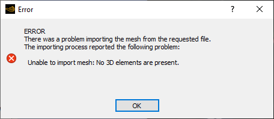
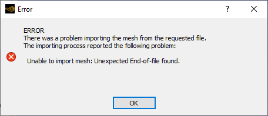

+++
date = '2025-09-19T08:00:00+05:00'
draft = false
title = 'Решение ошибки импортирования КЭ-сетки формата CDB в ANSYS CFX'
math = true
tags = ["Ansys", "CFX", "Mechanical", "APDL", "CDB", "гидродинамика", "ошибка"]
+++

<!--more-->
В качестве исходной секти в **ANSYS CFX** может быть использована сетка, подготовленная в программном комплексе **ANSYS Mechanical APDL** в формате `.CDB`.

При импортировании в **CFX** КЭ-сетки, подготовленной в **ANSYS Mechanical APDL** версии 21 года и выше, возникает следующая ошибка:



Такая ошибка возникает при использовании конечных элементов *MESH200* (с опцией 10 - 8-узловые, или с опцией 11 - 20-узловые)

При использовании расчётных элементов *SOLID185* или *SOLID186* появляется другая ошибка:



Корень проблемы лежит в созданном в **ANSYS Mechanical APDL** файле `.CDB`. Такой файл включает в себя команды **APDL**, подобные стандартным исходным программам на языке **APDL**. 

Проблема импорта возникает из-за параметра *UNBL* в некоторых командах, например
```
EN,UNBL,ATTR,       -1,
```
Такой параметр стал появляться в **ANSYS Mechanical APDL** версии 21 и выше.


Аналогичная команда при запуске этого же скрипта в более ранних версиях **ANSYS Mechanical APDL** выглядела следующим образом
```
EN,R5.0,ATTR,       -1,
```

Если заменить параметр `UNBL` в подготовленном в 21 версии файле на `R5.0`, то ошибка исчезнет.
