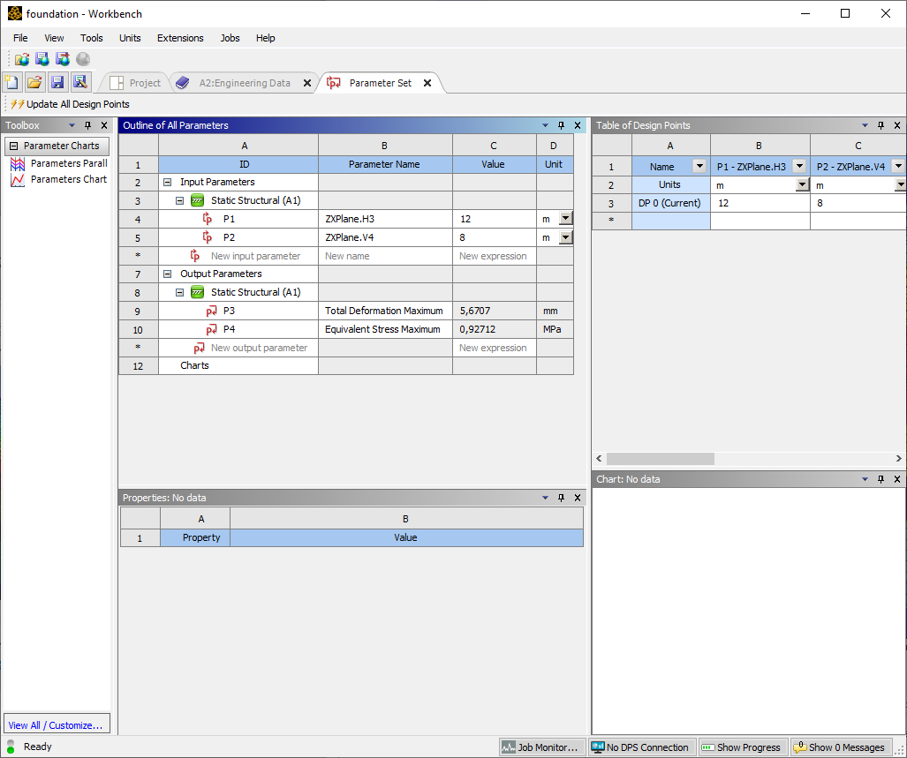
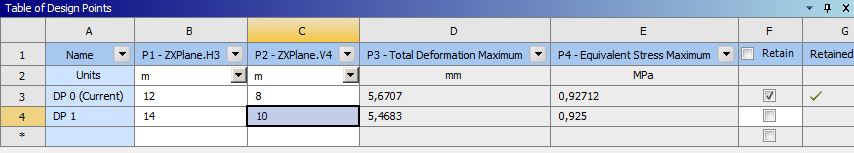

+++
date = '2025-11-21T08:00:00+05:00'
draft = false
title = 'Параметризация модели. Расчёт системы "фундамент - грунт" в ANSYS Workbench Mechanical'
math = true
tags = ["Ansys", "Ansys Mechanical", "МДТТ", "Теория упругости"]
categories = ['raschetnye-programmnye-kompleksy']
courses = ['raschetnye-programmnye-kompleksy']
+++

<!--more-->

## Подготовка проекта

Проект состоит из одной системы *Static Structural*.

## Материалы

В качестве материала плитного фундамента используется материал с усреднёнными свойствами железобетона.

Свойства грунта (слои от верхнего до нижнего):

| Номер слоя | Вид грунта | Нормативный модуль деформаций, МПа | Коэффициент Пуассона | Плотность, кг/м^3  | 
|:-----------|:----------:|:-----------:|:-----------:|:-----------:|
| 1 | Суглинок | 34 | 0.35 | 1600 |
| 2 | Супесь   | 32 | 0.30 | 1400 |
| 3 | Гравий   | 30 | 0.27 | 1200 |

## Геометрия

- Размеры плиты: 8м х 12м х 0.5м, высота от грунта до вверхней поверхности плиты - 0.2м
- Размеры грунта в плоскости плиты могут варьироваться и выбираются в процессе расчёта из соображений корректности моделирования. Изначально возьмём размеры 16м х 24м
- Размеры грунта по толщине:
| Номер слоя | Вид грунта | Высота слоя, м |
|:-----------|:----------:|:-----------:|
| 1 | Суглинок | 2 |
| 2 | Супесь   | 2 |
| 3 | Гравий   | 6 |

- Геометрию необходимо создать в приложении *Design Modeler*. 
- Строится модель четверти системы *фундамент-основание*. Расчёт будет проводиться в таком виде, т.к. нагрузка симметричная. При необходимости учёта несимметричной нагрузки, модель можно отразить с помощью инструмента *Mirror*.

- Обратите внимание, что размеры выше указаны для всей конструкции, а строится четверть модели.
- Плита и грунт создаются последовательным вытягиванием из макетов. Грунт состоит из трёх слоёв.
- Для вычитания объёма плиты из вверхнего слоя грунта используется операция *Boolean* - *Subtract* с опцией сохранения вычитаемого тела *Preserve Tool Bodies?* - *Yes*.
- Для разделения тел грунта на простые прямоугольные параллелепипеды - исползуются операции *Slice* - *Slice by Surface* с указанием поверхностей плиты.
- Для удобства дальнейшего назначения материалов и создания результатов для разных частей модели отдельным группам объёмов назначаются имена инструментом *Named Selection*

## Назначение материалов именнованным группам

- В *Mechanical* добавьте инструменты *Material assignment* для каждой пары именнованной группы *Named Selection* и соответствующего материала. 

## Конечно-элементная сетка

Для создания конечно-элементной сетки дополнительные инструменты можно не добавлять. 

## Граничные условия

Для нижней грани и боковых граней отсечённой части модели задаются нулевые перемещения по нормали. На боковых поверхностях, таким образом, будут созданы симметричные граничные условия. 

## Нагрузка

Нагрузка - давление 30 кПа на верхнюю поверхность плиты.

## Статический расчёт

- Добавьте результаты в виде контуров напряжений, перемещений (суммарных и осевых), деформаций для конструкции в целом и отдельно для разных грунтов и для плиты.
- Проведите расчёт модели.

## Параметризация

- Была расчитана модель для одного набора параметров.
- Необходимо определить, достаточными, недостаточными или избыточными являются размеры окружающего фундамент грунта.
- Для того, чтобы вручную не менять параметры и перезапускать расчёт, воспользуемся возможностью параметризации модели.
- В *Design Modeler* выберем макет грунта и в *Details View* нажмём на квадратики левее имём размеров модели:

- Если в квадратике появилась синяя буква **P**, значит размер теперь будет задаваться как параметр.
- В проекте должен появиться блок *Parameter Set*

- Открыв блок *Parameter Set* можно изменить значение параметра и произвести расчёт без входа в *Design Modeler* и *Mechanical*

- Свойства геометрии - входные параметры расчёта. Для того, чтобы отслеживать их влияние, необходимо добавить выходные параметры расчёта.
- Для этого необходимо зайти в *Mechanical* и также нажать на квадратик у параметра максимальных перемещений модели.

- Тоже самое необходимо сделать для максимальных напряжений.
- Теперь в *Parameter Set* появились выходные параметры. 

- В таблице *Table of Design Points* можно добавить ещё одну строку (новый набор параметров *Design Point* - новый расчёт), в которой указать другие значения параметров.

- Для расчёта необходимо нажать *Update Selected Design Points* для выбранных строк таблицы.

- По-умолчанию расчёт будет проведён, но полные результаты будут сохранены только для текущего (current) расчёта. Для сохранения результатов в другом расчёте необходимо поставить галочку в поле *Retain*.

## Задачи для самостоятельного решения

1. Добавьте учёт силы тяжести на дополнительном первом шаге нагружения.
2. Определите какие размеры грунта необходимо взять, чтобы исключить влияние краевых эффектов на напряженно-деформированное состояние плиты и окружающего её грунта.
3. Добавьте в входные параметры стандартныq размер конечного элемента и в выходные параметры количество узлов и и количество конечных элементов (*Details of "Mesh"* - *Statistics*). Определите, сходятся ли результаты к определённым значением при увеличении степеней свободы модели.

