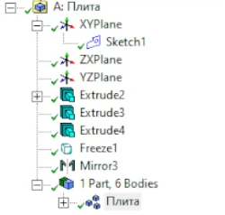
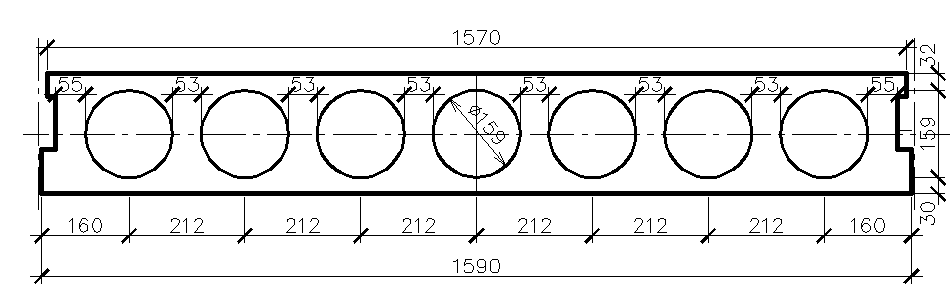
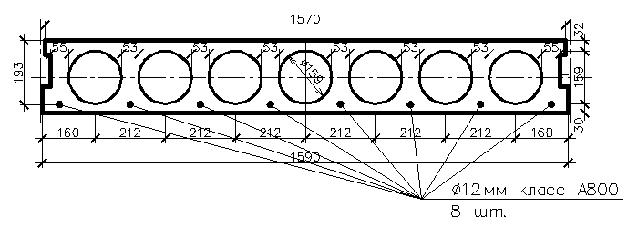

+++
date = '2025-09-12T10:00:00+05:00'
draft = false
title = 'Создание геометрии в ANSYS Workbench Design Modeler'
math = true
tags = ["Ansys", "Workbench", "Ansys Design Modeler", "МДТТ", "Теория упругости"]
categories = ['Расчётные программные комплексы']
courses = ['Расчётные программные комплексы']
+++

<!--more-->

**Design Modeler** - простая CAD-система, в которой можно построить геометрию модели, импортировать геометрию из другой CAD-системы, а также провести обработку этой геометрии для подготовки к генерации конечно-элеметной сетки.

Принцип работы **Design Modeler** основан на создании дерева последовательных операций. Такая парадигма позволяет работать с отдельными шагами (операциями) построения модели, а именно:
- вносить изменения (размеры, типы операций, выбранные элементы геометрии) в существующие операции
- удалять операции
- выключать/включать операции без удаления
- добавлять операции внутри дерева

## Создание геометрической модели плиты перекрытия

Добавим отдельный блок геометрии *Geometry* и назывём его "Плита"
<!-- /videos/ansys/wb/design_modeler/ -->


откроем приложение **Design Modeler**



### Размеры плиты
В данном уроке мы построим модель плиты перекрытия.

Размеры плиты 1590х5650 мм.

Создавать геометрию будем методом "снизу-вверх", т.е. построение будет начинаться с элементарных геометрических объектов - линий и точек, на основе которых будут построены области, из которых уже будут созданы объёмы.

### Создание исходного скетча
Двухмерная геометрия в **Design Modeler** создаётся с помощью инструмента *Sketch*. Откроем панель *Scetching* в плоскости *XY*



Зададим общий контур без точных размеров. Ввиду того, что геометрия симметрична относительно центральной плоскости, построим лишь половину сечения

С помощью инструмента *Line* построим прямые линии.



При построении автоматически устанавливаются ограничения исходя из положения объектов, например ограничение на вертикальность линии в случае если линия строилась примерно вертикальной. 
В данном уроке мы рассмотрим ограничения отдельно, поэтому первоначальное построение произведено достаточно произвольным образом.

Инструментом *Arc by center* создадим полуокружность центрального отверстия, а оставшиеся отверстия создадим инструментом *Circle*



### Установка ограничений

Добавим ограничения *Constraints*

- На вертикальность и горизонтальность прямых линий:



- Для того, чтобы совместить точки между собой, а также привязать точки к осям, воспользуемся инструментом *Coincident*


- Инструментом *Equal Radius* добавим ограничения на одинаковость радиусов отверстий, а также с помощью инструмента *Drag* сместим отверстия внутрь контура сечения.



- Инструментом *Tangent* обеспечим соответствие верхней части сечения отверстиям



### Расстановка размеров

- Добавим горизонтальные размеры сечения



- Добавим вертикальные размеры сечения



- Добавим ограничение диаметра отверстий



Визуальная окраска в синий цвет говорит о том, что все нужные размеры заданы, геометрия скетча однозначна.

### Ввод размеров
Для удобства задания размеров перейдём в миллиметры



Зададим конкретные размеры модели:



На этом создание скетча закончено.
Перейдём к созданию трёхмерной геометрии.

### Экструзия 

*Экструзия* - "вытягивание" сечения вдоль некоторой траектории на заданную длину. 
Как правило, траектория является нормалью к сечению, однако она может быть направлена не только перпендикулярно относительно сечения, а общем виде может быть и криволинейной.

При экструзии области сечения вытянутся в объёмы, линии в области, а точки в линии.

Для создания отдельной площадки для опирания плиты на ригель произведём экструзию в три шага: 
1) на 120 мм, но
2) на 5410 мм, т.е. на величину длины пролёта: 5650 мм - 2 * 120 мм = 5410 мм, 
3) и ещё на 120 мм.



В качестве настройки *Operation* мы выбрали *Add Frozen*, что делает создаваемое тело "замороженным", такое тело автоматически не присоединяется к уже существующему телу.

### Отражение
Данный вид модели подойдёт для расчётов с симметричной относительно плоскости *YZ* нагрузкой. Однако, если нагрузка будет несимметричной, необходимо будет добавить отраженные части. Для этого воспользуемся инструментом *Mirror*



Обратим внимание, что было создано 5 тел, а не 6, т.к. при отражении первого тела автоматически произошла операция объединения тел. Чтобы этого не произошло, предварительно добавим "замораживание" всех тел



Для того, чтобы отдельные тела работали совместно в рамках единого тела, необходимо обеспечить совместность их границ, для этого объединим тела в одну групп (*part*)



Если необходимо отключить, но не удалить, часть тел, воспользуемся методом *supress*

## Задачи для самостоятельного решения

1. Проведите расчёт напряженно-деформированного состояния опирающейся на ригели плиты. В качестве нагрузки используйте собственный вес конструкции, вес пола пола 0.5 кН/м^2 и временную распределённую нагрузку 10 кН/м^2.
Свойства материала задайте в соответствии классом бетона B25.

2. Добавьте второй скетч, представляющий собой 8 стержней продольной арматуры 

после экструзии стержней вычтите их из плиты с помощью инструмена Create-Boolean с настройками *Operation: Subtract*, *Preserve Tool Bodies: Yes*. Добавьте эти тела в группу *Плита*

