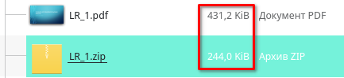
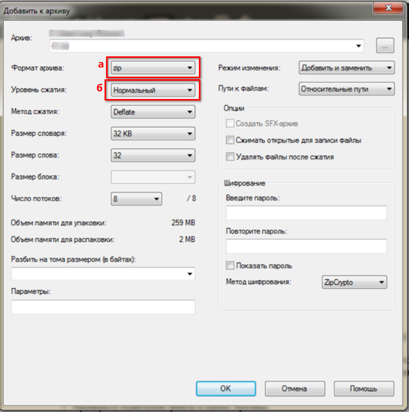
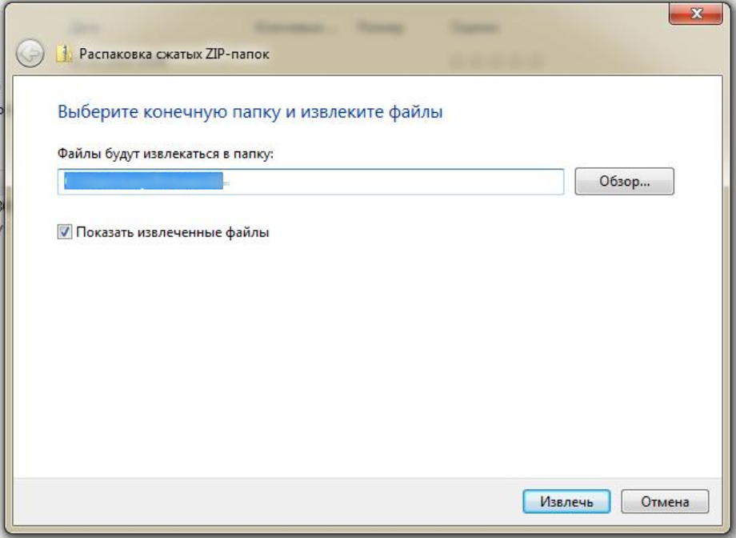

+++
date = '2026-03-30T08:00:00+05:00'
draft = true
title = 'Архивация. Создание архива данных. Извлечение данных из архива'
tags = ["Информатика", "Архив"]
categories = ["informatika"]
courses = ["informatika"]
+++

*Цель работы: изучение принципов архивации файлов, функций и режимов работы архиваторов, приобретение практических навыков работы по созданию архивных файлов и извлечению файлов из архивов.*

<!--more-->

## Архивация

Архивация (упаковка)
: — помещение исходных файлов (данных) в архивный файл в сжатом (англ. lossy) или несжатом (англ. lossless) виде.

Сжатие данных
: — алгоритмическое преобразование данных, которое уменьшает их объём. При этом данные не теряются.


Архивация нужна для:
 - хранения данных в сжатом виде (файлы меньше занимают места на диске);
 - создания резервных копий используемых файлов. Нужны на случай потери или порчи по каким-либо причинам основной копии (невнимательность пользователя, повреждение жёсткого диска, заражение компьютера вирусом и т.д.);
 - подготовки файлов для отправки по электронной почте, или с помощью других интернет-сервисов, или с помощью других каналов коммуникации;

### Принцип архивации/сжатия данных

#### RLE

Существует много разных алгоритмов сжатия данных без потерь. 
Примеры таких алгоритмов:

- [Кодирование Хаффмана](https://ru.wikipedia.org/wiki/Кодирование_Хаффмана)
- [LZ77](https://ru.wikipedia.org/wiki/LZ77)
- [LZ78](https://ru.wikipedia.org/wiki/LZ78)
- [LZW](https://ru.wikipedia.org/wiki/LZW)
- [Deflate](https://ru.wikipedia.org/wiki/Deflate)
- [Brotli](https://ru.wikipedia.org/wiki/Brotli)
- [Bzip2](https://ru.wikipedia.org/wiki/Bzip2)
- [Арифметическое кодирование](https://ru.wikipedia.org/wiki/Арифметическое_кодирование)
- [PPM](https://ru.wikipedia.org/wiki/Prediction_by_partial_matching)

Рассмотрим принцип сжатия данных без потерь на примере **кодирования длин серий (Run-Length Encoding, RLE)**. 
Это простой алгоритм. 
Он заменяет серии (последовательности) из двух или более одинаковых символов числом, обозначающим длину серии. 
После длины идёт сам символ. 
Алгоритм полезен для сильно избыточных данных, например простых картинок с большим количеством одинаковых пикселей.

Рассмотрим пример.
На входе:
```
AAABBCCCCDEEEEEEEEAAAAAAAAAAAAAAAAAAAAAAAAAAAAAA
```

На выходе:
```
3A2B4C1D8E29A
```

Как вы видите, преобразованный набор символов хранит ту же информацию, но занимает в 48/13≈3.7 раза меньше места! Число 3.7 - **степень сжатия данных**.

#### Самостоятельное задание:

Зашифруйте последовательности с помощью  **RLE (кодирования длин серий)** и посчитайте степень сжатия:

- SRRRJJJAAAGOYAEEEAAASAVVVSCALLVVVPPPLASSSAAAAADDD
- GYUURRRJJJJJWWWWWWWWCCCCCCCCCCCCC
- HAAAAAVEEEEEEANNNNNNNIIIIICCCCEEEEEEEEDDDDDDDDDDAYY

#### LZ77

LZ77 
: — алгоритм, использующий **словарь** и **скользящее окно** для поиска комбинаций символов в уже пройденных данных.

Общая схема алгоритма заключается в:

- Входные данные читаются последовательно.
- Слева от текущей позиции - `прочитанная часть символов`
- Справа от текущей позиции - `непрочитанная часть символов`
- Cкользящее окно = `прочитанная часть символов` + `непрочитанная часть символов`
- Для символов `непрочитанной части` ищется наиболее длинное совпадение в прочитанной части. Если совпадение найдено, то 
  1. составляется комбинация (**смещение**, **длина**, **следующий символ**). 
     - **смещение** указывает на сколько шагов надо сместиться назад, 
     - **длина** - количество совпадающих символов. 
  2. Комбинация записывается в словарь
- В конце выходными данными является словарь комбинаций.

##### Пример
Рассмотрим пример. Мы хотим закодировать текст:


    \begin{tikzpicture}[
        >=Latex,
        every node/.style={font=\ttfamily},
        placeholder0/.style={draw=teal!60, fill=teal!8, rounded corners=2pt, inner sep=2pt, text=teal!90!white},
        placeholder1/.style={draw=purple!60, fill=purple!8, rounded corners=2pt, inner sep=2pt, text=purple!90!white},
        arg0/.style={text=teal!70!white},
        arg1/.style={text=purple!80!white},
        digitbox/.style={draw=black!60, minimum width=3.8mm, minimum height=6mm, inner sep=0pt,
            execute at begin node={\strut},  % Добавляет невидимый "распор" с фиксированной высотой
            rounded corners=2pt, 
            anchor=base},
        digitbox0/.style={
            digitbox,
            fill=teal!8,
            draw=teal!60,
            text=teal!90!white
        },
        digitbox1/.style={
            digitbox,
            fill=purple!8,
            draw=purple!60,
            text=purple!90!white
        },
    ]

    % ---- Общая левая граница ----
    \node (leftanchor) at (0,0) {};

    % Начальный пустой узел
    \node (r0) at ($(leftanchor)+(0,0)$) {};

    \newcounter{nodecount}
    \setcounter{nodecount}{0}

    \ExplSyntaxOn
    \NewDocumentCommand{\stringtochars}{mm}
    {
        \tl_set:Nn \l_tmpa_tl {#1}
        \tl_map_inline:Nn \l_tmpa_tl

        {
            \stepcounter{nodecount}

            \node[#2, right=0pt~of~r\the\numexpr\value{nodecount}-1\relax]
            (r\arabic{nodecount}) {##1};
        }
    }
    \ExplSyntaxOff

    %\stringtochars{~~~~~~~~~~~~~~~~~~~}{digitbox}
    \stringtochars{cabracadabrarrarrad}{digitbox}

    \end{tikzpicture}


Наш **первый шаг** - выбрать размеры двух буферов. 

Первый буфер 
: — это буфер просмотра прочитанной части символов. 
Размер этого буфера зависит от того, насколько далеко от текущей позиции алгоритм будет искать совпадение в просмотренных данных. 
Увеличение этого размера позволит найти больше повторящихся комбинаций и увеличить степень сжатия, но это займёт больше времени.

Второй буфер 
: — буфер просмотра непрочитанной части символов. 
Размер этого буфера зависит от максимальной длины комбинации, которую мы хотим записать исходя из требований к скорости алгорима и техническим характеристикам компьютера. 


Размер **первого буфера** может быть больше или равным размеру **второго буфера**. Для простоты выберем оба буфера, равными 6 символам. 

Начальная позиция:


    \begin{tikzpicture}[
        >=Latex,
        every node/.style={font=\ttfamily},
        placeholder0/.style={draw=teal!60, fill=teal!8, rounded corners=2pt, inner sep=2pt, text=teal!90!white},
        placeholder1/.style={draw=purple!60, fill=purple!8, rounded corners=2pt, inner sep=2pt, text=purple!90!white},
        arg0/.style={text=teal!70!white, font=\ttfamily\scriptsize},
        arg1/.style={text=purple!80!white, font=\ttfamily\scriptsize},
        digitbox/.style={draw=black!60, minimum width=3.8mm, minimum height=4mm, inner sep=0pt,
            execute at begin node={\strut},  % Добавляет невидимый "распор" с фиксированной высотой
            rounded corners=2pt,
            anchor=base},
        digitbox0/.style={
            digitbox,
            fill=teal!8,
            draw=teal!60,
            text=teal!90!white
        },
        digitbox1/.style={
            digitbox,
            fill=purple!8,
            draw=purple!60,
            text=purple!90!white
        },
    ]

    % ---- Общая левая граница ----
    \node (leftanchor) at (0,0) {};

    % Начальный пустой узел
    \node (r0) at ($(leftanchor)+(0,0)$) {};

    \newcounter{nodecount}
    \setcounter{nodecount}{0}

    \ExplSyntaxOn
    \NewDocumentCommand{\stringtochars}{mm}
    {
        \tl_set:Nn \l_tmpa_tl {#1}
        \tl_map_inline:Nn \l_tmpa_tl

        {
            \stepcounter{nodecount}

            \node[#2, right=0pt~of~r\the\numexpr\value{nodecount}-1\relax]
            (r\arabic{nodecount}) {##1};
        }
    }
    \ExplSyntaxOff

    \stringtochars{~ ~ ~ ~ ~ ~ ~}{digitbox1}
    \stringtochars{c a b r a c a}{digitbox0}

    \node[arg1, above=0.15cm of r4, anchor=center] (label1) {Прочитанная часть};
    \node[arg0, above=0.15cm of r11, anchor=center] (label0) {Непрочитанная часть};

    \coordinate (midpoint) at ($(r8)+(0,-0.45cm)$);
    \node[arg0, right=0.3cm of midpoint, anchor=west] (currentpos) {Текущая позиция};
    \draw[-latex, teal!60] (currentpos) -- (midpoint) -- (r8);

    \end{tikzpicture}



Запишем в словарь символ **c**: **(0,0,c)**, первый ноль - текущая позиция, второй ноль пишется, так как нет смещения. Идём дальше:


    \begin{tikzpicture}[
        >=Latex,
        every node/.style={font=\ttfamily},
        placeholder0/.style={draw=teal!60, fill=teal!8, rounded corners=2pt, inner sep=2pt, text=teal!90!white},
        placeholder1/.style={draw=purple!60, fill=purple!8, rounded corners=2pt, inner sep=2pt, text=purple!90!white},
        arg0/.style={text=teal!70!white, font=\ttfamily\scriptsize},
        arg1/.style={text=purple!80!white, font=\ttfamily\scriptsize},
        digitbox/.style={draw=black!60, minimum width=3.8mm, minimum height=4mm, inner sep=0pt,
            execute at begin node={\strut},  % Добавляет невидимый "распор" с фиксированной высотой
            rounded corners=2pt,
            anchor=base},
        digitbox0/.style={
            digitbox,
            fill=teal!8,
            draw=teal!60,
            text=teal!90!white
        },
        digitbox1/.style={
            digitbox,
            fill=purple!8,
            draw=purple!60,
            text=purple!90!white
        },
    ]

    % ---- Общая левая граница ----
    \node (leftanchor) at (0,0) {};

    % Начальный пустой узел
    \node (r0) at ($(leftanchor)+(0,0)$) {};

    \newcounter{nodecount}
    \setcounter{nodecount}{0}

    \ExplSyntaxOn
    \NewDocumentCommand{\stringtochars}{mm}
    {
        \tl_set:Nn \l_tmpa_tl {#1}
        \tl_map_inline:Nn \l_tmpa_tl

        {
            \stepcounter{nodecount}

            \node[#2, right=0pt~of~r\the\numexpr\value{nodecount}-1\relax]
            (r\arabic{nodecount}) {##1};
        }
    }
    \ExplSyntaxOff

    \stringtochars{~ ~ ~ ~ ~ ~ c}{digitbox1}
    \stringtochars{a b r a c a d}{digitbox0}

    \node[arg1, above=0.15cm of r4, anchor=center] (label1) {Прочитанная часть};
    \node[arg0, above=0.15cm of r11, anchor=center] (label0) {Непрочитанная часть};

    \coordinate (midpoint) at ($(r8)+(0,-0.45cm)$);
    \node[arg0, right=0.3cm of midpoint, anchor=west] (currentpos) {Текущая позиция};
    \draw[-latex, teal!60] (currentpos) -- (midpoint) -- (r8);

    \end{tikzpicture}



Запишем в словарь символ **a**: **(0,0,a)**. Идём дальше:


    \begin{tikzpicture}[
        >=Latex,
        every node/.style={font=\ttfamily},
        placeholder0/.style={draw=teal!60, fill=teal!8, rounded corners=2pt, inner sep=2pt, text=teal!90!white},
        placeholder1/.style={draw=purple!60, fill=purple!8, rounded corners=2pt, inner sep=2pt, text=purple!90!white},
        arg0/.style={text=teal!70!white, font=\ttfamily\scriptsize},
        arg1/.style={text=purple!80!white, font=\ttfamily\scriptsize},
        digitbox/.style={draw=black!60, minimum width=3.8mm, minimum height=4mm, inner sep=0pt,
            execute at begin node={\strut},  % Добавляет невидимый "распор" с фиксированной высотой
            rounded corners=2pt,
            anchor=base},
        digitbox0/.style={
            digitbox,
            fill=teal!8,
            draw=teal!60,
            text=teal!90!white
        },
        digitbox1/.style={
            digitbox,
            fill=purple!8,
            draw=purple!60,
            text=purple!90!white
        },
    ]

    % ---- Общая левая граница ----
    \node (leftanchor) at (0,0) {};

    % Начальный пустой узел
    \node (r0) at ($(leftanchor)+(0,0)$) {};

    \newcounter{nodecount}
    \setcounter{nodecount}{0}

    \ExplSyntaxOn
    \NewDocumentCommand{\stringtochars}{mm}
    {
        \tl_set:Nn \l_tmpa_tl {#1}
        \tl_map_inline:Nn \l_tmpa_tl

        {
            \stepcounter{nodecount}

            \node[#2, right=0pt~of~r\the\numexpr\value{nodecount}-1\relax]
            (r\arabic{nodecount}) {##1};
        }
    }
    \ExplSyntaxOff

    \stringtochars{~ ~ ~ ~ ~ c a}{digitbox1}
    \stringtochars{b r a c a d a}{digitbox0}

    \node[arg1, above=0.15cm of r4, anchor=center] (label1) {Прочитанная часть};
    \node[arg0, above=0.15cm of r11, anchor=center] (label0) {Непрочитанная часть};

    \coordinate (midpoint) at ($(r8)+(0,-0.45cm)$);
    \node[arg0, right=0.3cm of midpoint, anchor=west] (currentpos) {Текущая позиция};
    \draw[-latex, teal!60] (currentpos) -- (midpoint) -- (r8);

    \end{tikzpicture}


Запишем в словарь символ **b**: **(0,0,b)**. Идём дальше:


    \begin{tikzpicture}[
        >=Latex,
        every node/.style={font=\ttfamily},
        placeholder0/.style={draw=teal!60, fill=teal!8, rounded corners=2pt, inner sep=2pt, text=teal!90!white},
        placeholder1/.style={draw=purple!60, fill=purple!8, rounded corners=2pt, inner sep=2pt, text=purple!90!white},
        arg0/.style={text=teal!70!white, font=\ttfamily\scriptsize},
        arg1/.style={text=purple!80!white, font=\ttfamily\scriptsize},
        digitbox/.style={draw=black!60, minimum width=3.8mm, minimum height=4mm, inner sep=0pt,
            execute at begin node={\strut},  % Добавляет невидимый "распор" с фиксированной высотой
            rounded corners=2pt,
            anchor=base},
        digitbox0/.style={
            digitbox,
            fill=teal!8,
            draw=teal!60,
            text=teal!90!white
        },
        digitbox1/.style={
            digitbox,
            fill=purple!8,
            draw=purple!60,
            text=purple!90!white
        },
    ]

    % ---- Общая левая граница ----
    \node (leftanchor) at (0,0) {};

    % Начальный пустой узел
    \node (r0) at ($(leftanchor)+(0,0)$) {};

    \newcounter{nodecount}
    \setcounter{nodecount}{0}

    \ExplSyntaxOn
    \NewDocumentCommand{\stringtochars}{mm}
    {
        \tl_set:Nn \l_tmpa_tl {#1}
        \tl_map_inline:Nn \l_tmpa_tl

        {
            \stepcounter{nodecount}

            \node[#2, right=0pt~of~r\the\numexpr\value{nodecount}-1\relax]
            (r\arabic{nodecount}) {##1};
        }
    }
    \ExplSyntaxOff

    \stringtochars{~ ~ ~ ~ c a b}{digitbox1}
    \stringtochars{r a c a d a b}{digitbox0}

    \node[arg1, above=0.15cm of r4, anchor=center] (label1) {Прочитанная часть};
    \node[arg0, above=0.15cm of r11, anchor=center] (label0) {Непрочитанная часть};

    \coordinate (midpoint) at ($(r8)+(0,-0.45cm)$);
    \node[arg0, right=0.3cm of midpoint, anchor=west] (currentpos) {Текущая позиция};
    \draw[-latex, teal!60] (currentpos) -- (midpoint) -- (r8);

    \end{tikzpicture}


Запишем в словарь символ **r**: **(0,0,r)**. Идём дальше:


    \begin{tikzpicture}[
        >=Latex,
        every node/.style={font=\ttfamily},
        placeholder0/.style={draw=teal!60, fill=teal!8, rounded corners=2pt, inner sep=2pt, text=teal!90!white},
        placeholder1/.style={draw=purple!60, fill=purple!8, rounded corners=2pt, inner sep=2pt, text=purple!90!white},
        arg0/.style={text=teal!70!white, font=\ttfamily\scriptsize},
        arg1/.style={text=purple!80!white, font=\ttfamily\scriptsize},
        digitbox/.style={draw=black!60, minimum width=3.8mm, minimum height=4mm, inner sep=0pt,
            execute at begin node={\strut},  % Добавляет невидимый "распор" с фиксированной высотой
            rounded corners=2pt,
            anchor=base},
        digitbox0/.style={
            digitbox,
            fill=teal!8,
            draw=teal!60,
            text=teal!90!white
        },
        digitbox1/.style={
            digitbox,
            fill=purple!8,
            draw=purple!60,
            text=purple!90!white
        },
    ]

    % ---- Общая левая граница ----
    \node (leftanchor) at (0,0) {};

    % Начальный пустой узел
    \node (r0) at ($(leftanchor)+(0,0)$) {};

    \newcounter{nodecount}
    \setcounter{nodecount}{0}

    \ExplSyntaxOn
    \NewDocumentCommand{\stringtochars}{mm}
    {
        \tl_set:Nn \l_tmpa_tl {#1}
        \tl_map_inline:Nn \l_tmpa_tl

        {
            \stepcounter{nodecount}

            \node[#2, right=0pt~of~r\the\numexpr\value{nodecount}-1\relax]
            (r\arabic{nodecount}) {##1};
        }
    }
    \ExplSyntaxOff

    \stringtochars{~ ~ ~ c a b r}{digitbox1}
    \stringtochars{a c a d a b r}{digitbox0}

    \node[arg1, above=0.15cm of r4, anchor=center] (label1) {Прочитанная часть};
    \node[arg0, above=0.15cm of r11, anchor=center] (label0) {Непрочитанная часть};

    \coordinate (midpoint) at ($(r8)+(0,-0.45cm)$);
    \node[arg0, right=0.3cm of midpoint, anchor=west] (currentpos) {Текущая позиция};
    \draw[-latex, teal!60] (currentpos) -- (midpoint) -- (r8);

    \draw[-latex, purple!60] ($(r5)+(0,-0.45cm)$) -- (r5);

    \end{tikzpicture}



Символ **a** уже встречался, поэтому считаем расстояние до него: 3 шага смещения. 
Следующий символ из непрочитанной части - **c**. 
Такого символа не было в комбинации, которую мы нашли.
Поэтому длина комбинации - 1.
Запишем в словарь: **(3,1,c)**. 
Так как мы учли следующий за комбинацией символ **c**, то сместимся на два шага:


    \begin{tikzpicture}[
        >=Latex,
        every node/.style={font=\ttfamily},
        placeholder0/.style={draw=teal!60, fill=teal!8, rounded corners=2pt, inner sep=2pt, text=teal!90!white},
        placeholder1/.style={draw=purple!60, fill=purple!8, rounded corners=2pt, inner sep=2pt, text=purple!90!white},
        arg0/.style={text=teal!70!white, font=\ttfamily\scriptsize},
        arg1/.style={text=purple!80!white, font=\ttfamily\scriptsize},
        digitbox/.style={draw=black!60, minimum width=3.8mm, minimum height=4mm, inner sep=0pt,
            execute at begin node={\strut},  % Добавляет невидимый "распор" с фиксированной высотой
            rounded corners=2pt,
            anchor=base},
        digitbox0/.style={
            digitbox,
            fill=teal!8,
            draw=teal!60,
            text=teal!90!white
        },
        digitbox1/.style={
            digitbox,
            fill=purple!8,
            draw=purple!60,
            text=purple!90!white
        },
    ]

    % ---- Общая левая граница ----
    \node (leftanchor) at (0,0) {};

    % Начальный пустой узел
    \node (r0) at ($(leftanchor)+(0,0)$) {};

    \newcounter{nodecount}
    \setcounter{nodecount}{0}

    \ExplSyntaxOn
    \NewDocumentCommand{\stringtochars}{mm}
    {
        \tl_set:Nn \l_tmpa_tl {#1}
        \tl_map_inline:Nn \l_tmpa_tl

        {
            \stepcounter{nodecount}

            \node[#2, right=0pt~of~r\the\numexpr\value{nodecount}-1\relax]
            (r\arabic{nodecount}) {##1};
        }
    }
    \ExplSyntaxOff

    \stringtochars{~ c a b r a c}{digitbox1}
    \stringtochars{a d a b r a r}{digitbox0}

    \node[arg1, above=0.15cm of r4, anchor=center] (label1) {Прочитанная часть};
    \node[arg0, above=0.15cm of r11, anchor=center] (label0) {Непрочитанная часть};

    \coordinate (midpoint) at ($(r8)+(0,-0.45cm)$);
    \node[arg0, right=0.3cm of midpoint, anchor=west] (currentpos) {Текущая позиция};
    \draw[-latex, teal!60] (currentpos) -- (midpoint) -- (r8);

    \draw[-latex, purple!60] ($(r3)+(0,-0.45cm)$) -- (r3);
    \draw[-latex, purple!60] ($(r6)+(0,-0.45cm)$) -- (r6);

    \end{tikzpicture}



Текущий символ **a** мы уже встречали, причём дважды. 
Поэтому мы ищем наиболее длинную комбинацию: **a**, **ad**, **ada**, **adab** и т.д. 
Но не длиннее буфера непрочитанной области. 
Так как комбинаций длиннее 1 нет, то записываем в словарь найденную комбинацию с наименьшим смещением: **(2,1,d)**. Идём дальше:


    \begin{tikzpicture}[
        >=Latex,
        every node/.style={font=\ttfamily},
        placeholder0/.style={draw=teal!60, fill=teal!8, rounded corners=2pt, inner sep=2pt, text=teal!90!white},
        placeholder1/.style={draw=purple!60, fill=purple!8, rounded corners=2pt, inner sep=2pt, text=purple!90!white},
        arg0/.style={text=teal!70!white, font=\ttfamily\scriptsize},
        arg1/.style={text=purple!80!white, font=\ttfamily\scriptsize},
        digitbox/.style={draw=black!60, minimum width=3.8mm, minimum height=4mm, inner sep=0pt,
            execute at begin node={\strut},  % Добавляет невидимый "распор" с фиксированной высотой
            rounded corners=2pt,
            anchor=base},
        digitbox0/.style={
            digitbox,
            fill=teal!8,
            draw=teal!60,
            text=teal!90!white
        },
        digitbox1/.style={
            digitbox,
            fill=purple!8,
            draw=purple!60,
            text=purple!90!white
        },
    ]

    % ---- Общая левая граница ----
    \node (leftanchor) at (0,0) {};

    % Начальный пустой узел
    \node (r0) at ($(leftanchor)+(0,0)$) {};

    \newcounter{nodecount}
    \setcounter{nodecount}{0}

    \ExplSyntaxOn
    \NewDocumentCommand{\stringtochars}{mm}
    {
        \tl_set:Nn \l_tmpa_tl {#1}
        \tl_map_inline:Nn \l_tmpa_tl

        {
            \stepcounter{nodecount}

            \node[#2, right=0pt~of~r\the\numexpr\value{nodecount}-1\relax]
            (r\arabic{nodecount}) {##1};
        }
    }
    \ExplSyntaxOff

    \stringtochars{a b r a c a d}{digitbox1}
    \stringtochars{a b r a r r a}{digitbox0}

    \node[arg1, above=0.15cm of r4, anchor=center] (label1) {Прочитанная часть};
    \node[arg0, above=0.15cm of r11, anchor=center] (label0) {Непрочитанная часть};

    \coordinate (midpoint) at ($(r8)+(0,-0.45cm)$);
    \node[arg0, right=0.3cm of midpoint, anchor=west] (currentpos) {Текущая позиция};
    \draw[-latex, teal!60] (currentpos) -- (midpoint) -- (r8);

    \draw[-latex, purple!60] ($(r1)+(0,-0.45cm)$) -- (r1);
    \draw[-latex, purple!60] ($(r4)+(0,-0.45cm)$) -- (r4);    
    \draw[-latex, purple!60] ($(r6)+(0,-0.45cm)$) -- (r6);

    \end{tikzpicture}



Удача! Первая длинная комбинация, которая позволит сэкономить много места!
Символ **a** встречался 3 раза, однако самая длинная комбинация **abra** начинается с самого дальнего символа. 
Запишем в словарь комбинацию **(7,4,r)** и сместимся сразу на 5 позиций:



    \begin{tikzpicture}[
        >=Latex,
        every node/.style={font=\ttfamily},
        placeholder0/.style={draw=teal!60, fill=teal!8, rounded corners=2pt, inner sep=2pt, text=teal!90!white},
        placeholder1/.style={draw=purple!60, fill=purple!8, rounded corners=2pt, inner sep=2pt, text=purple!90!white},
        arg0/.style={text=teal!70!white, font=\ttfamily\scriptsize},
        arg1/.style={text=purple!80!white, font=\ttfamily\scriptsize},
        digitbox/.style={draw=black!60, minimum width=3.8mm, minimum height=4mm, inner sep=0pt,
            execute at begin node={\strut},  % Добавляет невидимый "распор" с фиксированной высотой
            rounded corners=2pt,
            anchor=base},
        digitbox0/.style={
            digitbox,
            fill=teal!8,
            draw=teal!60,
            text=teal!90!white
        },
        digitbox1/.style={
            digitbox,
            fill=purple!8,
            draw=purple!60,
            text=purple!90!white
        },
    ]

    % ---- Общая левая граница ----
    \node (leftanchor) at (0,0) {};

    % Начальный пустой узел
    \node (r0) at ($(leftanchor)+(0,0)$) {};

    \newcounter{nodecount}
    \setcounter{nodecount}{0}

    \ExplSyntaxOn
    \NewDocumentCommand{\stringtochars}{mm}
    {
        \tl_set:Nn \l_tmpa_tl {#1}
        \tl_map_inline:Nn \l_tmpa_tl

        {
            \stepcounter{nodecount}

            \node[#2, right=0pt~of~r\the\numexpr\value{nodecount}-1\relax]
            (r\arabic{nodecount}) {##1};
        }
    }
    \ExplSyntaxOff

    \stringtochars{a d a b r a r}{digitbox1}
    \stringtochars{r a r r a d ~}{digitbox0}

    \node[arg1, above=0.15cm of r4, anchor=center] (label1) {Прочитанная часть};
    \node[arg0, above=0.15cm of r11, anchor=center] (label0) {Непрочитанная часть};

    \coordinate (midpoint) at ($(r8)+(0,-0.45cm)$);
    \node[arg0, right=0.3cm of midpoint, anchor=west] (currentpos) {Текущая позиция};
    \draw[-latex, teal!60] (currentpos) -- (midpoint) -- (r8);

    \draw[-latex, purple!60] ($(r5)+(0,-0.45cm)$) -- (r5);
    \draw[-latex, purple!60] ($(r7)+(0,-0.45cm)$) -- (r7);

    \end{tikzpicture}



Символ **r** встречается 2 раза, при этом так же, как и в прошлый раз, с дальнего символа начинается более длинная комбинация. 
Причём комбинация включает символы также в непрочитанной зоне. 
Мы можем это также учесть. 
Запишем в словарь комбинацию **rarra**: **(3,5,d)**.

Собирём вместе все наши записи из словаря:  
**(0,0,c) (0,0,a) (0,0,b) (0,0,r) (3,1,c) (2,1,d) (7,4,r) (3,5,d)**

Была показана упрощённая схема алгоритма. 
Если мы посчитаем количество памяти, требующееся для хранения наших записей, то оно превысит количество памяти, необходимое для хранения исходной строки. 

Алгоритм начнёт работать, если мы значительно увеличим **буфер прочитанной зоны** и будем шифровать длинный исходный текст.

##### Самостоятельное задание:

1. Расшифруйте полученную в примере закодированную строку, запишите результат, сравните с исходной строкой.
2. Придумайте последовательность длиной не меньше 20 символов и зашифруйте её с помощью алгоритма **LZ77**. В качестве последовательности можете использовать любой текст.

---

### Архивы данных

Архив
: – это специальным образом организованный файл, содержащий в себе один или несколько файлов в сжатом или несжатом виде. 
Также архив содержит служебную информацию об именах файлов, дате и времени их создания или модификации.


Степень сжатия зависит от:
- используемой программы,
- алгоритма сжатия,
- типа исходных файлов.

Лучше всего сжимаются файлы картинок и текстовые файлы, для которых размер архива может достигать 5 – 40% от общего размера исходных файлов. 
Меньше сжимаются файлы исполняемых программ и загрузочных модулей — 60 – 90%. 
Почти не сжимаются уже заархивированные файлы.

**Пример сжатия файла с 412.2 Кб до 244 Кб:**


В оглавлении архивного файла (архива) для каждого содержащегося в нём файла хранится следующая информация:
- имя файла;
- сведения о каталоге, в котором содержится файл;
- дата и время последней модификации файла;
- размер файла на диске и в архиве;
- код циклического контроля для каждого файла, используемый для проверки целостности архива.

Для архивации используются специальные программы - **Архиваторы**, осуществляющие упаковку и сжатие исходных файлов.

Архиваторы позволяют:

- создавать архивы с файлами;
- защищать созданные архивы паролем (получить данные из архива можно только введя пароль);
- разделять большой архивный файл на несколько частей (многотомный архив) при необходимости переноса данных на нескольких носителях ограниченного объёма;
- сохранять и восстанавливать структуру подкаталогов. Сжиматься могут как один, так и несколько файлов, которые в сжатом виде помещаются в архив.

Программы для архивации отличаются используемыми методами сжатия, что соответственно влияет на степень сжатия. 
Например архиватор **7-zip** использует алгоритм сжатия данных по словарю **LZMA**, схожий с рассмотренным выше алгоритмом **LZ77**.

Для того чтобы воспользоваться информацией, запакованной в архив, необходимо архив раскрыть или распаковать. Это делается либо программой-архиватором, либо парной к ней программой-разархиватором. 

Разархивация (распаковка)
: — процесс восстановления файлов из архива в первоначальном виде. При распаковке файлы извлекаются из архива и помещаются на диск или в оперативную память.

Архиваторы имеют следующие функциональные возможности:

1. Уменьшение требуемого объёма памяти для хранения файлов от 20% до 90% первоначального объёма.
2. Обновление в архиве только тех файлов, которые изменялись со времени их последнего занесения в архив, т.е. программа-упаковщик сама следит за изменениями, внесенными пользователем в архивируемые файлы, и помещает в архив только новые и измененные файлы.
3. Объединение группы файлов с сохранением в архиве имен директорий с именами файлов, что позволяет при разархивации восстанавливать полную структуру директорий и файлов.
4. Написания комментариев к архиву и файлам в архиве.
5. Создание саморазархивируемых архивов, которые для извлечения файлов не требуют наличия самого архиватора.
6. Создание многотомных архивов – последовательности архивных файлов. Многотомные архивы предназначены для архивации больших комплексов файлов на носители (например, флеш-память). 

#### Популярные архиваторы:
| Архиватор | Платформа | Лицензия | Ключевые преимущества | Поддерживаемые форматы |
| :--- | :--- | :--- | :--- | :--- |
| **[7-Zip](https://www.7-zip.org/)** | Windows, Linux, macOS | Открытая (LGPL) | Лучшее сжатие (LZMA2), шифрование AES-256, портативная версия | 7z, ZIP, TAR, RAR (распаковка), +20 форматов |
| **[PeaZip](https://peazip.github.io/)** | Windows, Linux, macOS, BSD | Открытая (LGPL/BSD) | Поддержка 200+ форматов, двухфакторная аутентификация, портативная версия | ZIP, 7Z, RAR, TAR, PEA, +190 форматов |
| **[Keka](https://www.keka.io/)** | macOS, Linux | Проприетарная (бесплатная загрузка) | Нативный интерфейс macOS, перетаскивание, высокая скорость | 7Z, ZIP, TAR, RAR (распаковка), DMG |
| **[The Unarchiver](https://heptapod.host/DagAgren/TheUnarchiver)** | macOS | Проприетарная (бесплатная) | Лёгкий, поддержка 30+ редких форматов, интеграция с Finder | RAR, 7Z, ZIP, ISO, CAB (только распаковка) |
| **[WinRAR](https://www.win-rar.com/)** | Windows, Linux, Android, macOS | Проприетарная (условно-бесплатная) | Превосходное сжатие RAR/RAR5, функции восстановления архивов | RAR, ZIP, 7Z, ISO, CAB |
| **[WinZip](https://www.winzip.com/)** | Windows, macOS | Проприетарная (коммерческая) | Интеграция с облаками (Dropbox, GDrive), инструменты для PDF, корпоративное шифрование | ZIP, ZIPX, LHA, CAB |
| **[PowerArchiver](https://www.powerarchiver.com/)** | Windows | Проприетарная (условно-бесплатная) | Поддержка 40+ форматов, шифрование FIPS 140-2, планировщик резервных копий | ZIP, 7Z, RAR, ISO, VHD |
| **[BorgBackup](https://www.borgbackup.org/)** | Linux | Открытая (BSD) | Дедупликация, шифрование, инкрементные снимки, поддержка SSH | Резервные архивы (зашифрованные) |
| **[restic](https://restic.net/)** | Кроссплатформенный | Открытая (BSD) | Зашифрованные дедуплицированные архивы, поддержка облачных бэкендов (S3, SFTP) | Резервные репозитории |

Другие архиваторы вы можете посмотреть в [списке архиваторов](https://en.wikipedia.org/wiki/Comparison_of_file_archivers).

---

## Практика

### Задание 1. Сбор информации для последующего архивирования

1. На рабочем столе создайте директорию и назовите её `Информатика_архивация`.
2. В папке `Информатика_архивация` создайте текстовый файл `результаты архивации.txt`
3. Внутри папки `Информатика_архивация` создайте директорию `Архивация картинок`, и с помощью браузера и любой поисковой системы найдите 10 фотографий городов, природы, людей из Вашей страны и скачайте их в данную директорию.
4. Нажмите правой клавишей мыши (ПКМ) по директории `Архивация картинок`, нажмите левой клавишей мыши (ЛКМ) по пункту **Свойства**, посмотрите на размер папки в байтах и запишите это значение в файл `результаты архивации.txt` в виде:

```
размер директории "Архивация картинок" до архивации составляет ... байт
```

5. Внутри `Информатика_архивация` создайте директорию `Архивация PDF документов`, и с помощью браузера найдите 5 любых статей по интересующей вас теме из энциклопедии [Wikipedia](https://wikipedia.org) на Вашем родном языке. 
Скачайте статьи в директорию `Архивация PDF документов` как документы формата **PDF**. 
Для этого на нужной странице нажмите ПКМ и выберите **Сохранить страницу как**, далее измените тип файла на **Сохранить как PDF**

PDF (Portable Document Format) 
: — универсальный открытый кроссплатформенный формат файлов, в котором можно хранить и передавать отчёты, статьи, презентации и другие документы. 
Файлы такого формата можно создать с помощью редактора текстовых документов из файлов ***.docx***, с помощью Latex-редактора, с помощью редактора презентаций и многих других программ.

6. Нажмите ПКМ по директории `Архивация PDF документов`, нажмите ЛКМ по пункту **Свойства**, посмотрите на размер папки в байтах и запишите это значение в файл `результаты архивации.txt`:

```
размер директории "Архивация PDF документов" до архивации составляет ... байт
```

7. Внутри папки `Информатика_архивация` создайте директорию `Архивация HTML-страниц`, и с помощью браузера найдите 5 любых статей на интересующую вас тему из энциклопедии [Wikipedia](https://ru.wikipedia.org/) на русском языке и скачайте их в данную директорию как HTML-страницы.

8. Нажмите ПКМ по директории `Архивация HTML-страниц`, нажмите левой клавишей мыши (ЛКМ) по пункту **Свойства**, посмотрите на размер папки в байтах и запишите это значение в файл `результаты архивации.txt`:

```
размер директории "Архивация HTML-страниц" до архивации составляет ... байт
```

---

## Задание 2. Создание архива

1. Зайдите в директорию `Информатика_архивация`
2. Нажмите ПКМ по директории `Архивация картинок`, наведите на пункт **7-Zip** и нажмите ЛКМ по **Добавить к архиву...**
3. Выберите формат архива ***zip*** и максимальный уровень сжатия:

**Параметры создания архива (а — Формат архива, б — Уровень сжатия):**


4. Посмотрите на размер полученного архива в байтах и добавьте запись в файл `результаты архивации.txt` в виде
```
размер директории "Архивация картинок" после архивации составляет ... байт
```
5. Посчитайте (вы можете использовать приложение ***Калькулятор***) значение того, какую долю в процентах занимает размер архива от размера директории до архивации. Добавьте запись об этом в файл `результаты архивации.txt` в виде
```
Соотношение размера архива "Архивация картинок.zip" к размеру исходной директории равно ... \%
```
6. Посчитайте степень сжатия архива:
```
Степень сжатия равна  ...
```
7. Повторите пункты 1—6 для ***Архивация PDF документов***
8. Повторите пункты 1—6 для ***Архивация HTML-страниц***
9. В файл `результаты архивации.txt` добавьте в свободной форме оценку сравнения трёх результатов архивации.
11. Загрузите файлы `результаты архивации.txt`, `Архивация картинок.zip`, `Архивация PDF документов.zip` и `Архивация HTML-страниц.zip` в папку ***Архивация*** в папке ***Информатика*** в вашем облачном хранилище.

---

## Задание 3. Извлечение файлов из архива

1. Создайте на **Рабочем столе** папку `Извлечение`.
2. Выберите архив `Архивация картинок.zip`
3. Щёлкните по нему ПКМ, выберите пункт **Извлечь всё...**
4. Распакуйте его на **Рабочий стол** в папку `Извлечение`. Для этого щелчком по кнопке `Извлечь` откройте окно задания параметров извлечения из архива, в котором укажите нужную папку в дереве папок


5. Нажмите кнопку **ОК**.
6. Ознакомьтесь с результатом извлечения.
7. Повторите пункты 2—6 для архива `Архивация PDF документов.zip` 
8. Повторите пункты 2—6 для архива `Архивация HTML-страниц.zip` 
9. Удалите папку `Извлечение` с **Рабочего стола**.

---

## Дополнительное (необязательное) задание. Программирование

1. Напишите программу кодирования и декодирования данных методами RLE и LZ77.
2. Сравните время работы таких алгоритмов на входных данных различной длины.
3. Сравните размер закодированных данных и степень сжатия алгоритмов.

---
