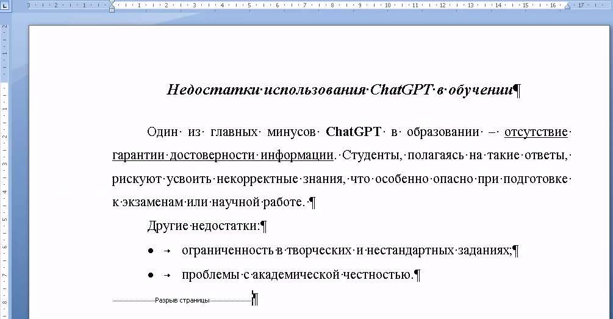

+++
date = '2026-06-08T08:00:00+05:00'
title = 'Экзамен по курсу Информатика 2026'
tags = ["informatika", "Excel", "Электронные таблицы", "Редактор текстовых документов", "Информационные процессы"]
categories = ["informatika"]
courses = ["informatika"]
+++

<!--more-->

## Правила оценивания работы

1. Каждое выполненное задание оценивается по количеству баллов, указанному в названии.
2. Экзамен делится на три раздела: 
   - Информационные процессы
   - Редактор текстовых документов
   - Электронные таблицы
3. Можно делать любые задания. 
5. Оценка за экзамен выставляется по сумме набранных баллов **в каждом разделе**:

| Раздел                        | оценка 5 | оценка 4 | оценка 3 |
| :---------------------------- | :------: | :------: | :------: |
| Информационные процессы       |    6     |    4     |    2     |
| Редактор текстовых документов |    6     |    4     |    2     |
| Электронные таблицы           |    7     |    4     |    2     |

## Информационные процессы

### Задание 1. Информационный объём фразы (1 балл)

С помощью алфавитного (синтаксического) подхода вычислите информационный объём фразы:

**`Я сдам экзамен на пять!`**

Считайте, что в алфавите русского языка 33 буквы.

### Задание 2. Кодирование текста **LZ77** (3 балла)

С помощью алгоритма **LZ77** закодируйте фразу:

**`Всех скороговорок не перескороговоришь, не перевыскороговоришь.`**

### Задание 3. Декодирование текста **LZ77** (3 балла)

Декодируйте, закодированный с помощью алгоритма **LZ77**, текст:
`(0,0,О)` `(0,0,c)` `(0,0,и)` `(0,0,п)` `(0,0, )` `(0,0,о)` `(0,0,х)` `(0,0,р)` `(6,2,,)` `(7,1,а)` `(2,1,А)` `(8,1,х)` `(15,4,с)` `(5,2,.)` `(6,1,О)` `(26,4,А)` `(17,4,у)` `(27,2,А)` `(25,5,О)` `(19,4,у)` `(26,1,)`

### Задание 4. Кодирование текста **RLE** (1 балл)

Закодируйте с помощью алгоритма **RLE**, текст:
`EEEEEXXXXAAAMMISSCCCOOOOLLLLL`

### Задание 5. Декодирование текста **RLE** (1 балл)

1. Декодируйте, закодированный с помощью алгоритма **RLE**, текст:
   `4RM87A`

2. Посчитайте степень сжатия закодированного текста.

### Задание 6. Перевод из десятичной системы счисления (1 балл)

Переведите число \(35_{10}\) из десятичной системы счисления в двоичную.

### Задание 7. Перевод в десятичную систему счисления (1 балл)

Переведите из число \(100110_2\) из двоичной системы счисления в десятичную.

## Редактор текстовых документов

В любом редакторе текстовых документов создайте новый документ. Сохраните его под названием **Экзамен_Фамилия_Имя.docx** (впишите свою фамилию и имя)

### Задание 1. Форматирование текста (2 балла)

1. Введите текст и оформите документ в соответствии с шаблоном:

В абзацах задания используются следующие настройки:

- Размер шрифта: 16 пт или 14 пт
- Отступы: 0 или 1.27 см
- Отступ первой строки: 0 или 1.25 см
- Интервал до абзаца: 0
- Интервал после абзаца: 0 или 16 пт
- Междустрочный интервал: полуторный (1.5 строки)

Конкретные настройки каждого абзаца выберите в соответствии с рисунком.

### Задание 2. Формулы (1 балл)

1. На новой странице добавьте формулу:

$$ z(x,y) = \frac{(\pi\cdot x)^2}{2} + \frac{(\pi\cdot y)^2}{3} $$

2. К формуле добавьте номер формулы \((1)\)

### Задание 3. Таблицы (2 балла)

1. На новой странице создайте таблицу:


	\newcount\thisyear \newcount\prevyear \newcount\pprevyear \newcount\ppprevyear \thisyear=\numexpr\the\year\relax \prevyear=\numexpr\thisyear-1\relax \pprevyear=\numexpr\prevyear-1\relax \ppprevyear=\numexpr\pprevyear-1\relax \centering \begin{tabular}{|c|c|c|c|} \hline \rowcolor[HTML]{FFFFC7} \textbf{№} & \textbf{I} & \textbf{II} & \textbf{Сумма} \\ \hline & \textit{0.5} & \textit{0.3} & \textit{0.8} \\ \cline{2-4} \multirow{-2}{*}{\the\ppprevyear} & \textit{0.8} & \textit{-0.3} & \textit{0.5} \\ \hline & \textit{0.5} & \textit{0.1} & \textit{0.6} \\ \cline{2-4} \multirow{-2}{*}{\the\pprevyear} & \textit{0.2} & \textit{-0.3} & \textit{-0.1} \\ \hline & \textit{0.4} & \textit{0.4} & \textit{0.8} \\ \cline{2-4} \multirow{-2}{*}{\the\prevyear} & \textit{0.9} & \textit{-0.3} & \textit{0.6} \\ \hline & \textit{0.1} & \textit{0.3} & \textit{0.4} \\ \cline{2-4} \multirow{-2}{*}{\the\thisyear} & \textit{0.3} & \textit{-0.3} & \textit{0.0} \\ \hline \end{tabular} 


2. Добавьте подпись таблицы и оформите по **ГОСТ 7.32-2017 Отчёт о НИР**:

Таблица 1 -- Изменение значения по годам

### Задание 4. Векторная графика (3 балла)

1. На новой странице создайте векторный рисунок:


	\begin{tikzpicture}[->, >=stealth', auto, semithick, node distance=3cm] \tikzstyle{every state}=[fill=white,draw=black,thick,text=black,scale=1] \node[state] (A) {$0$}; \node[state] (B)[right of=A] {$1$}; \node[state] (C)[right of=B] {$2$}; \node[state] (D)[right of=C] {$3$}; \path (A) edge[loop left] node{$1$} (A) (B) edge[bend left,below] node{$1/3$} (A) edge[bend left,above] node{$2/3$} (C) (C) edge[bend left,below] node{$2/3$} (B) edge[bend left,above] node{$1/3$} (D) (D) edge[loop right] node{$1$} (D); \end{tikzpicture}


2. Добавьте подпись рисунка и оформите по **ГОСТ 7.32-2017 Отчёт о НИР**:
   
Рисунок 1 -- Схема

### Задание 5. Растровые изображения (2 балла)

1. На новой странице:
   - Добавьте рисунок, включающий два жёстких диска разных фирм. 
   - Картинки найдите в Интернете. 
2. Добавьте подпись рисунка. 
   

### Задание 6. Стили (2 балла)

На основе сделанных заданий создайте стили:
- $Основной\_текст
- $Подпись_таблицы
- $Подпись\_рисунка
- $Текст\_в\_таблице
- $Формула
			

## Электронные таблицы

В любом редакторе электронных таблиц создайте новый документ. Сохраните его под названием **Экзамен_Фамилия_Имя.xlsx** (впишите свою фамилию и имя)

### Задание 1. Форматирование таблиц (2 балла)

1. На листе **Задание 1** оформите таблицу:


	\begin{tabular}{|l|c|c|c|c|}
		\hline
		\rowcolor[rgb]{0.94,0.97,1}
		\textbf{Характеристика} & \textbf{Тип / Ед. изм.} & \textbf{SATA SSD} & \textbf{NVMe Gen4} & \textbf{Максимум} \\
		\hline
		Последовательное чтение & МБ/с & 550 & 7\,000 & 7\,000 \\
		\hline
		Последовательная запись & МБ/с & 520 & 6\,000 & 6\,000 \\
		\hline
		Время доступа & мс & 0,1 & 0,02 & 0,02 \\
		\hline
		Случайный ввод-вывод & IOPS & 100\,000 & 1\,000\,000 & 1\,000\,000 \\
		\hline
		\textbf{Цена за 1 ТБ} & \textbf{руб.} & \textbf{6\,000} & \textbf{8\,000} & \textbf{8\,000} \\
		\hline
		\rowcolor[rgb]{0.94,1,0.97}
		\multicolumn{5}{|l|}{\small \textit{Примечание: характеристики и цены оценочные, основаны на средних рыночных данных.}} \\
		\hline
	\end{tabular}


2. Для цен выберите тип - денежный
3. Для столбца **Максимум** замените значения на формулы, вычисляющие максимумальное из чисел в строке

### Задание 2. Арифметические операции (1 балл)

На листе **Задание2** вычислите:  

$$ a = 2 \cdot (3 + 0.1415) + 2 \cdot \frac{2 + 4}{3^2} $$

### Задание 3. Функции (1 балл)

На листе **Задание 3**:
1. Задайте значение \(x\)
2. Посчитайте значение \(z\) по формуле:
   $$ z=2 \cdot \sin{(x+\pi)} $$

### Задание 4. Ссылки (2 балла)

На листе **Задание 4**:

1. Задайте константу \(M = 1.75\)
2. Создайте последовательность \(i\): \(1, 2, 3, …, 20 \)
3. Вычислите значения по формуле: \(y = M \cdot (i - 1)\)
4. Установите для результатов экспоненциальный формат с 2 знаками после запятой.

### Задание 5. Диаграммы (3 балла)

На листе **Задание 5**:
1. Подготовьте данные изменения величины \(x\) в диапазоне от \(0\) до \(\pi\) с шагом \(\frac{\pi}{5}\)
2. Постройте изменение величины:
   $$ y(x) = \tan{x} $$
3. Нарисуйте диаграмму \(y(x)\)
4. Оформите диаграмму (линии сетки, контур фигуры, подписи осей)

### Задание 6. Ветвящиеся алгоритмы (2 балла)
На листе **Задание 6**:

1. Посчитайте выражение:
	$$ y(x) = \begin{cases} 2, \quad x \le 0 \\ 3, \quad x>0 \end{cases} $$
2. Нарисуйте блок-схему вычисления этого выражения.

### Задание 7. Циклические алгоритмы (2 балла)
На листе **Задание 6**:

1. Посчитайте сумму:
	$$ S=\sum_{i=1}^{6} (3 + i)^3 $$

### Задание 8. Матрицы (4 балла)
На листе **Задание 6**:

1. На листе **Сам.Задание3** найдите определитель матрицы:

$$ G =\begin{pmatrix} 2.5 & 0.5 \\ 4.5 & 6.9 \end{pmatrix} $$

2. Найдите транспонированную матрицу \(G^T\). 
3. Найдите сумму:
   $$ R = G + G^T $$
4. Найдите произведение матриц:
   $$ M = R \cdot G $$
5. Найдите обратную матрицу \(M^-1\). Проведите проверку обратной матрицы.