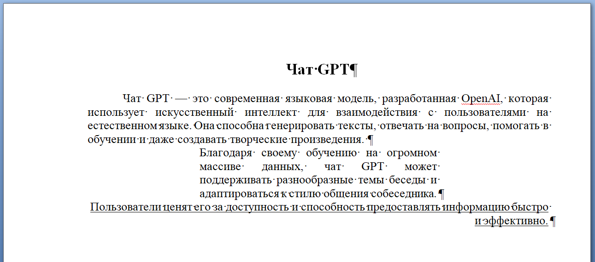
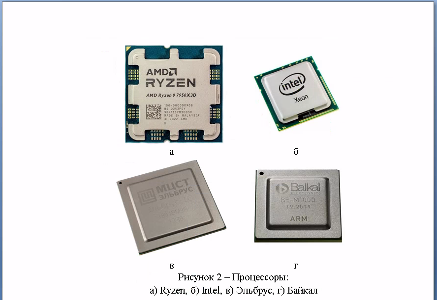

+++
date = '2026-05-20T08:00:00+05:00'
title = 'Контрольная работа по модулю Прикладное программное обеспечение'
tags = ["informatika", "Excel", "Электронные таблицы", "Редактор текстовых документов"]
categories = ["informatika"]
courses = ["informatika"]
+++

<!--more-->

## Редактор текстовых документов

В любом редакторе текстовых документов создайте новый документ. Сохраните его под названием **Фамилия_Имя.docx** (впишите свою фамилию и имя)

### Задание 1. Форматирование текста

1. Введите текст и оформите документ в соответствии с шаблоном:

В абзацах задания используются следующие настройки:

- Размер шрифта: 16 пт или 12 пт
- Отступы: 0 или 4 см
- Отступ первой строки: 0 или 1.25 см
- Интервал до абзаца: 0 или 14 пт
- Интервал после абзаца: 0 или 14 пт
- Междустрочный интервал: одинарный

Конкретные настройки каждого абзаца выберите в соответствии с рисунком.

### Задание 2. Формулы

1. На новой странице добавьте формулу:

$$ y = f(x) $$

2. Ниже добавьте формулу:

$$ r(p) = 2\pi\cdot\left(\left(p + 1\right)^2+1\right) $$

3. Ниже добавьте формулу:

$$ z_i = \frac{m^2 + i}{2 \cdot m} $$

4. К формулам добавьте номера формул \((1)\), \((2)\), \((3)\)

### Задание 3. Таблицы

1. На новой странице создайте таблицу:


	\newcount\thisyear
	\newcount\nextyear
	\newcount\prevyear
	\thisyear=\numexpr\the\year\relax
	\nextyear=\numexpr\thisyear+1\relax
	\prevyear=\numexpr\thisyear-1\relax
	%\begin{table}[H]
	\large
	 \centering
	 \begin{tabular}{|c|ccc|c|}
	   \hline
	    \multicolumn{1}{|l|}{\multirow{2}{*}{\textbf{№}}} & \multicolumn{3}{c|}{\textbf{Годы}} & \multirow{2}{*}{\textbf{Итого}} \\ \cline{2-4} \multicolumn{1}{|l|}{} & \multicolumn{1}{c|}{\textbf{\the\prevyear}} & \multicolumn{1}{c|}{\textbf{\the\thisyear}} & \textbf{\the\nextyear} & \\ \hline 1 & \multicolumn{1}{c|}{1331} & \multicolumn{1}{c|}{245} & 53 & 1576 \\ \hline 2 & \multicolumn{1}{c|}{248} & \multicolumn{1}{c|}{123} & 90 & 335 \\ \hline 3 & \multicolumn{1}{c|}{125} & \multicolumn{1}{c|}{881} & 345 & 590 \\
	  \hline
	 \end{tabular}
	%\end{table}


2. Добавьте подпись таблицы по ГОСТ:

Таблица 1 -- Изменение значения по годам

### Задание 4. Векторная графика

1. На новой странице создайте векторный рисунок:


\begin{tikzpicture} \sbEntree{E} \sbCompSum{sum1}{E}{+}{-}{+}{} \sbRelier[$R(s)$]{E}{sum1} \sbSumh{sum2}{sum1} \sbRelier{sum1}{sum2} \sbBlocL{g1}{$G_1$}{sum2} \sbSortie[4]{Salida}{g1} \sbRelier{g1}{Salida} \sbNomLien[0.8]{Salida}{$C(s)$} \sbDecaleNoeudy[-4]{g1-Salida}{arriba} \sbDecaleNoeudy[4]{g1}{abajo} \sbBlocr{fil1}{$F_1$}{arriba} \sbBlocr{fil2}{$F_2$}{abajo} \sbRelieryx{g1-Salida}{fil1} \sbRelieryx{g1-Salida}{fil2} \sbRelierxy{fil1}{sum2} \sbRelierxy{fil2}{sum1} \sbDecaleNoeudy[-8]{g1-Salida}{arriba2} \sbBlocr{fil3}{$F_3$}{arriba2} \sbRelieryx{g1-Salida}{fil3} \sbRelierxy{fil3}{sum1} \end{tikzpicture}


2. Добавьте подпись рисунка:
   
Рисунок 1 -- Схема

### Задание 5. Растровые изображения

1. На новой странице:
   - Добавьте рисунок, включающий четыре процессора разных фирм. 
   - Картинки найдите в Интернете. 
   - Вид рисунка:
	

2. Добавьте подпись рисунка. 
   
### Задание 6. Стили

На основе сделанных заданий создайте стили:
- $Основной\_текст
- $Подпись_таблицы
- $Подпись\_рисунка
- $Текст\_в\_таблице
- $Формула
			
## Электронные таблицы

В любом редакторе электронных таблиц создайте новый документ. Сохраните его под названием **Фамилия_Имя.xlsx** (впишите свою фамилию и имя)

### Задание 1

1. На листе **Задание 1** оформите таблицу:


	\begin{tabular}{|l|c|c|c|c|c|}
	\hline
	\rowcolor[rgb]{0.94,0.97,1}
	\textbf{Комплектующее} & \textbf{Тип} & \textbf{Ardor EVO X133} & \textbf{Ardor EVO X146} & \textbf{Bloody CZ79C3} & \textbf{Максимум} \\
	\hline
	Процессор & & 85\,000 & 85\,000 & 35\,000 & 85\,000 \\
	\hline
	Материнская плата & & 22\,000 & 22\,000 & 20\,000 & 22\,000 \\
	\hline
	Оперативная память & 64 ГБ DDR5 6000 МГц & 70\,000 & 70\,000 & 65\,000 & 70\,000 \\
	\hline
	Видеокарта & RTX 5080 16 ГБ & 170\,000 & 170\,000 & 170\,000 & 170\,000 \\
	\hline
	Блок питания & 1000 Вт / 850 Вт & 12\,000 & 12\,000 & 10\,000 & 12\,000 \\
	\hline
	Корпус & Mid-Tower & 8\,000 & 10\,000 & 7\,000 & 10\,000 \\
	\hline
	Охлаждение & СЖО 360 мм & 11\,000 & 11\,000 & 9\,000 & 11\,000 \\
	\hline
	Диски & 2 ТБ / 1 ТБ NVMe & 15\,000 & 15\,000 & 8\,000 & 15\,000 \\
	\hline
	\textbf{Итого (оценка)} & & \textbf{393\,000} & \textbf{395\,000} & \textbf{324\,000} & \\
	\hline
	\rowcolor[rgb]{0.94,1,0.97}
	\multicolumn{6}{|l|}{\small \textit{Примечание: цены на комплектующие оценочные, основаны на рыночных данных.}} \\
	\hline
	\rowcolor[rgb]{0.94,1,0.97}
	\multicolumn{6}{|l|}{\small \textit{Реальные цены готовых систем: X133 — от 340\,999 Р, X146 — от 349\,999 Р, CZ79C3 — от 250\,140 Р.}} \\
	\hline
	\end{tabular}


2. Для цен выберите тип - денежный
3. Для столбца **Максимум** замените значения на формулы, вычисляющие максимумальную цену в строке
4. Для строки **Итого (оценка)** замените значения на формулы, вычисляющие сумму в столбце
 
### Задание 2

На листе **Задание2** вычислите:  

$$ a = (4 - 1.4) \cdot \left(4.2 +\frac{2}{3}\right) $$

### Задание 3

На листе **Задание 3**:
1. Задайте значение \(x\)
2. Посчитайте значение \(y\) по формуле:
   $$ y=x^2+x+1 $$
   
3. Посчитайте значение \(z\) по формуле:
   $$ z=e^{x}+6 $$

### Задание 4

На листе **Задание 4**:

1. Задайте константу \(U = 1.75\)
2. Создайте последовательность \(i\): \(1, 2, 3, …, 20 \)
3. Вычислите значения по формуле: \(y = U \cdot (i + 1)\)
3. Установите для результатов экспоненциальный формат с 2 знаками после запятой.

### Задание 5

На листе **Задание 5**:
1. Подготовьте данные изменения величины \(x\) в диапазоне от \(0\) до \(2\pi\) с шагом \(\frac{\pi}{10}\)
2. Постройте изменение величины:
   $$ y(x) = \cos{x} $$
3. Нарисуйте диаграмму \(y(x)\)
4. Оформите диаграмму (линии сетки, контур фигуры, подписи осей)
5. Добавьте на диаграмму кривую:
   $$ z(x) = \sin{x} $$

