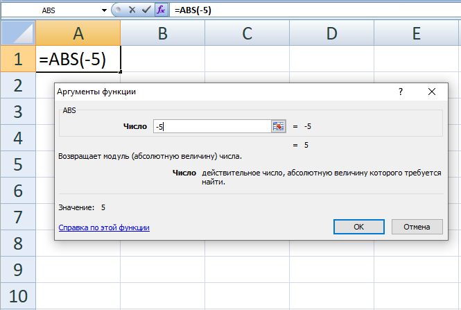
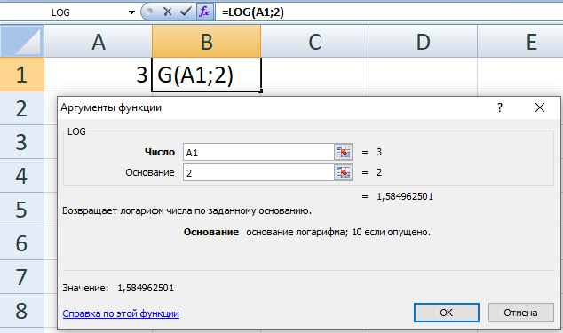

+++
date = '2026-05-05T08:00:00+05:00'
title = 'Электронные таблицы. Основные принципы работы'
tags = ["informatika", "Excel", "Электронные таблицы"]
categories = ["informatika"]
courses = ["informatika"]
+++

<!--more-->

### Форматы

Файлы электронных таблиц имеют следующие расширения:

- xlsx - Office Open XML открытый формат. Является zip-архивом
- .xls - проприетарные документы MS Excel

### Вид электронной таблицы

Основные элементы электронных таблиц:


	\begin{tikzpicture}
 		\node[above right, inner sep=0] (image) at (0,0) {
		    \includegraphics[width=10cm]{excel_base_1.png}
		};
	       
		\begin{scope}[x={($0.1*(image.south east)$)},	y={($0.1*(image.north west)$)}]
            \draw[ultra thick, red!80!black] (0,8.8) rectangle (5,10)
			node[above left,white,fill=red!80!black]{\small имя ячейки/ссылка на ячейку};
			    
			\draw[latex-, very thick,red!80!black] (7.0,3.1) edge (8,0) (9,4.2) -- (8,0)
			node[below, white, fill=red!80!black]{\small ячейки/cells};
			    
			\draw[ultra thick, red!80!black] (0.7,8.5) rectangle (10,7.5) 
			node[below left,white,fill=red!80!black]{\small столбцы/columns};
			    
			\draw[ultra thick, red!80!black] (0.8,7.5) rectangle (0,2)
			node[above right,white,rotate=90,fill=red!80!black]{\small строки/rows};
				   
			\draw[ultra thick, red!80!black] (7,8.8) rectangle (10,10)
			node[above left,white,fill=red!80!black]{\small поле ввода в ячейку};
			
			\draw[ultra thick, red!80!black] (1.8,2.0) rectangle (6.5,1.2)
			node[below left,white,fill=red!80!black]{\small листы/sheets};
	    
			\draw[ultra thick, red!80!black] (0,1.1) rectangle (1.8,0)
			node[below left,white,fill=red!80!black]{\small состояние};
		\end{scope}
	\end{tikzpicture}


При использовании альтернативного вида ссылок на ячейки **R1C1**:


	\begin{tikzpicture}
 		\node[above right, inner sep=0] (image) at (0,0) {
		    \includegraphics[width=10cm]{excel_base_2.png}
		};
	       
		\begin{scope}[x={($0.1*(image.south east)$)},	y={($0.1*(image.north west)$)}]
            \draw[ultra thick, red!80!black] (0,8.8) rectangle (5,10)
			node[above left,white,fill=red!80!black]{\small имя ячейки/ссылка на ячейку};
			    
			\draw[latex-, very thick,red!80!black] (7.0,3.1) edge (8,0) (9,4.2) -- (8,0)
			node[below, white, fill=red!80!black]{\small ячейки/cells};
			    
			\draw[ultra thick, red!80!black] (0.7,8.5) rectangle (10,7.5) 
			node[below left,white,fill=red!80!black]{\small столбцы/columns};
			    
			\draw[ultra thick, red!80!black] (0.8,7.5) rectangle (0,2)
			node[above right,white,rotate=90,fill=red!80!black]{\small строки/rows};
				   
			\draw[ultra thick, red!80!black] (7,8.8) rectangle (10,10)
			node[above left,white,fill=red!80!black]{\small поле ввода в ячейку};
			
			\draw[ultra thick, red!80!black] (1.8,2.0) rectangle (6.5,1.2)
			node[below left,white,fill=red!80!black]{\small листы/sheets};
	    
			\draw[ultra thick, red!80!black] (0,1.1) rectangle (1.8,0)
			node[below left,white,fill=red!80!black]{\small состояние};
		\end{scope}
	\end{tikzpicture}


Включение вида **R1C1** ссылок для Excel 2007: Параметры Excel → Формулы → Работа с формулами → Стиль ссылок R1C1 

### Ячейка

Ячейка является основным элементом электронных таблиц. 

В ячейке может храниться:
- **текст** (набор символов)
- **число** (целое, дробное, процент, дата/время)
- **формула** (выражение, начинающееся с `=`, например, `=1+2`)
- **логическое значение** (`ИСТИНА`/`ЛОЖЬ` или `TRUE`/`FALSE`)
- **пустое значение** (ячейка не заполнена)
- **ошибка** (например, `#ДЕЛ/0!`, `#Н/Д`)
- **гиперссылка**
- **мини-диаграмма**
- **изображение** 

### Математические вычисления

Электронные таблицы позволяют проводить разные вычисления.

Рассмотрим пример арифметической (математической) операции:

\tikz[baseline] {
    % Узлы с операндами и оператором
    \node[fill=green!20, anchor=base, text=black!95] (nA) {$A$};
    \node[fill=red!20, ellipse, anchor=base, text=black!95] (plus) at ([xshift=12pt]nA.base east) {$+$};
    \node[fill=green!20, anchor=base, text=black!95] (nB) at ([xshift=10pt]plus.base east) {$B$};

    % Подписи над операндами со стрелками вниз
    \node[above left=0.6cm of nA, green!70!black] (labelA) {операнд};
    \draw[-latex, thick, green!50] (labelA.south) -- (nA.north west);

    \node[above right=0.6cm of nB, green!70!black] (labelB) {операнд};
    \draw[-latex, thick, green!50] (labelB.south) -- (nB.north east);

    % Подпись над оператором со стрелкой вниз
    \node[above=0.7cm of plus, red!70!black] (labelPlus) {оператор};
    \draw[-latex, thick, red!50] (labelPlus.south) -- (plus.north);

    % Фигурная скобка с подписью по центру
    \draw[decorate, decoration={brace, amplitude=10pt, mirror}, thick] (nA.south west) -- (nB.south east)
        node[below, yshift=-12pt, midway] {операция};
}


Если подставить числа, то операция принимает вид:


\tikz[baseline] {
    % Узлы с операндами и оператором
    \node[fill=green!20, anchor=base, text=black!95] (nA) {1};
    \node[fill=red!20, ellipse, anchor=base, text=black!95] (plus) at ([xshift=12pt]nA.base east) {$+$};
    \node[fill=green!20, anchor=base, text=black!95] (nB) at ([xshift=10pt]plus.base east) {2};

    % Подписи над операндами со стрелками вниз
    \node[above left=0.6cm of nA, green!70!black] (labelA) {операнд};
    \draw[-latex, thick, green!50] (labelA.south) -- (nA.north west);

    \node[above right=0.6cm of nB, green!70!black] (labelB) {операнд};
    \draw[-latex, thick, green!50] (labelB.south) -- (nB.north east);

    % Подпись над оператором со стрелкой вниз
    \node[above=0.7cm of plus, red!70!black] (labelPlus) {оператор};
    \draw[-latex, thick, red!50] (labelPlus.south) -- (plus.north);

    % Фигурная скобка с подписью по центру
    \draw[decorate, decoration={brace, amplitude=10pt, mirror}, thick] (nA.south west) -- (nB.south east)
        node[below, yshift=-12pt, midway] {операция};
}


для вычисления результата такой операции в электронных таблицах используется **формула**. 
Запись **формулы** начинается со знака = (равно):


	\begin{tikzpicture}[
	img/.style={
		inner sep=0pt,
		anchor=north west
	},
	frm/.style={
		inner sep=0pt,
		anchor=north west,
		draw=red!70!black,
		line width=1pt
	},
	]
	\node[img] (img1) at (0,0) {\includegraphics[width=6cm, trim=0 0 0 0, clip]{excel_formula_1.png}};
	\node[img] (img2) at (6.2,0) {\includegraphics[width=6cm, trim=0 0 0 0, clip]{excel_formula_2.png}};
	%\node[frm, minimum width=1.5cm, minimum height=0.6cm] (frm1) at (8.3,0.0) {};
	%\node[frm, minimum width=1.2cm, minimum height=0.9cm] (frm2) at (10.2,-0.55) {};
	%\node[frm, minimum width=0.6cm, minimum height=0.7cm] (frm3) at (6.85,-1.6) {};

	% вспомогательная сетка:
	   %\draw[help lines] (-1,0) grid (12,-2);
	   %\foreach \x in {-1,...,12} % Подписи по оси X
	     %\node[anchor=north east, text=green!70!black] at (\x,0) {\small\x};
	   %\foreach \y in {-0,...,-2} % Подписи по оси Y
	     %\node[anchor=south east, text=green!70!black] at (0,\y) {\small\y};
	\end{tikzpicture}


***Примечание:*** *можно начать запись формулы с оператора, тогда знак = будет подставлен автоматически. Например запись -3+5 автоматически превратится в формулу =-3+5*

Основные арифметические операции представлены в таблице:

#### Таблица арифметических операций

|       Операция       | Символ оператора | Приоритет | Пример формулы | Результат |
| :------------------: | :--------------: | :-------: | :------------- | :-------: |
|       сложение       |        +         |     3     | =3+2           |     5     |
|      вычитание       |        -         |     3     | =3-4           |    -1     |
|      умножение       |        *         |     2     | =5*3           |    15     |
|       деление        |        /         |     2     | =5/2           |    2,5    |
| возведение в степень |        ^         |     1     | =2^3           |     8     |

Если в операции больше одного оператора, то такая операция называется **смешанная операция** или **комбинированная операция**.

Пример комбинированной операции:


\tikz[baseline] {
    % Узлы с операндами и оператором
    \node[fill=green!20, anchor=base, text=black!95] (nA) {$A$};
    \node[fill=red!20, ellipse, anchor=base, text=black!95] (plus) at ([xshift=12pt]nA.base east) {$+$};
    \node[fill=green!20, anchor=base, text=black!95] (nB) at ([xshift=10pt]plus.base east) {$B$};
    \node[fill=red!20, ellipse, anchor=base, text=black!95] (times) at ([xshift=12pt]nB.base east) {$*$};
    \node[fill=green!20, anchor=base, text=black!95] (nC) at ([xshift=10pt]times.base east) {$C$};

    % Подписи над операндами со стрелками вниз
    \node[above left=0.6cm of nA, green!70!black] (labelA) {операнд};
    \draw[-latex, thick, green!50] (labelA.south) -- (nA.north west);

    \node[below right=0.6cm of nB, green!70!black] (labelB) {операнд};
    \draw[-latex, thick, green!50] (labelB.north) -- (nB.south east);

    \node[above right=0.6cm of nC, green!70!black] (labelC) {операнд};
    \draw[-latex, thick, green!50] (labelC.south) -- (nC.north east);

    % Подпись над оператором со стрелкой вниз
    \node[above=0.7cm of plus, red!70!black] (labelPlus) {оператор};
    \draw[-latex, thick, red!50] (labelPlus.south) -- (plus.north);

    \node[below right=0.2cm and 1.2cm of times, red!70!black] (labelPlus) {оператор};
    \draw[-latex, thick, red!50] (labelPlus.west) -- (times.south east);

    % Фигурная скобка с подписью по центру
    \draw[decorate, decoration={brace, amplitude=10pt, mirror}, thick]
        (nA.south west) -- (nB.south east) node[below, yshift=-10pt, midway] {операция};
    \draw[decorate, decoration={brace, amplitude=10pt, mirror}, thick]
        (nC.north east) -- (nB.north west) node[above, yshift=8pt, midway] {операция};
}


В соответствии с таблицей приоритет умножения 2, приоритет сложения 3, значит сначала будет произведена операция умножения, а затем операция сложения.

Если мы хотим произвести операцию с меньшим приоритетом до операции с большим приоритетом, то необходимо использовать скобки:


\tikz[baseline] {
    % Узлы с операндами и оператором
    \node[fill=green!20, anchor=base, text=black!95] (nA) {$A$};
    \node[anchor=base, text=violet, scale=1.3] (lBracket) at ([xshift=-3pt]nA.base west) {$($};
    \node[fill=red!20, ellipse, anchor=base, text=black!95] (plus) at ([xshift=12pt]nA.base east) {$+$};
    \node[fill=green!20, anchor=base, text=black!95] (nB) at ([xshift=10pt]plus.base east) {$B$};
    \node[anchor=base, text=violet, scale=1.3] (rBracket) at ([xshift=3pt]nB.base east) {$)$};
    \node[fill=red!20, ellipse, anchor=base, text=black!95] (times) at ([xshift=5pt]rBracket.base east) {$*$};
    \node[fill=green!20, anchor=base, text=black!95] (nC) at ([xshift=10pt]times.base east) {$C$};

    % Подписи над операндами со стрелками вниз
    \node[above left=0.6cm of nA, green!70!black] (labelA) {операнд};
    \draw[-latex, thick, green!50] (labelA.south) -- (nA.north west);

    \node[below right=0.6cm of nB, green!70!black] (labelB) {операнд};
    \draw[-latex, thick, green!50] (labelB.north) -- (nB.south east);

    \node[above right=0.6cm of nC, green!70!black] (labelC) {операнд};
    \draw[-latex, thick, green!50] (labelC.south) -- (nC.north east);

    % Подпись над оператором со стрелкой вниз
    \node[above=0.7cm of plus, red!70!black] (labelPlus) {оператор};
    \draw[-latex, thick, red!50] (labelPlus.south) -- (plus.north);

    \node[below right=0.2cm and 1.2cm of times, red!70!black] (labelPlus) {оператор};
    \draw[-latex, thick, red!50] (labelPlus.west) -- (times.south east);

    % Фигурная скобка с подписью по центру
    \draw[decorate, decoration={brace, amplitude=10pt, mirror}, thick]
        (nA.south west) -- (nB.south east) node[below, yshift=-10pt, midway] {операция};
    \draw[decorate, decoration={brace, amplitude=10pt, mirror}, thick]
        (nC.north east) -- (nB.north west) node[above, yshift=8pt, midway] {операция};
}


пример такой операции:

=(1+2)*3

результатом будет 9. 

Ещё один пример:

=9^(1/2)

результатом будет 3, так как сначала будет вычислено деление в степени, равное 0.5, а далее 3 будет возведено в степень 0.5. Если скобки не поставить, то формула

=9^1/2

будет равна 4.5, т.к. сначала будет посчитано возведение в степень 9^1, а далее 9/2=4.5

#### Самостоятельное задание

В новом документе электронных таблиц посчитайте операции из таблицы выше.

## Ссылки

- Ссылка нужна для того, чтобы в одной ячейке использовать значение из другой ячейки.
- Ссылка состоит из указания номера (буквы) *столбца* и номера *строки* ячейки, из которой будет получено значение.
- Ссылка используется в формулах.

Пример использования ссылки:


	\begin{tikzpicture}[
	img/.style={
		inner sep=0pt,
		anchor=north west
	},
	frm/.style={
		inner sep=0pt,
		anchor=north west,
		draw=red!70!black,
		line width=1pt
	},
	]
	\node[img] (img1) at (0,0) {\includegraphics[width=6cm, trim=0 0 0 0, clip]{excel_cell_2.png}};
	\node[img] (img2) at (6.2,0) {\includegraphics[width=6cm, trim=0 0 0 0, clip]{excel_cell_1.png}};
	%\node[frm, minimum width=1.5cm, minimum height=0.6cm] (frm1) at (8.3,0.0) {};
	%\node[frm, minimum width=1.2cm, minimum height=0.9cm] (frm2) at (10.2,-0.55) {};
	%\node[frm, minimum width=0.6cm, minimum height=0.7cm] (frm3) at (6.85,-1.6) {};

	% вспомогательная сетка:
	   %\draw[help lines] (-1,0) grid (12,-2);
	   %\foreach \x in {-1,...,12} % Подписи по оси X
	     %\node[anchor=north east, text=green!70!black] at (\x,0) {\small\x};
	   %\foreach \y in {-0,...,-2} % Подписи по оси Y
	     %\node[anchor=south east, text=green!70!black] at (0,\y) {\small\y};
	\end{tikzpicture}


#### Самостоятельное задание

Столбцы имеют номера: **A**, **B**, **C**, ..., **X**, **Y**, **Z**, ...

Напишите следующие 5 номеров столбоцов после **Z**.

#### Самостоятельное задание

В режиме **R1C1** число после **R** обозначает номер строки (*row*), число после **C** - номер столбца (*column*).
Например ссылка **A3** будет указывать на ту же ячейку, что и **R3C1**, аналогично для **D5** и **R5C4**.

Заполните пропуски в таблице:

| Стиль **A1** | Стиль **R1C1** |
| ------------ | -------------- |
| A1           | R1C1           |
| C5           | R5C3           |
| F10          |                |
|              | R2C7           |
| AA3          |                |
|              | R10C33         |
| B2           |                |
|              | R7C4           |
| Z1           |                |
|              | R15C39         |

### Протягивание ячеек

Протягивание ячеек позволяет создавать *диапазоны ячеек* с логикой заполнения, определяемой изначально выбранными ячейками.

Для того, чтобы протянуть ячейку (или диапазон ячеек), нужно:
1. выделить ячейки, навести курсор на правый нижний угол ячейки (или диапазона),
2. зажать ЛКМ (левую клавишу мыши)
3. сместить курсор в сторону (вниз, вверх, влево или вправо), в которую необходимо добавить значения

Например в двух ячейках указаны номера 1 и 2, логика заключается в том, что число 2 на единицу больше числа 1, если протянуть диапазон вниз, то следующие ячейки посчитаются исходя из этой логики.


	\begin{tikzpicture}[
	img/.style={
		inner sep=0pt,
		anchor=north west
	},
	frm/.style={
		inner sep=0pt,
		anchor=north west,
		draw=red!70!black,
		line width=1pt
	},
	]
	\node[img] (img1) at (0,0) {\includegraphics[width=4cm, trim=0 0 0 0, clip]{excel_cells_1.png}};
	\node[img] (img2) at (4.2,0) {\includegraphics[width=4cm, trim=0 0 0 0, clip]{excel_cells_2.png}};
	\node[img] (img3) at (8.4,0) {\includegraphics[width=4cm, trim=0 0 0 0, clip]{excel_cells_3.png}};
	%\node[frm, minimum width=1.5cm, minimum height=0.6cm] (frm1) at (8.3,0.0) {};
	%\node[frm, minimum width=1.2cm, minimum height=0.9cm] (frm2) at (10.2,-0.55) {};
	%\node[frm, minimum width=0.6cm, minimum height=0.7cm] (frm3) at (6.85,-1.6) {};

	% вспомогательная сетка:
	   %\draw[help lines] (-1,0) grid (12,-2);
	   %\foreach \x in {-1,...,12} % Подписи по оси X
	     %\node[anchor=north east, text=green!70!black] at (\x,0) {\small\x};
	   %\foreach \y in {-0,...,-2} % Подписи по оси Y
	     %\node[anchor=south east, text=green!70!black] at (0,\y) {\small\y};
	\end{tikzpicture}


### Абсолютные и относительные ссылки

Указание строки и(или) столбца может быть **относительным** или **абсолютным**
- Относительная ссылка указывает на строку/столбец относительно той ячейки, в которой она записана и изменяется при копировании/переносе/протягивании ячейки
- Ссылки по-умолчанию - относительные
- Относительное положение в обычном виде ссылок определяется неявно
- При виде **R1C1** относительные номера строк/столбцов указываются явно, положительные - сдвиг вниз/вправо, отрицательные - вверх/влево

Пример копирования относительных ссылок - вид ссылки меняется в зависимости от ячейки, куда она была скопирована:

	\begin{tikzpicture}[
	img/.style={
		inner sep=0pt,
		anchor=north west
	},
	frm/.style={
		inner sep=0pt,
		anchor=north west,
		draw=red!70!black,
		line width=1pt
	},
	]
	\node[img] (img1) at (0,0) {\includegraphics[width=6cm, trim=0 0 0 0, clip]{excel_cells_absrel_1.png}};
	\node[img] (img2) at (6.2,0) {\includegraphics[width=6cm, trim=0 0 0 0, clip]{excel_cells_absrel_2.png}};
	%\node[frm, minimum width=1.5cm, minimum height=0.6cm] (frm1) at (8.3,0.0) {};
	%\node[frm, minimum width=1.2cm, minimum height=0.9cm] (frm2) at (10.2,-0.55) {};
	%\node[frm, minimum width=0.6cm, minimum height=0.7cm] (frm3) at (6.85,-1.6) {};

	% вспомогательная сетка:
	   %\draw[help lines] (-1,0) grid (12,-2);
	   %\foreach \x in {-1,...,12} % Подписи по оси X
	     %\node[anchor=north east, text=green!70!black] at (\x,0) {\small\x};
	   %\foreach \y in {-0,...,-2} % Подписи по оси Y
	     %\node[anchor=south east, text=green!70!black] at (0,\y) {\small\y};
	\end{tikzpicture}


- Абсолютная ссылка указывает на конкретную строку или столбец и не изменяется при копировании/переносе/протягивании ячейки.
- Для указания абсолютной ссылки на строку/столбец в обычном стиле, перед строкой/столбцом необходимо поставить знак **$**
- Абсолютные ссылки удобно использовать для определения постоянных величин (констант).

Пример копирования ссылки с абсолютным указанием столбца - строка не меняется при копировании:


	\begin{tikzpicture}[
	img/.style={
		inner sep=0pt,
		anchor=north west
	},
	frm/.style={
		inner sep=0pt,
		anchor=north west,
		draw=red!70!black,
		line width=1pt
	},
	]
	\node[img] (img1) at (0,0) {\includegraphics[width=6cm, trim=0 0 0 0, clip]{excel_cells_absrel_3.png}};
	\node[img] (img2) at (6.2,0) {\includegraphics[width=6cm, trim=0 0 0 0, clip]{excel_cells_absrel_4.png}};
	%\node[frm, minimum width=1.5cm, minimum height=0.6cm] (frm1) at (8.3,0.0) {};
	%\node[frm, minimum width=1.2cm, minimum height=0.9cm] (frm2) at (10.2,-0.55) {};
	%\node[frm, minimum width=0.6cm, minimum height=0.7cm] (frm3) at (6.85,-1.6) {};

	% вспомогательная сетка:
	   %\draw[help lines] (-1,0) grid (12,-2);
	   %\foreach \x in {-1,...,12} % Подписи по оси X
	     %\node[anchor=north east, text=green!70!black] at (\x,0) {\small\x};
	   %\foreach \y in {-0,...,-2} % Подписи по оси Y
	     %\node[anchor=south east, text=green!70!black] at (0,\y) {\small\y};
	\end{tikzpicture}


- Для смены типа ссылки используется клавиша **F4**

Примеры разных типов ссылок:

#### Таблица относительных и абсолютных ссылок

\begin{tabular}{
	>{\small}p{2.5cm}|>{\small}p{2.5cm}|>{\small}p{2.5cm}>{\small}p{1cm}|>{\small}p{1cm}>{\small}p{1cm}|>{\small}p{4.5cm}
	}
\hline
\multirow{2}{*}{Строка} & \multirow{2}{*}{Столбец} & \multicolumn{2}{>{\small}p{1cm}|}{Обычный вид} & \multicolumn{2}{>{\small}c|}{Вид R1C1} & \multicolumn{1}{>{\small}c}{\multirow{2}{*}{Описание}} \\ \cline{3-6}
 & & \multicolumn{1}{>{\small}p{0.9cm}|}{ячейка} & \multicolumn{1}{>{\small}p{1.0cm}|}{\makecell{содер- \\ жимое}} & \multicolumn{1}{>{\small}p{0.9cm}|}{ячейка} & \multicolumn{1}{>{\small}p{1.2cm}|}{\makecell{содер- \\ жимое}} & \multicolumn{1}{>{\small}p{1cm}}{} \\ \hline
{\normalsize  относительная} & {\normalsize  относительная} & \multicolumn{1}{>{\small}p{1cm}|}{A2} & =B4 & \multicolumn{1}{>{\small}c|}{R2C1} & =R{[}2{]}C{[}1{]} & ссылка на две строки вниз и один столбец вправо \\ \hline
{\normalsize  относительная} & {\normalsize абсолютная} & \multicolumn{1}{>{\small}p{1cm}|}{A2} & =\$B4 & \multicolumn{1}{>{\small}c|}{R2C1} & =R{[}2{]}C2 & ссылка на две строки вниз и второй (B) столбец \\ \hline
{\normalsize абсолютная} & {\normalsize  относительная} & \multicolumn{1}{>{\small}p{1cm}|}{A2} & =B\$4   & \multicolumn{1}{>{\small}c|}{R2C1} & =R4C{[}1{]} & ссылка на четвёртую строку и один столбец вправо \\ \hline
{\normalsize абсолютная} & {\normalsize абсолютная} & \multicolumn{1}{>{\small}p{1cm}|}{A2} & =\$B\$4   & \multicolumn{1}{>{\small}c|}{R2C1} & =R4C2   & ссылка на четвёртую строку второго столбца   \\ \hline
\end{tabular}


#### Самостоятельное задание

Заполните пустые ячейки таблицы:


\begin{tabular}{
	>{\small}p{2.5cm}|>{\small}p{2.5cm}|>{\small}p{2.5cm}>{\small}p{1cm}|>{\small}p{1cm}>{\small}p{1cm}|>{\small}p{4.5cm}
	}
\hline
\multirow{2}{*}{Строка} & \multirow{2}{*}{Столбец} & \multicolumn{2}{>{\small}p{1cm}|}{Обычный вид} & \multicolumn{2}{>{\small}c|}{Вид R1C1} & \multicolumn{1}{>{\small}c}{\multirow{2}{*}{Описание}} \\ \cline{3-6}
 & & \multicolumn{1}{>{\small}p{0.9cm}|}{ячейка} & \multicolumn{1}{>{\small}p{1.0cm}|}{\makecell{содер- \\ жимое}} & \multicolumn{1}{>{\small}p{0.9cm}|}{ячейка} & \multicolumn{1}{>{\small}p{1.2cm}|}{\makecell{содер- \\ жимое}} & \multicolumn{1}{>{\small}p{1cm}}{} \\ \hline
{\normalsize  относительная} & {\normalsize  относительная} & \multicolumn{1}{>{\small}p{1cm}|}{D4} & & \multicolumn{1}{>{\small}c|}{} & & ссылка на три строки вниз и один столбец вправо \\ \hline
{\normalsize  относительная} & {\normalsize абсолютная} & \multicolumn{1}{>{\small}p{1cm}|}{D5} &  & \multicolumn{1}{>{\small}c|}{} &  & ссылка на четыре строки вверх и пятый столбец \\ \hline
{\normalsize абсолютная} & {\normalsize  относительная} & \multicolumn{1}{>{\small}p{1cm}|}{} &  & \multicolumn{1}{>{\small}c|}{R5C2} & & ссылка на первую строку и один столбец влево \\ \hline
{\normalsize абсолютная} & {\normalsize абсолютная} & \multicolumn{1}{>{\small}p{1cm}|}{} &  & \multicolumn{1}{>{\small}c|}{R6C3} & & ссылка на вторую строку шестого столбца \\ \hline
\end{tabular}


#### Имена

Любой ячейке или диапазону ячеек можно присвоить **Имя**. **Имя** представляет собой абсолютную ссылку:


	\begin{tikzpicture}[
	img/.style={
		inner sep=0pt,
		anchor=north west
	},
	frm/.style={
		inner sep=0pt,
		anchor=north west,
		draw=red!70!black,
		line width=1pt
	},
	]
	\node[img] (img1) at (0,0) {\includegraphics[width=6cm, trim=0 0 0 0, clip]{excel_names_1.png}};
	\node[img] (img2) at (2.,-2.) {\includegraphics[width=6cm, trim=0 0 0 0, clip]{excel_names_2.png}};
	\node[img] (img3) at (4.,-4.) {\includegraphics[width=6cm, trim=0 0 0 0, clip]{excel_names_3.png}};
	%\node[frm, minimum width=1.5cm, minimum height=0.6cm] (frm1) at (8.3,0.0) {};
	%\node[frm, minimum width=1.2cm, minimum height=0.9cm] (frm2) at (10.2,-0.55) {};
	%\node[frm, minimum width=0.6cm, minimum height=0.7cm] (frm3) at (6.85,-1.6) {};

	% вспомогательная сетка:
	   %\draw[help lines] (-1,0) grid (12,-2);
	   %\foreach \x in {-1,...,12} % Подписи по оси X
	     %\node[anchor=north east, text=green!70!black] at (\x,0) {\small\x};
	   %\foreach \y in {-0,...,-2} % Подписи по оси Y
	     %\node[anchor=south east, text=green!70!black] at (0,\y) {\small\y};
	\end{tikzpicture}


Создавать, изменять, удалять **имена** можно с помощью инструмента **Формулы** - **Диспетчер имён**:


	\begin{tikzpicture}[
	img/.style={
		inner sep=0pt,
		anchor=north west
	},
	frm/.style={
		inner sep=0pt,
		anchor=north west,
		draw=red!70!black,
		line width=1pt
	},
	]
	\node[img] (img1) at (0,0) {\includegraphics[width=6cm, trim=0 0 0 0, clip]{excel_names_4.png}};
	\node[img] (img2) at (1.,-1.34) {\includegraphics[width=6cm, trim=0 0 0 0, clip]{excel_names_5.png}};
	%\node[frm, minimum width=1.5cm, minimum height=0.6cm] (frm1) at (8.3,0.0) {};
	%\node[frm, minimum width=1.2cm, minimum height=0.9cm] (frm2) at (10.2,-0.55) {};
	%\node[frm, minimum width=0.6cm, minimum height=0.7cm] (frm3) at (6.85,-1.6) {};

	% вспомогательная сетка:
	   %\draw[help lines] (-1,0) grid (12,-2);
	   %\foreach \x in {-1,...,12} % Подписи по оси X
	     %\node[anchor=north east, text=green!70!black] at (\x,0) {\small\x};
	   %\foreach \y in {-0,...,-2} % Подписи по оси Y
	     %\node[anchor=south east, text=green!70!black] at (0,\y) {\small\y};
	\end{tikzpicture}


Правила создания **имён**:
- Первым символом имени должна быть буква, знак подчеркивания (\_) или обратная косая черта (\\). Остальные символы имени могут быть буквами, цифрами, точками и знаками подчеркивания.
- Имена не могут быть такими же, как ссылки на ячейки, например, Z\$100 или R1C1.
- Нельзя использовать имена ячеек: R, r, C, c, так как эти буквы используются для ссылок на ячейки.
- Пробелы не допускаются. В качестве разделителей слов используйте символ подчеркивания (\_) или точку (.), например, **Налог\_Продаж** или **Первый.Квартал**.
- Имя может содержать до 255-ти символов.
- Имя может состоять из строчных и прописных букв. При этом процессоры электронных таблиц не различают строчные и прописные буквы в именах.

### Зависимости формул

Если в одной ячейке есть ссылка на другую ячейку, то первая ячейка называется **зависимой**, а вторая - **влияющей**.

Можно включить визуальное отображение зависимостей между ячейками с помощью раздела **Формулы** - **Зависимости формул**:


	\begin{tikzpicture}[
	img/.style={
		inner sep=0pt,
		anchor=north west
	},
	frm/.style={
		inner sep=0pt,
		anchor=north west,
		draw=red!70!black,
		line width=1pt
	},
	]
	\node[img] (img1) at (0,0) {\includegraphics[width=12cm, trim=0 0 0 0, clip]{excel_cells_rel_1.png}};
	\node[img, below=1.5cm of img1] (img2) {\includegraphics[width=12cm, trim=17cm 0 4cm 1cm, clip]{excel_cells_rel_1.png}};
	%\node[frm, minimum width=1.5cm, minimum height=0.6cm] (frm1) at (8.3,0.0) {};
	%\node[frm, minimum width=1.2cm, minimum height=0.9cm] (frm2) at (10.2,-0.55) {};
	%\node[frm, minimum width=0.6cm, minimum height=0.7cm] (frm3) at (6.85,-1.6) {};

	% вспомогательная сетка:
	   %\draw[help lines] (-1,0) grid (12,-2);
	   %\foreach \x in {-1,...,12} % Подписи по оси X
	     %\node[anchor=north east, text=green!70!black] at (\x,0) {\small\x};
	   %\foreach \y in {-0,...,-2} % Подписи по оси Y
	     %\node[anchor=south east, text=green!70!black] at (0,\y) {\small\y};
	\end{tikzpicture}


Пример включения опции **Влияющие ячейки**:

	\begin{tikzpicture}[
	img/.style={
		inner sep=0pt,
		anchor=north west
	},
	frm/.style={
		inner sep=0pt,
		anchor=north west,
		draw=red!70!black,
		line width=1pt
	},
	]
	\node[img] (img1) at (0,0) {\includegraphics[width=6cm, trim=0 0 0 0, clip]{excel_cells_rel_2.png}};
	\node[img] (img2) at (6.2,0) {\includegraphics[width=6cm, trim=0 0 0 0, clip]{excel_cells_rel_3.png}};
	%\node[frm, minimum width=1.5cm, minimum height=0.6cm] (frm1) at (8.3,0.0) {};
	%\node[frm, minimum width=1.2cm, minimum height=0.9cm] (frm2) at (10.2,-0.55) {};
	%\node[frm, minimum width=0.6cm, minimum height=0.7cm] (frm3) at (6.85,-1.6) {};

	% вспомогательная сетка:
	   %\draw[help lines] (-1,0) grid (12,-2);
	   %\foreach \x in {-1,...,12} % Подписи по оси X
	     %\node[anchor=north east, text=green!70!black] at (\x,0) {\small\x};
	   %\foreach \y in {-0,...,-2} % Подписи по оси Y
	     %\node[anchor=south east, text=green!70!black] at (0,\y) {\small\y};
	\end{tikzpicture}


### Полный путь ссылки
До это мы рассматривали ссылки, которые работали в пределах одного листа. Если мы хотим сослаться на ячейки на другом листе документа, мы должны добавить имя листа перед ссылкой:

	\begin{tikzpicture}[
	img/.style={
		inner sep=0pt,
		anchor=north west
	},
	frm/.style={
		inner sep=0pt,
		anchor=north west,
		draw=red!70!black,
		line width=1pt
	},
	]
	\node[img] (img1) at (0,0) {\includegraphics[width=6cm, trim=0 0 0 0, clip]{excel_cells_fullpath_1.png}};
	\node[img] (img2) at (6.2,0) {\includegraphics[width=6cm, trim=0 0 0 0, clip]{excel_cells_fullpath_2.png}};
	%\node[frm, minimum width=1.5cm, minimum height=0.6cm] (frm1) at (8.3,0.0) {};
	%\node[frm, minimum width=1.2cm, minimum height=0.9cm] (frm2) at (10.2,-0.55) {};
	%\node[frm, minimum width=0.6cm, minimum height=0.7cm] (frm3) at (6.85,-1.6) {};

	% вспомогательная сетка:
	   %\draw[help lines] (-1,0) grid (12,-2);
	   %\foreach \x in {-1,...,12} % Подписи по оси X
	     %\node[anchor=north east, text=green!70!black] at (\x,0) {\small\x};
	   %\foreach \y in {-0,...,-2} % Подписи по оси Y
	     %\node[anchor=south east, text=green!70!black] at (0,\y) {\small\y};
	\end{tikzpicture}


В примере выше написаны два варианта ссылки, с кавычками и без. Можно писать и так, и так. Но если в названии листа есть пробелы, то использовать кавычки обязательно.

Если мы хотим сослаться не только на другой лист текущего документа, но на лист другого документа (который открыт в данный момент), то нужно перед листом ещё указать имя документа (называемый книгой):


	\begin{tikzpicture}[
	img/.style={
		inner sep=0pt,
		anchor=north west
	},
	frm/.style={
		inner sep=0pt,
		anchor=north west,
		draw=red!70!black,
		line width=1pt
	},
	]
	\node[img] (img1) at (0,0) {\includegraphics[width=12cm, trim=0 0 0 0, clip]{excel_cells_fullpath_3.png}};
	%\node[frm, minimum width=1.5cm, minimum height=0.6cm] (frm1) at (8.3,0.0) {};
	%\node[frm, minimum width=1.2cm, minimum height=0.9cm] (frm2) at (10.2,-0.55) {};
	%\node[frm, minimum width=0.6cm, minimum height=0.7cm] (frm3) at (6.85,-1.6) {};

	% вспомогательная сетка:
	   %\draw[help lines] (-1,0) grid (12,-2);
	   %\foreach \x in {-1,...,12} % Подписи по оси X
	     %\node[anchor=north east, text=green!70!black] at (\x,0) {\small\x};
	   %\foreach \y in {-0,...,-2} % Подписи по оси Y
	     %\node[anchor=south east, text=green!70!black] at (0,\y) {\small\y};
	\end{tikzpicture}


тогда полная ссылка будет выглядеть так:

=\`[Книга2.xlsx]Лист1\`!A1

### Ссылка на диапазон ячеек

Для ссылки на диапазон ячеек нужно указать левую вверхнюю и правую нижнюю ячейку, разделённых знаком двоеточие (**:**), как показано на примере:


	\begin{tikzpicture}[
	img/.style={
		inner sep=0pt,
		anchor=north west
	},
	frm/.style={
		inner sep=0pt,
		anchor=north west,
		draw=red!70!black,
		line width=1pt
	},
	]
	\node[img] (img1) at (0,0) {\includegraphics[width=6cm, trim=0 0 0 0, clip]{excel_range_1.png}};
	\node[img] (img2) at (6.2,0) {\includegraphics[width=6cm, trim=0 0 0 0, clip]{excel_range_2.png}};
	%\node[frm, minimum width=1.5cm, minimum height=0.6cm] (frm1) at (8.3,0.0) {};
	%\node[frm, minimum width=1.2cm, minimum height=0.9cm] (frm2) at (10.2,-0.55) {};
	%\node[frm, minimum width=0.6cm, minimum height=0.7cm] (frm3) at (6.85,-1.6) {};

	% вспомогательная сетка:
	   %\draw[help lines] (-1,0) grid (12,-2);
	   %\foreach \x in {-1,...,12} % Подписи по оси X
	     %\node[anchor=north east, text=green!70!black] at (\x,0) {\small\x};
	   %\foreach \y in {-0,...,-2} % Подписи по оси Y
	     %\node[anchor=south east, text=green!70!black] at (0,\y) {\small\y};
	\end{tikzpicture}


#### Самостоятельное задание

Напишите ссылку на диапазон ячеек, в который вместятся все цифры шестнадцатиричной системы счисления.

### Форматы данных

Каждой ячейке может быть назначен формат данных. В зависимости от формата данные будут записываться и отображаться в разном виде. 
- Если формат не указывать явно, то он будет назначен при вводе значений в ячейку.
- Формат можно назначить сразу диапазону ячеек. В том числе можно назначить формат всему столбцу или всей строке.

Указание формата ячейки:

	\begin{tikzpicture}[
	img/.style={
		inner sep=0pt,
		anchor=north west
	},
	frm/.style={
		inner sep=0pt,
		anchor=north west,
		draw=red!70!black,
		line width=1pt
	},
	]
	\node[img] (img1) at (0,0) {\includegraphics[width=6cm, trim=0 0 0 0, clip]{excel_formats_1.png}};
	\node[img] (img2) at (6.2,0) {\includegraphics[width=8cm, trim=0 0 0 0, clip]{excel_formats_2.png}};
	%\node[frm, minimum width=1.5cm, minimum height=0.6cm] (frm1) at (8.3,0.0) {};
	%\node[frm, minimum width=1.2cm, minimum height=0.9cm] (frm2) at (10.2,-0.55) {};
	%\node[frm, minimum width=0.6cm, minimum height=0.7cm] (frm3) at (6.85,-1.6) {};

	% вспомогательная сетка:
	   %\draw[help lines] (-1,0) grid (12,-2);
	   %\foreach \x in {-1,...,12} % Подписи по оси X
	     %\node[anchor=north east, text=green!70!black] at (\x,0) {\small\x};
	   %\foreach \y in {-0,...,-2} % Подписи по оси Y
	     %\node[anchor=south east, text=green!70!black] at (0,\y) {\small\y};
	\end{tikzpicture}


### Оформление таблиц

При работе с электронными таблицами рекомендуется не просто вписывать данные и формулы, но добавлять визуальное оформление, а также добавлять комментарии:


	\begin{tikzpicture}[
	img/.style={
		inner sep=0pt,
		anchor=north west
	},
	frm/.style={
		inner sep=0pt,
		anchor=north west,
		draw=red!70!black,
		line width=1pt
	},
	]
	\node[img] (img1) at (0,0) {\includegraphics[width=6cm, trim=0 0 0 0, clip]{excel_goodview_1.png}};
	\node[img] (img2) at (6.3,-2) {\includegraphics[width=8cm, trim=0 0 0 0, clip]{excel_goodview_2.png}};
	\node[minimum width=1.5cm, minimum height=0.6cm, text=red!80!black] (frm1) at (2.5,0.5) {Плохой пример без оформления:};
	\node[minimum width=1.5cm, minimum height=0.6cm, text=green!60!black] (frm2) at (11.4,-1.5) {Хороший пример с оформлением:};
	%\node[frm, minimum width=1.2cm, minimum height=0.9cm] (frm2) at (10.2,-0.55) {};
	%\node[frm, minimum width=0.6cm, minimum height=0.7cm] (frm3) at (6.85,-1.6) {};

	% вспомогательная сетка:
	   %\draw[help lines] (-1,0) grid (12,-2);
	   %\foreach \x in {-1,...,12} % Подписи по оси X
	     %\node[anchor=north east, text=green!70!black] at (\x,0) {\small\x};
	   %\foreach \y in {-0,...,-2} % Подписи по оси Y
	     %\node[anchor=south east, text=green!70!black] at (0,\y) {\small\y};
	\end{tikzpicture}


Инструменты оформления электронных таблиц соответствуют оформлению таблиц в текстовых документах:
- Шрифт, размер шрифта, начертание, цвет, выравнивание, направление текста, перенос текста
- Заливка и границы ячейки


	\begin{tikzpicture}[
	img/.style={
		inner sep=0pt,
		anchor=north west
	},
	frm/.style={
		inner sep=0pt,
		anchor=north west,
		draw=red!70!black,
		line width=1pt
	},
	]
	\node[img] (img1) at (0,0) {\includegraphics[height=5cm, trim=0cm 14cm 6cm 0, clip]{excel_formats_1.png}};

	% вспомогательная сетка:
	   %\draw[help lines] (-1,0) grid (12,-2);
	   %\foreach \x in {-1,...,12} % Подписи по оси X
	     %\node[anchor=north east, text=green!70!black] at (\x,0) {\small\x};
	   %\foreach \y in {-0,...,-2} % Подписи по оси Y
	     %\node[anchor=south east, text=green!70!black] at (0,\y) {\small\y};
	\end{tikzpicture}


### Функции

Для реализации сложных математических, статистических, матричных и других операций в электронных таблицах используются **функции**.

- Функции добавляются в форумулы
- Функция, подобно функции в языках программирования, состоит из названия и аргументов, которые записаны в круглых скобках. Аргументы разделены между собой точкой с запятой (;)
- Функции можно записать с клавиатуры или воспользоваться мастером функций

#### Мастер функций
Выбор функции:


	\begin{tikzpicture}[
	img/.style={
		inner sep=0pt,
		anchor=north west
	},
	frm/.style={
		inner sep=0pt,
		anchor=north west,
		draw=red!70!black,
		line width=1pt
	},
	]
	\node[img] (img1) at (0,0) {\includegraphics[width=12cm, trim=0 0 0 0, clip]{excel_func_wizard_1.png}};
	\node[frm, minimum width=0.55cm, minimum height=0.55cm] (frm1) at (4.,-.0) {};

	% вспомогательная сетка:
	   %\draw[help lines] (-1,0) grid (12,-2);
	   %\foreach \x in {-1,...,12} % Подписи по оси X
	     %\node[anchor=north east, text=green!70!black] at (\x,0) {\small\x};
	   %\foreach \y in {-0,...,-2} % Подписи по оси Y
	     %\node[anchor=south east, text=green!70!black] at (0,\y) {\small\y};
	\end{tikzpicture}


Ввод аргумента функции:

Ввод аргументов функции для функции нескольких аргументов:

#### Самостоятельное задание
Откройте мастер функций и найдите, в какой категории расположены указанные функции. Заполните таблицу:

| Функция | Категория |
| ------- | --------- |
| СУММ    |           |
| ВПР     |           |
| ЕСЛИ    |           |
| ИНДЕКС  |           |
| СЕГОДНЯ |           |
| КОРЕНЬ  |           |
| СТРОКА  |           |

Примеры часто используемых функций представлены в таблице:


\begin{tabular}{p{2.2cm}|p{6.2cm}|p{3cm}|p{3cm}}
\hline
\textbf{Функция} & \textbf{Описание}                    & \textbf{Пример} & \textbf{Результат} \\ \hline
КОРЕНЬ           & квадратный корень числа              & =КОРЕНЬ(4)      & 2                  \\ \hline
ABS              & модуль (абсолютная величина) числа   & =ABS(\$A8)      & 4 если A8=-4       \\ \hline
EXP & экспонента числа & \begin{tabular}[c]{@{}c@{}}=EXP(1)\\ =EXP(2)\end{tabular} & \begin{tabular}[c]{@{}c@{}}2,718\\ 7,389\end{tabular} \\ \hline
LN               & натуральный логарифм числа           & =LN(EXP(5))     & 5                  \\ \hline
LOG              & логарифм по заданному основанию      & =LOG(16;2)      & 4                  \\ \hline
LOG10            & десятичный алгоритм                  & =LOG10(1000)    & 3                  \\ \hline
ФАКТР            & факториал числа                      & =ФАКТР(4)       & 24                 \\ \hline
ЦЕЛОЕ            & ближайшее целое числа & =ЦЕЛОЕ(4,4)     & 4                  \\ \hline
ПИ               & число Пи                  & =ПИ()           & 3,1415             \\ \hline
COS              & косинус угла              & =COS(ПИ())      & -1                 \\ \hline
ACOS             & арккосинус числа в радианах          & =ACOS(-1)       & 3,1415             \\ \hline
COSH             & гиперболический косинус числа        & =COSH(2)        & 3,762196           \\ \hline
\end{tabular}


#### Самостоятельное задание

Для каждого математического выражения запиши **формулу** электронной таблицы:

| Номер | Математическое выражение         | Формула электронной таблицы |
| ----- | -------------------------------- | --------------------------- |
| 1     | \(\sqrt{25}\)                    |                             |
| 2     | \(                               | -8                          | \) |  |
| 3     | \(e^3\)                          |                             |
| 4     | \(\ln(10)\)                      |                             |
| 5     | \(\log_2(8)\)                    |                             |
| 6     | \(\lg(100)\)                     |                             |
| 7     | \(5!\)                           |                             |
| 8     | \(\lfloor 7,9 \rfloor\)          |                             |
| 9     | \(\pi\)                          |                             |
| 10    | \(\cos(0)\)                      |                             |
| 11    | \(\sqrt{16} +-3\)                |                             |
| 12    | \(e^{\ln(5)}\)                   |                             |
| 13    | \(\log_3(81) \cdot 2!\)          |                             |
| 15    | \(\cos(\pi) + \arccos(1)\)       |                             |
| 16    | \(\cosh(0)\)                     |                             |
| 17    | \(\frac{\sqrt{64}}{\lg(100)}\)   |                             |
| 18    | \(e^{\ln(2)} + \log_{10}(1000)\) |                             |
---

## Глоссарий

Добавьте слова и фразы в свой глоссарий

|                           |                          |
| ------------------------- | ------------------------ |
| ячейка                    | лист                     |
| строка                    | формула                  |
| столбец                   | функция                  |
| выделить ячейку           | оператор                 |
| протянуть ячейку          | операция                 |
| протягивание ячейки       | операнд                  |
| диапазон ячеек            | комбинированная операция |
| вертикальное выравнивание | номер столбца            |
| относительная ссылка      | номер строки             |
| абсолютная ссылка         | форматы данных           |
| зависимая ячейка          |                          |
| влияющая ячейка           |                          |
|                           |                          |

