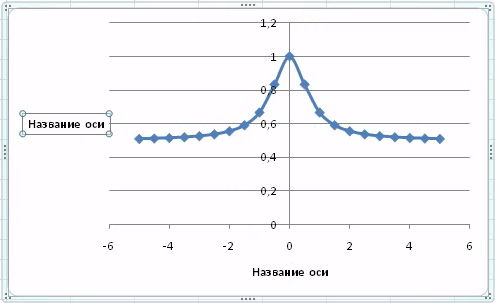
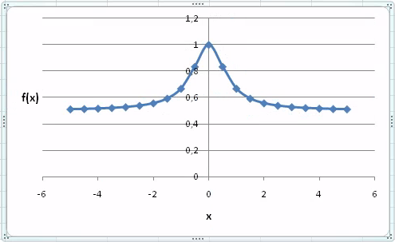
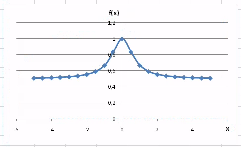
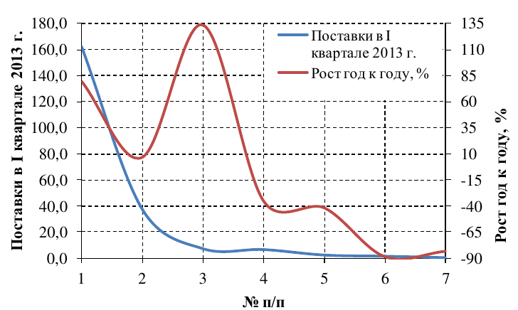
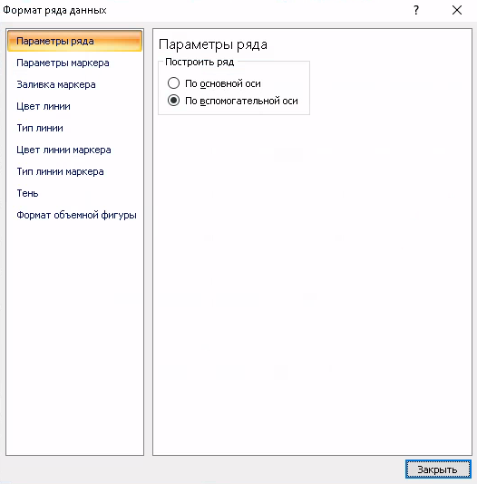

+++
date = '2026-05-18T08:00:00+05:00'
title = 'Электронные таблицы. Диаграммы'
tags = ["informatika", "Excel", "Электронные таблицы"]
categories = ["informatika"]
courses = ["informatika"]
+++

<!--more-->

## Задание 0

1. Откройте любой офисный редактор электронных таблиц. В данной работе будут использоваться скриншоты из редактора **MS Excel 2007**, однако подойдёт любой другой аналог (**Only Office**, **Libre Office** и др.).

2. Добавьте листы так, чтобы всего было 5 листов.

3. Переименуйте лист **Лист1** в **Задание1**. Аналогично переименуйте другие листы: **Задание2**, **Задание3**, **Задание4**


	\begin{tikzpicture}[
	img/.style={
		inner sep=0pt,
		anchor=north west
	},
	frm/.style={
		inner sep=0pt,
		anchor=north west,
		draw=red!70!black,
		line width=1pt
	},
	lbl/.style={
	inner sep=4pt,
	outer sep=0.4pt,
	anchor=north west,
	draw=red!70!black,
	line width=2pt,
	fill=white,
	font=\fontsize{10pt}{10pt}\selectfont,
	align=left,
	text=red!70!black,
	text width=3.4cm,
	execute at begin node={\hyphenpenalty=10000\relax}  % для исключения переносов слов через тире
	},
	arrow/.style={
	-{Triangle[length=12pt, width=8pt]},
	draw=red!70!black,
	line width=2pt,
	}
	]
	\node[img] (img1) at (0,0) {\includegraphics[width=8cm, trim={0 0 0 2cm}, clip]{excel_base_1.png}};
			    
	\node[frm, minimum width=1.8cm, minimum height=0.5cm] (frm1) at (1.4,-1.6) {};
	\node[frm, minimum width=1.0cm, minimum height=0.5cm] (frm2) at (5.1,-1.6) {};

	\node[lbl] (lbl1) at (-2.0, -.2) {Нажмите ПКМ для переименования};
	\node[lbl] (lbl2) at (4.0, -0.) {Нажмите ЛКМ для добавления листа};

	\draw[arrow] (lbl1.south) -- (frm1.west);
	\draw[arrow] (lbl2.south) -- (frm2.north);
	\end{tikzpicture}


***Примечание:*** *ЛКМ - левая клавиша мыши, ПКМ - правая клавиша мыши*

## Задание 1

1. Переключитесь на лист **Задание1**
2. Выделите ячейки **A1:B1** и назначьте им формат - текстовый
3. Выделите ячейки **A2:B22** и назначьте им формат - числовой
4. В ячейке **A1** введите текст "x" (без кавычек)
5. В ячейке **B1** введите текст "f(x)" (без кавычек)
6. Заполните диапазон ячеек **A2:A22** значениями от \(-5\) до \(5\) с шагом \(0.5\)
7. Диапазон ячеек **B2:B22** заполните значениями, полученными по формуле:
   $$ f(x) = \frac{1+x^2}{1+2x^2} $$
8. Выделите диапазон **A1:B22** — диапазон значений вместе с заголовками
9. Вставьте новую диаграмму по выделенным данным с помощью меню **Вставка** — раздел **Диаграммы** — **Точечная** — **Точечная с гладкими кривыми и маркерами**

	
		\begin{tikzpicture}[
		img/.style={
			inner sep=0pt,
			anchor=north west
		},
		frm/.style={
			inner sep=0pt,
			anchor=north west,
			draw=red!70!black,
			line width=1pt
		},
		lbl/.style={
		inner sep=4pt,
		outer sep=0.4pt,
		anchor=north west,
		draw=red!70!black,
		line width=2pt,
		fill=white,
		font=\fontsize{10pt}{10pt}\selectfont,
		align=left,
		text=red!70!black,
		text width=3.4cm,
		execute at begin node={\hyphenpenalty=10000\relax}  % для исключения переносов слов через тире
		},
		arrow/.style={
		-{Triangle[length=12pt, width=8pt]},
		draw=red!70!black,
		line width=2pt,
		}
		]
		\node[img] (img1) at (0,0) {\includegraphics[width=12cm, trim={0 0 0 0cm}, clip]{excel_diagrams_1.png}};
					
		\node[frm, minimum width=0.75cm, minimum height=0.3cm] (frm1) at (1.0,-0.25) {};
		\node[frm, minimum width=0.6cm, minimum height=0.7cm] (frm2) at (5.9,-0.5) {};
		\node[frm, minimum width=0.5cm, minimum height=0.55cm] (frm3) at (6.5,-1.35) {};

		% вспомогательная сетка:
		%\draw[help lines] (-1,0) grid (12,-3);
		%\foreach \x in {-1,...,12} % Подписи по оси X
			%\node[anchor=north east, text=green!70!black] at (\x,0) {\small\x};
		%\foreach \y in {-0,...,-3} % Подписи по оси Y
			%\node[anchor=south east, text=green!70!black] at (0,\y) {\small\y};
		\end{tikzpicture}
	

	Появится диаграмма:

	
		\begin{tikzpicture}[
		img/.style={
			inner sep=0pt,
			anchor=north west
		},
		frm/.style={
			inner sep=0pt,
			anchor=north west,
			draw=red!70!black,
			line width=1pt
		},
		lbl/.style={
		inner sep=4pt,
		outer sep=0.4pt,
		anchor=north west,
		draw=red!70!black,
		line width=2pt,
		fill=white,
		font=\fontsize{10pt}{10pt}\selectfont,
		align=left,
		text=red!70!black,
		text width=3.4cm,
		execute at begin node={\hyphenpenalty=10000\relax}  % для исключения переносов слов через тире
		},
		arrow/.style={
		-{Triangle[length=12pt, width=8pt]},
		draw=red!70!black,
		line width=2pt,
		}
		]
		\node[img] (img1) at (0,0) {\includegraphics[width=10cm, trim={0 0 0 0cm}, clip]{excel_diagrams_2.png}};
					
		% вспомогательная сетка:
		%   \draw[help lines] (-1,0) grid (12,-8);
		% \foreach \x in {-1,...,12} % Подписи по оси X
		%   \node[anchor=north east, text=green!70!black] at (\x,0) {\small\x};
		% \foreach \y in {-0,...,-8} % Подписи по оси Y
		%  \node[anchor=south east, text=green!70!black] at (0,\y) {\small\y};
		\end{tikzpicture}
	

10. Выделите элемент **Название диаграммы** (нажмите по элементу ЛКМ) и удалите его (нажмите клавишу **Delete**).

	Также удалите элемент **Легенда**.

	
		\begin{tikzpicture}[
		img/.style={
			inner sep=0pt,
			anchor=north west
		},
		frm/.style={
			inner sep=0pt,
			anchor=north west,
			draw=red!70!black,
			line width=1pt
		},
		lbl/.style={
		inner sep=4pt,
		outer sep=0.4pt,
		anchor=north west,
		draw=red!70!black,
		line width=2pt,
		fill=white,
		font=\fontsize{10pt}{10pt}\selectfont,
		align=left,
		text=red!70!black,
		text width=2.4cm,
		execute at begin node={\hyphenpenalty=10000\relax}  % для исключения переносов слов через тире
		},
		arrow/.style={
		-{Triangle[length=12pt, width=8pt]},
		draw=red!70!black,
		line width=2pt,
		}
		]
		\node[img] (img1) at (0,0) {\includegraphics[width=10cm, trim={0 0 0 0cm}, clip]{excel_diagrams_2.png}};
					
		\node[frm, minimum width=1.cm, minimum height=0.6cm] (frm1) at (4.5,-0.25) {};
		\node[frm, minimum width=1.3cm, minimum height=0.7cm] (frm2) at (8.6,-3.1) {};
		
		\node[lbl] (lbl1) at (10.1, -.2) {Название диаграммы};
		\node[lbl] (lbl2) at (10.1, -5.) {Легенда};

		\draw[arrow] (lbl1.west) -- (frm1.east);
		\draw[arrow] (lbl2.west) -- (frm2.south);

		% вспомогательная сетка:
		%\draw[help lines] (-1,0) grid (12,-8);
		%\foreach \x in {-1,...,12} % Подписи по оси X
			% \node[anchor=north east, text=green!70!black] at (\x,0) {\small\x};
		% \foreach \y in {-0,...,-8} % Подписи по оси Y
			% \node[anchor=south east, text=green!70!black] at (0,\y) {\small\y};
		\end{tikzpicture}
	

	Диаграмма после удаления **Названия диаграммы**:

	
		\begin{tikzpicture}[
		img/.style={
			inner sep=0pt,
			anchor=north west
		},
		frm/.style={
			inner sep=0pt,
			anchor=north west,
			draw=red!70!black,
			line width=1pt
		},
		lbl/.style={
		inner sep=4pt,
		outer sep=0.4pt,
		anchor=north west,
		draw=red!70!black,
		line width=2pt,
		fill=white,
		font=\fontsize{10pt}{10pt}\selectfont,
		align=left,
		text=red!70!black,
		text width=2.4cm,
		execute at begin node={\hyphenpenalty=10000\relax}  % для исключения переносов слов через тире
		},
		arrow/.style={
		-{Triangle[length=12pt, width=8pt]},
		draw=red!70!black,
		line width=2pt,
		}
		]
		\node[img] (img1) at (0,0) {\includegraphics[width=10cm, trim={0 0 0 0cm}, clip]{excel_diagrams_3.png}};
					
		%\node[frm, minimum width=1.cm, minimum height=0.6cm] (frm1) at (4.5,-0.25) {};
		%\node[frm, minimum width=1.3cm, minimum height=0.7cm] (frm2) at (8.6,-3.1) {};
		
		%\node[lbl] (lbl1) at (10.1, -.2) {Название диаграммы};
		%\node[lbl] (lbl2) at (10.1, -5.) {Легенда};

		%\draw[arrow] (lbl1.west) -- (frm1.east);
		%\draw[arrow] (lbl2.west) -- (frm2.south);

		% вспомогательная сетка:
		%\draw[help lines] (-1,0) grid (12,-8);
		%\foreach \x in {-1,...,12} % Подписи по оси X
			% \node[anchor=north east, text=green!70!black] at (\x,0) {\small\x};
		% \foreach \y in {-0,...,-8} % Подписи по оси Y
			% \node[anchor=south east, text=green!70!black] at (0,\y) {\small\y};
		\end{tikzpicture}
	

	Диаграмма после удаления **Легенды**:

	
		\begin{tikzpicture}[
		img/.style={
			inner sep=0pt,
			anchor=north west
		},
		frm/.style={
			inner sep=0pt,
			anchor=north west,
			draw=red!70!black,
			line width=1pt
		},
		lbl/.style={
		inner sep=4pt,
		outer sep=0.4pt,
		anchor=north west,
		draw=red!70!black,
		line width=2pt,
		fill=white,
		font=\fontsize{10pt}{10pt}\selectfont,
		align=left,
		text=red!70!black,
		text width=2.4cm,
		execute at begin node={\hyphenpenalty=10000\relax}  % для исключения переносов слов через тире
		},
		arrow/.style={
		-{Triangle[length=12pt, width=8pt]},
		draw=red!70!black,
		line width=2pt,
		}
		]
		\node[img] (img1) at (0,0) {\includegraphics[width=10cm, trim={0 0 0 0cm}, clip]{excel_diagrams_4.png}};
					
		%\node[frm, minimum width=1.cm, minimum height=0.6cm] (frm1) at (4.5,-0.25) {};
		%\node[frm, minimum width=1.3cm, minimum height=0.7cm] (frm2) at (8.6,-3.1) {};
		
		%\node[lbl] (lbl1) at (10.1, -.2) {Название диаграммы};
		%\node[lbl] (lbl2) at (10.1, -5.) {Легенда};

		%\draw[arrow] (lbl1.west) -- (frm1.east);
		%\draw[arrow] (lbl2.west) -- (frm2.south);

		% вспомогательная сетка:
		%\draw[help lines] (-1,0) grid (12,-8);
		%\foreach \x in {-1,...,12} % Подписи по оси X
			% \node[anchor=north east, text=green!70!black] at (\x,0) {\small\x};
		% \foreach \y in {-0,...,-8} % Подписи по оси Y
			% \node[anchor=south east, text=green!70!black] at (0,\y) {\small\y};
		\end{tikzpicture}
	

	***Примечание:*** *элемент **Легенда** обязателен, если на рисунке больше одной кривой. Если на рисунке одна кривая, то легенда не нужна.*

11. Добавьте подпись **горизонтальной оси**:

	
		\begin{tikzpicture}[
		img/.style={
			inner sep=0pt,
			anchor=north west
		},
		frm/.style={
			inner sep=0pt,
			anchor=north west,
			draw=red!70!black,
			line width=1pt
		},
		lbl/.style={
		inner sep=4pt,
		outer sep=0.4pt,
		anchor=north west,
		draw=red!70!black,
		line width=2pt,
		fill=white,
		font=\fontsize{10pt}{10pt}\selectfont,
		align=left,
		text=red!70!black,
		text width=2.4cm,
		execute at begin node={\hyphenpenalty=10000\relax}  % для исключения переносов слов через тире
		},
		arrow/.style={
		-{Triangle[length=12pt, width=8pt]},
		draw=red!70!black,
		line width=2pt,
		}
		]
		\node[img] (img1) at (0,0) {\includegraphics[width=12cm, trim={0 0 0 0cm}, clip]{excel_diagrams_5.png}};
					
		\node[frm, minimum width=0.6cm, minimum height=0.65cm] (frm1) at (3.45,-0.5) {};
		\node[frm, minimum width=2.65cm, minimum height=0.25cm] (frm2) at (3.5,-1.15) {};
		\node[frm, minimum width=4.3cm, minimum height=0.5cm] (frm3) at (6.1,-1.6) {};
		
		%\node[lbl] (lbl1) at (10.1, -.2) {Название диаграммы};
		%\node[lbl] (lbl2) at (10.1, -5.) {Легенда};

		%\draw[arrow] (lbl1.west) -- (frm1.east);
		%\draw[arrow] (lbl2.west) -- (frm2.south);

		% вспомогательная сетка:
		%  \draw[help lines] (-1,0) grid (12,-4);
		% \foreach \x in {-1,...,12} % Подписи по оси X
		%  \node[anchor=north east, text=green!70!black] at (\x,0) {\small\x};
		% \foreach \y in {-0,...,-4} % Подписи по оси Y
		%  \node[anchor=south east, text=green!70!black] at (0,\y) {\small\y};
		\end{tikzpicture}
	

12. Добавьте подпись **вертикальной оси**:

	
		\begin{tikzpicture}[
		img/.style={
			inner sep=0pt,
			anchor=north west
		},
		frm/.style={
			inner sep=0pt,
			anchor=north west,
			draw=red!70!black,
			line width=1pt
		},
		lbl/.style={
		inner sep=4pt,
		outer sep=0.4pt,
		anchor=north west,
		draw=red!70!black,
		line width=2pt,
		fill=white,
		font=\fontsize{10pt}{10pt}\selectfont,
		align=left,
		text=red!70!black,
		text width=2.4cm,
		execute at begin node={\hyphenpenalty=10000\relax}  % для исключения переносов слов через тире
		},
		arrow/.style={
		-{Triangle[length=12pt, width=8pt]},
		draw=red!70!black,
		line width=2pt,
		}
		]
		\node[img] (img1) at (0,0) {\includegraphics[width=12cm, trim={0 0 0 0cm}, clip]{excel_diagrams_6.png}};
					
		\node[frm, minimum width=0.6cm, minimum height=0.65cm] (frm1) at (3.45,-0.5) {};
		\node[frm, minimum width=2.65cm, minimum height=0.25cm] (frm2) at (3.5,-1.37) {};
		\node[frm, minimum width=4.2cm, minimum height=0.5cm] (frm3) at (6.1,-2.65) {};
		
		%\node[lbl] (lbl1) at (10.1, -.2) {Название диаграммы};
		%\node[lbl] (lbl2) at (10.1, -5.) {Легенда};

		%\draw[arrow] (lbl1.west) -- (frm1.east);
		%\draw[arrow] (lbl2.west) -- (frm2.south);

		% вспомогательная сетка:
		%  \draw[help lines] (-1,0) grid (12,-4);
		% \foreach \x in {-1,...,12} % Подписи по оси X
		%  \node[anchor=north east, text=green!70!black] at (\x,0) {\small\x};
		%\foreach \y in {-0,...,-4} % Подписи по оси Y
		%  \node[anchor=south east, text=green!70!black] at (0,\y) {\small\y};
		\end{tikzpicture}
	

	Диаграмма после добавления **подписей осей**:

	

13. Измените текст **подписей осей** (двойным нажатием ЛКМ по элементу). 
	Настройки текста можно поменять на вкладке **Главная** — раздел **Шрифт**. 
	Установите **Размер шрифта** — 12 пт.
	Диаграмма после изменения текста **подписей осей**:

	

14. Поместите (зажав ЛКМ на элементе) **подписи осей** рядом с **осями**. 
	Для того, чтобы **подпись горизонтальной оси** перекрывала значение 6 на диаграмме, добавьте белую **заливку** текста (на вкладке **Главная** — раздел **Шрифт**).
	Диаграмма после смещения и настройки осей:

	

15. Добавьте **вертикальные линии сетки**:

	
		\begin{tikzpicture}[
		img/.style={
			inner sep=0pt,
			anchor=north west
		},
		frm/.style={
			inner sep=0pt,
			anchor=north west,
			draw=red!70!black,
			line width=1pt
		},
		lbl/.style={
		inner sep=4pt,
		outer sep=0.4pt,
		anchor=north west,
		draw=red!70!black,
		line width=2pt,
		fill=white,
		font=\fontsize{10pt}{10pt}\selectfont,
		align=left,
		text=red!70!black,
		text width=2.4cm,
		execute at begin node={\hyphenpenalty=10000\relax}  % для исключения переносов слов через тире
		},
		arrow/.style={
		-{Triangle[length=12pt, width=8pt]},
		draw=red!70!black,
		line width=2pt,
		}
		]
		\node[img] (img1) at (0,0) {\includegraphics[width=12cm, trim={0 0 0 0cm}, clip]{excel_diagrams_10.png}};
					
		\node[frm, minimum width=0.4cm, minimum height=0.6cm] (frm1) at (5.68,-0.4) {};
		\node[frm, minimum width=2.5cm, minimum height=0.25cm] (frm2) at (5.68,-1.125) {};
		\node[frm, minimum width=3.7cm, minimum height=0.4cm] (frm3) at (8.1,-1.5) {};
		
		%\node[lbl] (lbl1) at (10.1, -.2) {Название диаграммы};
		%\node[lbl] (lbl2) at (10.1, -5.) {Легенда};

		%\draw[arrow] (lbl1.west) -- (frm1.east);
		%\draw[arrow] (lbl2.west) -- (frm2.south);

		% вспомогательная сетка:
		%\draw[help lines] (-1,0) grid (12,-4);
		%\foreach \x in {-1,...,12} % Подписи по оси X
		%  \node[anchor=north east, text=green!70!black] at (\x,0) {\small\x};
		%\foreach \y in {-0,...,-4} % Подписи по оси Y
		%  \node[anchor=south east, text=green!70!black] at (0,\y) {\small\y};
		\end{tikzpicture}
	

16. Уберите внешний **контур фигуры**:

	
		\begin{tikzpicture}[
		img/.style={
			inner sep=0pt,
			anchor=north west
		},
		frm/.style={
			inner sep=0pt,
			anchor=north west,
			draw=red!70!black,
			line width=1pt
		},
		lbl/.style={
		inner sep=4pt,
		outer sep=0.4pt,
		anchor=north west,
		draw=red!70!black,
		line width=2pt,
		fill=white,
		font=\fontsize{10pt}{10pt}\selectfont,
		align=left,
		text=red!70!black,
		text width=2.4cm,
		execute at begin node={\hyphenpenalty=10000\relax}  % для исключения переносов слов через тире
		},
		arrow/.style={
		-{Triangle[length=12pt, width=8pt]},
		draw=red!70!black,
		line width=2pt,
		}
		]
		\node[img] (img1) at (0,0) {\includegraphics[width=12cm, trim={0 0 0 0cm}, clip]{excel_diagrams_11.png}};
					
		\node[frm, minimum width=0.55cm, minimum height=0.25cm] (frm1) at (7.5,-0.2) {};
		\node[frm, minimum width=1.0cm, minimum height=0.2cm] (frm2) at (5.1,-0.6) {};
		\node[frm, minimum width=1.5cm, minimum height=0.25cm] (frm3) at (5.1,-2.1) {};
		
		%\node[lbl] (lbl1) at (10.1, -.2) {Название диаграммы};
		%\node[lbl] (lbl2) at (10.1, -5.) {Легенда};

		%\draw[arrow] (lbl1.west) -- (frm1.east);
		%\draw[arrow] (lbl2.west) -- (frm2.south);

		% вспомогательная сетка:
		%\draw[help lines] (-1,0) grid (12,-4);
		%\foreach \x in {-1,...,12} % Подписи по оси X
		%  \node[anchor=north east, text=green!70!black] at (\x,0) {\small\x};
		%\foreach \y in {-0,...,-4} % Подписи по оси Y
		%  \node[anchor=south east, text=green!70!black] at (0,\y) {\small\y};
		\end{tikzpicture}
	

17. Откройте всплывающее меню **вертикальной оси** (нажмите ПКМ по оси). Выберите **Формат оси**. 
	Настройте **минимальное значение** на оси, **максимальное значение** на оси, **цену основных делений** на оси.
	Во вкладке **Число** установите один формат **Числовой** и один знак после запятой.

	
		\begin{tikzpicture}[
		img/.style={
			inner sep=0pt,
			anchor=north west
		},
		frm/.style={
			inner sep=0pt,
			anchor=north west,
			draw=red!70!black,
			line width=1pt
		},
		lbl/.style={
		inner sep=4pt,
		outer sep=0.4pt,
		anchor=north west,
		draw=red!70!black,
		line width=2pt,
		fill=white,
		font=\fontsize{10pt}{10pt}\selectfont,
		align=left,
		text=red!70!black,
		text width=2.4cm,
		execute at begin node={\hyphenpenalty=10000\relax}  % для исключения переносов слов через тире
		},
		arrow/.style={
		-{Triangle[length=12pt, width=8pt]},
		draw=red!70!black,
		line width=2pt,
		}
		]

		\node[frm, minimum width=0.55cm, minimum height=0.25cm] (frm1) at (5.5,4.) {\includegraphics[width=10cm, trim={0 0 0 0cm}, clip]{excel_diagrams_13.png}};
		\node[frm, minimum width=0.55cm, minimum height=0.25cm] (frm1) at (-5.,4.) {\includegraphics[width=10cm, trim={0 0 0 0cm}, clip]{excel_diagrams_14.png}};
		\node[img] (img1) at (0,0) {\includegraphics[width=8cm, trim={0 0 0 0cm}, clip]{excel_diagrams_12.png}};
					
		\node[frm, minimum width=4.3cm, minimum height=0.4cm] (frm2) at (3.7,-3.9) {};
		\node[frm, minimum width=2.55cm, minimum height=0.46cm] (frm3) at (5.55,3.5) {};
		\node[frm, minimum width=3.5cm, minimum height=1.25cm] (frm4) at (11.95,3.1) {};
		\node[frm, minimum width=2.55cm, minimum height=0.46cm] (frm5) at (-4.95,3.1) {};
		\node[frm, minimum width=1.cm, minimum height=0.46cm] (frm6) at (1.95,3.1) {};
		
		%\node[lbl] (lbl1) at (10.1, -.2) {Название диаграммы};
		%\node[lbl] (lbl2) at (10.1, -5.) {Легенда};

		%\draw[arrow] (lbl1.west) -- (frm1.east);
		%\draw[arrow] (lbl2.west) -- (frm2.south);

		% вспомогательная сетка:
		%\draw[help lines] (-1,0) grid (12,-4);
		%\foreach \x in {-1,...,12} % Подписи по оси X
		%  \node[anchor=north east, text=green!70!black] at (\x,0) {\small\x};
		%\foreach \y in {-0,...,-4} % Подписи по оси Y
		%  \node[anchor=south east, text=green!70!black] at (0,\y) {\small\y};
		\end{tikzpicture}
	

18.  Настройте формат **горизонтальной оси**:


		\begin{tikzpicture}[
		img/.style={
			inner sep=0pt,
			anchor=north west
		},
		frm/.style={
			inner sep=0pt,
			anchor=north west,
			draw=red!70!black,
			line width=1pt
		},
		lbl/.style={
		inner sep=4pt,
		outer sep=0.4pt,
		anchor=north west,
		draw=red!70!black,
		line width=2pt,
		fill=white,
		font=\fontsize{10pt}{10pt}\selectfont,
		align=left,
		text=red!70!black,
		text width=2.4cm,
		execute at begin node={\hyphenpenalty=10000\relax}  % для исключения переносов слов через тире
		},
		arrow/.style={
		-{Triangle[length=12pt, width=8pt]},
		draw=red!70!black,
		line width=2pt,
		}
		]

		\node[frm, minimum width=0.55cm, minimum height=0.25cm] (frm1) at (5.5,4.) {\includegraphics[width=10cm, trim={0 0 0 0cm}, clip]{excel_diagrams_15.png}};
		%\node[frm, minimum width=0.55cm, minimum height=0.25cm] (frm1) at (-5.,4.) {\includegraphics[width=10cm, trim={0 0 0 0cm}, clip]{excel_diagrams_14.png}};
		%\node[img] (img1) at (0,0) {\includegraphics[width=8cm, trim={0 0 0 0cm}, clip]{excel_diagrams_12.png}};
					
		%\node[frm, minimum width=4.3cm, minimum height=0.4cm] (frm2) at (3.7,-3.9) {};
		\node[frm, minimum width=2.55cm, minimum height=0.46cm] (frm3) at (5.55,3.5) {};
		\node[frm, minimum width=3.5cm, minimum height=1.6cm] (frm4) at (11.95,3.1) {};
		\node[frm, minimum width=3.6cm, minimum height=1.45cm] (frm4) at (8.2,0.15) {};
		\node[frm, minimum width=3.6cm, minimum height=1.45cm] (frm5) at (8.2,-1.3) {};
		%\node[frm, minimum width=2.55cm, minimum height=0.46cm] (frm5) at (-4.95,3.1) {};
		%\node[frm, minimum width=1.cm, minimum height=0.46cm] (frm6) at (1.95,3.1) {};
		
		%\node[lbl] (lbl1) at (10.1, -.2) {Название диаграммы};
		%\node[lbl] (lbl2) at (10.1, -5.) {Легенда};

		%\draw[arrow] (lbl1.west) -- (frm1.east);
		%\draw[arrow] (lbl2.west) -- (frm2.south);

		% вспомогательная сетка:
		%\draw[help lines] (-1,0) grid (12,-4);
		%\foreach \x in {-1,...,12} % Подписи по оси X
		%  \node[anchor=north east, text=green!70!black] at (\x,0) {\small\x};
		%\foreach \y in {-0,...,-4} % Подписи по оси Y
		%  \node[anchor=south east, text=green!70!black] at (0,\y) {\small\y};
		\end{tikzpicture}
	

Для **горизонтальной оси** выберите ноль знаков после запятой.

19. После изменения положения осей сместите **подписи осей**.

В итоге вы должны получить диаграмму вида:


	\begin{tikzpicture}[
	img/.style={
		inner sep=0pt,
		anchor=north west
	},
	frm/.style={
		inner sep=0pt,
		anchor=north west,
		draw=red!70!black,
		line width=1pt
	},
	lbl/.style={
	inner sep=4pt,
	outer sep=0.4pt,
	anchor=north west,
	draw=red!70!black,
	line width=2pt,
	fill=white,
	font=\fontsize{10pt}{10pt}\selectfont,
	align=left,
	text=red!70!black,
	text width=2.4cm,
	execute at begin node={\hyphenpenalty=10000\relax}  % для исключения переносов слов через тире
	},
	arrow/.style={
	-{Triangle[length=12pt, width=8pt]},
	draw=red!70!black,
	line width=2pt,
	}
	]

	\node[img] (img1) at (0,0) {\includegraphics[width=10cm, trim={0 0 0 0cm}, clip]{excel_diagrams_17.png}};	

	% вспомогательная сетка:
	   %\draw[help lines] (-1,0) grid (12,-4);
	   %\foreach \x in {-1,...,12} % Подписи по оси X
	   %  \node[anchor=north east, text=green!70!black] at (\x,0) {\small\x};
	   %\foreach \y in {-0,...,-4} % Подписи по оси Y
	   %  \node[anchor=south east, text=green!70!black] at (0,\y) {\small\y};
	\end{tikzpicture}


## Задание 2

1. Переключитесь на лист **Задание2**
2. Выделите ячейки **A1:C1** и назначьте им формат - текстовый
3. Выделите ячейки **A2:C22** и назначьте им формат - числовой
4. В ячейке **A1** введите текст "x" (без кавычек)
5. В ячейке **B1** введите текст "y" (без кавычек)
6. В ячейке **C1** введите текст "z" (без кавычек)
7. Заполните диапазон ячеек **A2:A22** значениями от \(0\) до \(5\) с шагом \(0.25\)
8. Диапазон ячеек **B2:B22** заполните значениями, полученными по формуле:
   $$ y = x^2 $$
9. Выделите диапазон **A1:B22** — диапазон значений вместе с заголовками
10. Вставьте новую диаграмму по выделенным данным с помощью меню **Вставка** — раздел **Диаграммы** — **Точечная** — **Точечная с гладкими кривыми**
11. Диапазон ячеек **C2:C22** заполните значениями, полученными по формуле:
   $$ z = x^3 $$

12. Добавьте новую кривую на график с помощью инструмента **Выбрать данные**:

	
		\begin{tikzpicture}[
		img/.style={
			inner sep=0pt,
			anchor=north west
		},
		frm/.style={
			inner sep=0pt,
			anchor=north west,
			draw=red!70!black,
			line width=1pt
		},
		lbl/.style={
		inner sep=4pt,
		outer sep=0.4pt,
		anchor=north west,
		draw=red!70!black,
		line width=2pt,
		fill=white,
		font=\fontsize{10pt}{10pt}\selectfont,
		align=left,
		text=red!70!black,
		text width=7.2cm,
		execute at begin node={\hyphenpenalty=10000\relax}  % для исключения переносов слов через тире
		},
		arrow/.style={
		-{Triangle[length=12pt, width=8pt]},
		draw=red!70!black,
		line width=2pt,
		}
		]

		\node[frm, minimum width=0.55cm, minimum height=0.25cm] (frm1) at (5.,0.) {\includegraphics[width=9cm, trim={0 0 0 0cm}, clip]{excel_diagrams_19.png}};
		\node[frm, minimum width=0.55cm, minimum height=0.25cm] (frm2) at (5.,-5.5) {\includegraphics[width=9cm, trim={0 0 0 0cm}, clip]{excel_diagrams_20.png}};
		\node[img] (img1) at (-5,0) {\includegraphics[width=10cm, trim={0 0 0 0cm}, clip]{excel_diagrams_18.png}};
					
		\node[frm, minimum width=4.35cm, minimum height=0.4cm] (frm3) at (0.4,-3.55) {};
		\node[frm, minimum width=1.7cm, minimum height=0.4cm] (frm4) at (5.05,-2.3) {};
		\node[frm, minimum width=6.0cm, minimum height=3.55cm] (frm5) at (5.05,-6.3) {};
		\node[frm, minimum width=0.5cm, minimum height=4.0cm] (frm6) at (-4.625,-1.3) {};
		\node[frm, minimum width=4.4cm, minimum height=0.5cm] (frm7) at (-4.075,-5.1) {};
		
		\node[lbl] (lbl1) at (-4.5, -6.9) {Выберите ячейку с названием кривой};
		\node[lbl] (lbl2) at (-4.5, -7.8) {Выберите диапазон ячеек со значениями на горизонтальной оси};
		\node[lbl] (lbl3) at (-4.5, -9.0) {Выберите диапазон ячеек со значениями на вертикальной оси};

		\draw[arrow] (lbl1.east) -- ([yshift=25pt]frm5.west);
		\draw[arrow] (lbl2.east) -- ([yshift=-5pt]frm5.west);
		\draw[arrow] (lbl3.east) -- ([yshift=-40pt]frm5.west);

		\draw[arrow] (lbl3.west) to[out=180, in=190] (frm6.west);
		\draw[arrow] (lbl2.west) to[out=170, in=190] (frm7.south west);

		% вспомогательная сетка:
		%\draw[help lines] (-1,0) grid (12,-4);
		%\foreach \x in {-1,...,12} % Подписи по оси X
		%  \node[anchor=north east, text=green!70!black] at (\x,0) {\small\x};
		%\foreach \y in {-0,...,-4} % Подписи по оси Y
		%  \node[anchor=south east, text=green!70!black] at (0,\y) {\small\y};
		\end{tikzpicture}
	

13. Оформите диаграмму, как в **Задании 1**. Так как на этой диаграмме две кривые, легенду нужно оставить.

## Задание 3

1. Переключитесь на лист **Задание3**
2. Подготовьте данные изменения величины \(\varphi\) в диапазоне от \(-\pi\) до \(0\) с шагом \(0.1\)
3. Постройте изменение величины:
   $$ x(\varphi)= 8\cdot\cos{2\varphi}\cdot\cos{\varphi} $$
3. Постройте изменение величины:
   $$ y(\varphi)= 8\cdot\cos{2\varphi}\cdot\sin{\varphi} $$
   
4. Нарисуйте диаграмму \(y(x)\)
5. Оформите диаграмму как в **Задании1**

## Задание 4

1. Переключитесь на лист **Задание4**
2. Постройте таблицу

	
	\begin{tabular}{|>{\centering\arraybackslash}p{0.5cm}|l|>{\centering\arraybackslash}p{3.1cm}|>{\centering\arraybackslash}p{2.7cm}|>{\centering\arraybackslash}p{3.1cm}|>{\centering\arraybackslash}p{2.7cm}|>{\raggedleft\arraybackslash}p{2.1cm}|}
		\hline
		\textbf{№ п/п} & \textbf{ОС} & \textbf{Поставки в I квартале 2013 г.} & \textbf{Доля рынка в I квартале 2013 г., \%} & \textbf{Поставки в I квартале 2012 г.} & \textbf{Доля рынка в I квартале 2012 г., \%} & \textbf{Рост год к году, \%} \\
		\hline
		1 & Android & 162,1 & 75,0 & 90,3 & 59,1 & 79,51 \\
		\hline
		2 & IOS & 37,4 & 17,3 & 35,1 & 22,9 & 6,55 \\
		\hline
		3 & Windows Phone & 7,0 & 3,2 & 3,0 & 2,0 & 133,33 \\
		\hline
		4 & BlackBerry OS & 6,3 & 2,9 & 9,7 & 6,4 & -35,05 \\
		\hline
		5 & Linux & 2,1 & 1,0 & 3,6 & 2,4 & -41,67 \\
		\hline
		6 & Symbia & 1,2 & 0,6 & 10,4 & 6,8 & -88,46 \\
		\hline
		7 & Прочие & 0,1 & 0,0 & 0,6 & 0,4 & -83,34 \\
		\hline
		\multicolumn{2}{|r|}{\textbf{Всего}} & \textbf{216,2} & \textbf{100} & \textbf{152,7} & \textbf{100} & \textbf{-29,11} \\
		\hline
	\end{tabular}
	

	В строке **Всего:** суммы посчитайте с помощью функции `СУММ()`

3. По данным таблицы постройте диаграмму:

	

	Для того, чтобы значения кривых отмечались на разных осях, нажмите ПКМ по одной из кривых и выберите **Формат ряда данных**,

	Установите опцию **По вспомогательной оси**:
 
	

## Глоссарий

Добавьте слова и фразы в свой глоссарий

|                                       |
| ------------------------------------- |
| диаграмма                             |
| элемент диаграммы                     |
| название диаграммы                    |
| ось графика                           |
| формат оси                            |
| вертикальная сетка                    |
| горизонтальная сетка                  |
| вставка диаграммы                     |
| точечная диаграмма                    |
| точечная диаграмма с гладкими кривыми |
| точечная диаграмма с маркерами        |
| легенда диаграммы                     |
| контур фигуры                         |
| кривая на графике                     |
| кривая на диаграмме                   |

