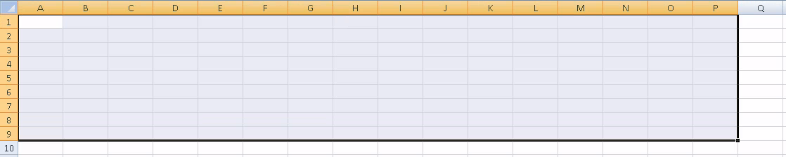
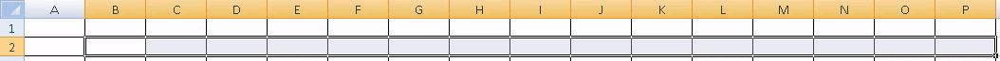
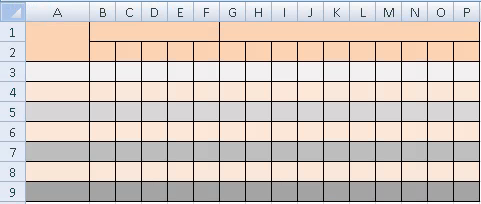
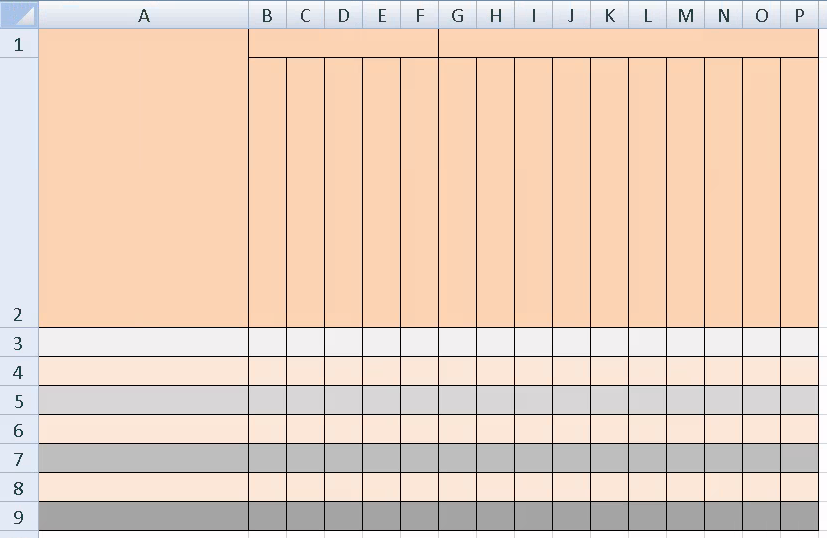
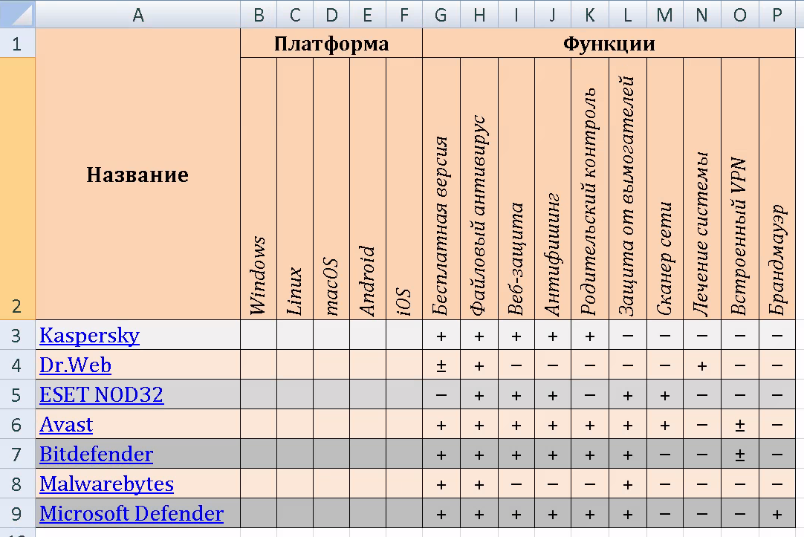

+++
date = '2026-05-07T08:00:00+05:00'
title = 'Электронные таблицы. Форматирование таблиц'
tags = ["informatika", "Excel", "Электронные таблицы", "Информационная безопасность"]
categories = ["informatika"]
courses = ["informatika"]
+++

<!--more-->

## Задание 0

Откройте любой офисный редактор электронных таблиц. В данной работе будут использоваться скриншоты из редактора **MS Excel 2007**, однако подойдёт любой другой аналог (**Only Office**, **Libre Office** и др.).

## Задание 1

На листе **Лист1** выделите диапазон ячеек **A1:P9** (поместите курсор мыши на ячейку **A1**, зажимте *левую клавишу мыши (ЛКМ),* переместите курсор на ячейку **P9**, отпустите *ЛКМ*):

С помощью инструмента **Границы** и опции **Все границы** задайте границы для ячеек диапазона:


	\begin{tikzpicture}[
	img/.style={
		inner sep=0pt,
		anchor=north west
	},
	frm/.style={
		inner sep=0pt,
		anchor=north west,
		draw=red!70!black,
		line width=1pt
	},
	]
	\node[img] (img1) at (0,0) {\includegraphics[width=12cm, trim=0 0 0 0, clip]{excel_table2.png}};
	\node[frm, minimum width=.5cm, minimum height=.3cm] (frm1) at (2.95,-0.9) {};	
	\node[frm, minimum width=2.9cm, minimum height=.3cm] (frm2) at (3.,-2.6) {};

	% вспомогательная сетка:
	   %\draw[help lines] (-1,0) grid (12,-5);
	   %\foreach \x in {-1,...,12} % Подписи по оси X
	   %  \node[anchor=north east, text=green!70!black] at (\x,0) {\small\x};
	   %\foreach \y in {-0,...,-5} % Подписи по оси Y
	   %  \node[anchor=south east, text=green!70!black] at (0,\y) {\small\y};
	\end{tikzpicture}


Для всего диапазона **A1:P9** выберите тип **Текстовый**:


	\begin{tikzpicture}[
	img/.style={
		inner sep=0pt,
		anchor=north west
	},
	frm/.style={
		inner sep=0pt,
		anchor=north west,
		draw=red!70!black,
		line width=1pt
	},
	]
	\node[img] (img1) at (0,0) {\includegraphics[width=12cm, trim=0 0 0 0, clip]{excel_table3.png}};
	\node[frm, minimum width=.3cm, minimum height=.3cm] (frm1) at (9.25,-0.6) {};
	\node[frm, minimum width=2.4cm, minimum height=.5cm] (frm1) at (8.05,-5.6) {};

	% вспомогательная сетка:
	   %\draw[help lines] (-1,0) grid (12,-7);
	   %\foreach \x in {-1,...,12} % Подписи по оси X
	     %\node[anchor=north east, text=green!70!black] at (\x,0) {\small\x};
	   %\foreach \y in {-0,...,-7} % Подписи по оси Y
	     %\node[anchor=south east, text=green!70!black] at (0,\y) {\small\y};
	\end{tikzpicture}


Выделите диапазон ячеек **B2:P2**:

назначьте ориентацию текста - 90°

	\begin{tikzpicture}[
	img/.style={
		inner sep=0pt,
		anchor=north west
	},
	frm/.style={
		inner sep=0pt,
		anchor=north west,
		draw=red!70!black,
		line width=1pt
	},
	]
	\node[img] (img1) at (0,0) {\includegraphics[width=12cm, trim=0 0 0 0, clip]{excel_table0.png}};
	\node[img] (img2) at (3.5,-1.8) {\includegraphics[width=8cm, trim=0 0 0 0, clip]{excel_table4.png}};
	\node[frm, minimum width=.3cm, minimum height=.3cm] (frm1) at (8.2,-1.3) {};
	\node[frm, minimum width=1.9cm, minimum height=.35cm] (frm2) at (9.5,-5.25) {};

	% вспомогательная сетка:
	  % \draw[help lines] (-1,0) grid (12,-8);
	  % \foreach \x in {-1,...,12} % Подписи по оси X
	  %   \node[anchor=north east, text=green!70!black] at (\x,0) {\small\x};
	  % \foreach \y in {-0,...,-8} % Подписи по оси Y
	  %   \node[anchor=south east, text=green!70!black] at (0,\y) {\small\y};

	\end{tikzpicture}


Выделите диапазон ячеек **A1:A2** и объедините их с помощью инструмента **Объединение ячеек**:


	\begin{tikzpicture}[
	img/.style={
		inner sep=0pt,
		anchor=north west
	},
	frm/.style={
		inner sep=0pt,
		anchor=north west,
		draw=red!70!black,
		line width=1pt
	},
	]
	\node[img] (img1) at (0,0) {\includegraphics[width=12cm, trim=0 0 0 0, clip]{excel_table6.png}};	
	\node[frm, minimum width=2.5cm, minimum height=.35cm] (frm1) at (5.55,-0.9) {};
	%\node[frm, minimum width=1.9cm, minimum height=.35cm] (frm2) at (9.5,-5.25) {};

	% вспомогательная сетка:
	  % \draw[help lines] (-1,0) grid (12,-8);
	  % \foreach \x in {-1,...,12} % Подписи по оси X
	  %   \node[anchor=north east, text=green!70!black] at (\x,0) {\small\x};
	  % \foreach \y in {-0,...,-8} % Подписи по оси Y
	  %   \node[anchor=south east, text=green!70!black] at (0,\y) {\small\y};

	\end{tikzpicture}


Объедините диапазон ячеек **B1:F1**.

Объедините диапазон ячеек **G1:P1**.

С помощью инструмента **Заливка** закрасьте фон ячеек в разные цвета, как на картинке:


	\begin{tikzpicture}[
	img/.style={
		inner sep=0pt,
		anchor=north west
	},
	frm/.style={
		inner sep=0pt,
		anchor=north west,
		draw=red!70!black,
		line width=1pt
	},
	]
	\node[img] (img1) at (0,0) {\includegraphics[width=12cm, trim=0 0 0 0, clip]{excel_table0.png}};
	\node[img] (img2) at (0,-1.75) {\includegraphics[width=12cm, trim=0 0 0 0, clip]{excel_table7.png}};
	\node[frm, minimum width=0.5cm, minimum height=.35cm] (frm1) at (3.55,-0.95) {};
	%\node[frm, minimum width=1.9cm, minimum height=.35cm] (frm2) at (9.5,-5.25) {};

	% вспомогательная сетка:
	  % \draw[help lines] (-1,0) grid (12,-8);
	  % \foreach \x in {-1,...,12} % Подписи по оси X
	  %   \node[anchor=north east, text=green!70!black] at (\x,0) {\small\x};
	  % \foreach \y in {-0,...,-8} % Подписи по оси Y
	  %   \node[anchor=south east, text=green!70!black] at (0,\y) {\small\y};

	\end{tikzpicture}


выделите столбцы **B:P** (наведите курсор мыши на букву **B** в названии столбца, зажмите *ЛКМ* и доведите курсор до буквы **P**). 
После этого нажмите на любой столбец *правой клавишей мыши (ПКМ)* и измените **ширину столбца**:


	\begin{tikzpicture}[
	img/.style={
		inner sep=0pt,
		anchor=north west
	},
	frm/.style={
		inner sep=0pt,
		anchor=north west,
		draw=red!70!black,
		line width=1pt
	},
	]
	\node[img] (img1) at (0,0) {\includegraphics[width=12cm, trim=0 0 0 0, clip]{excel_table8.png}};
	%\node[img] (img2) at (2,-1.5) {\includegraphics[width=2.8cm, trim=0 0 0 0, clip]{excel_table9.png}};
	\node[frm, minimum width=2.95cm, minimum height=.35cm] (frm1) at (6.9,-2.1) {};
	\node[frm, minimum width=2.8cm, minimum height=.35cm] (frm2) at (2.,-1.5) {\includegraphics[width=2.8cm, trim=0 0 0 0, clip]{excel_table9.png}};
	\node[frm, minimum width=1.33cm, minimum height=.35cm] (frm3) at (3.44,-1.9) {};

	% вспомогательная сетка:
	  % \draw[help lines] (-1,0) grid (12,-8);
	  % \foreach \x in {-1,...,12} % Подписи по оси X
	  %   \node[anchor=north east, text=green!70!black] at (\x,0) {\small\x};
	  % \foreach \y in {-0,...,-8} % Подписи по оси Y
	  %   \node[anchor=south east, text=green!70!black] at (0,\y) {\small\y};

	\end{tikzpicture}


результат:

таким же образом измените высоту строки **2**:


	\begin{tikzpicture}[
	img/.style={
		inner sep=0pt,
		anchor=north west
	},
	frm/.style={
		inner sep=0pt,
		anchor=north west,
		draw=red!70!black,
		line width=1pt
	},
	]
	\node[img] (img1) at (0,0) {\includegraphics[width=12cm, trim=0 0 0 0, clip]{excel_table11.png}};
	\node[frm, minimum width=4.25cm, minimum height=.4cm] (frm1) at (0.4,-4.3) {};
	\node[frm, minimum width=2.8cm, minimum height=.35cm] (frm2) at (5.,-1.55) {\includegraphics[width=2.8cm, trim=0 0 0 0, clip]{excel_table12.png}};
	\node[frm, minimum width=1.34cm, minimum height=.35cm] (frm3) at (6.4,-2.) {};

	% вспомогательная сетка:
	  % \draw[help lines] (-1,0) grid (12,-8);
	  % \foreach \x in {-1,...,12} % Подписи по оси X
	  %   \node[anchor=north east, text=green!70!black] at (\x,0) {\small\x};
	  % \foreach \y in {-0,...,-8} % Подписи по оси Y
	  %   \node[anchor=south east, text=green!70!black] at (0,\y) {\small\y};
	\end{tikzpicture}


результат:

Добавьте текст в ячейки заголовков. 
Оформите текст ячеек, как на картинке. 
Используйте инструменты настройки **шрифта** и настройки **выравнивания**:


	\begin{tikzpicture}[
	img/.style={
		inner sep=0pt,
		anchor=north west
	},
	frm/.style={
		inner sep=0pt,
		anchor=north west,
		draw=red!70!black,
		line width=1pt
	},
	]
	\node[img] (img1) at (0,0) {\includegraphics[width=12cm, trim=0 0 0 0, clip]{excel_table0.png}};
	\node[img] (img2) at (0,-1.7) {\includegraphics[width=12cm, trim=0 0 0 0, clip]{excel_table14.png}};
	\node[frm, minimum width=2.3cm, minimum height=1.cm] (frm1) at (2.15,-0.6) {};
	\node[frm, minimum width=0.85cm, minimum height=.7cm] (frm3) at (4.45,-0.6) {};

	% вспомогательная сетка:
	  % \draw[help lines] (-1,0) grid (12,-8);
	  % \foreach \x in {-1,...,12} % Подписи по оси X
	  %   \node[anchor=north east, text=green!70!black] at (\x,0) {\small\x};
	  % \foreach \y in {-0,...,-8} % Подписи по оси Y
	  %   \node[anchor=south east, text=green!70!black] at (0,\y) {\small\y};
	\end{tikzpicture}


Добавьте в ячейки названия и ссылки на популярные ***антивирусные программы*** (сокращённо - **антивирусы**). 

Нажмите ПКМ на ячейку **A3** и выберите **Гиперссылка...**. 
Укажите **Текст** и **Адрес** гиперссылки на сайт антивируса:

Текст: Kaspersky

Адрес: https://www.kaspersky.com/


	\begin{tikzpicture}[
	img/.style={
		inner sep=0pt,
		anchor=north west
	},
	frm/.style={
		inner sep=0pt,
		anchor=north west,
		draw=red!70!black,
		line width=1pt
	},
	]
	\node[img] (img1) at (0,0) {\includegraphics[width=12cm, trim=0 0 0 0, clip]{excel_table15.png}};
	\node[frm, minimum width=3.4cm, minimum height=.4cm] (frm1) at (2.4,-8.35) {};
	\node[frm, minimum height=.35cm] (frm2) at (5.75,-4.85) {\includegraphics[width=7cm, trim=0 0 0 0, clip]{excel_table16.png}};
	\node[frm, minimum width=1.34cm, minimum height=.35cm] (frm3) at (6.7,-5.1) {};
	\node[frm, minimum width=3.1cm, minimum height=.35cm] (frm4) at (6.7,-7.5) {};

	% вспомогательная сетка:
	  % \draw[help lines] (-1,0) grid (12,-8);
	  % \foreach \x in {-1,...,12} % Подписи по оси X
	  %   \node[anchor=north east, text=green!70!black] at (\x,0) {\small\x};
	  % \foreach \y in {-0,...,-8} % Подписи по оси Y
	  %   \node[anchor=south east, text=green!70!black] at (0,\y) {\small\y};
	\end{tikzpicture}


В ячейках **A4:A9** разместите гиперссылки:
| **Антивирус**      | **Ссылка**                                                 |
| :----------------- | :--------------------------------------------------------- |
| Dr.Web             | https://www.drweb.com/                                     |
| ESET NOD32         | https://www.eset.com/                                      |
| Avast              | https://www.avast.com/                                     |
| Bitdefender        | https://www.bitdefender.com/                               |
| Malwarebytes       | https://www.malwarebytes.com/                              |
| Microsoft Defender | https://www.microsoft.com/en-us/windows/microsoft-defender |

Заполните диапазон ячеек **G3:P9** отметив
- наличие функции у антивируса (+)
- отсутствие функции у антивируса (–)
- частичное наличие функции у антивируса (±)

как показано на рисунке:

Самостоятельное заполните диапазон ячеек **B3:F9**. В ячейке ставится значок +, если **антивирус** поддерживает указанную ***Операционную систему***.
Информацию об этом найдите на сайте **антивируса** или в статье про **антивирус** в энциклопедии [Wikipedia](https://ru.wikipedia.org).

Нажмите правой клавишей мыши по названию листа **Лист1** и с помощью опции **Переименовать** измените имя листа на **Антивирусы**.

## Задание 2

Переименуйте **Лист2** в **Угрозы**, на этом листе создайте таблицу:


\begin{tabular}{|>{\centering\arraybackslash}p{3.2cm}|>{\raggedright\arraybackslash}p{5.6cm}|>{\raggedright\arraybackslash}p{7.2cm}|}
\hline
\rowcolor[rgb]{0,0.4,0.8}
\textcolor{white}{\textbf{\textit{Угроза}}} &
\textcolor{white}{\textbf{\textit{Что это простыми словами}}} &
\textcolor{white}{\textbf{\textit{Защита и действия\textit}}} \\
\hline
\rowcolor[rgb]{0.94,0.97,1}
Вирусы и трояны & Вредоносные программы, портящие файлы или крадущие данные & Установите и используйте антивирус \\
\hline
\rowcolor[rgb]{1,1,1}
Фишинг & Поддельные сайты/письма под видом настоящих & Проявляйте внимательность. Не переходите по ссылкам из писем \\
\hline
\rowcolor[rgb]{0.94,0.97,1}
Слабые пароли & Пароль \textbf{123456} или \textbf{qwerty} — как открытая дверь & Придумайте пароль из 12+ символов (буквы+цифры+символы). Используйте менеджеры паролей \\
\hline
\rowcolor[rgb]{1,1,1}
Взлом Wi-Fi & Кто-то подключается к вашему роутеру & Используйте защиту WPA2 на Wi-Fi, установите сложный пароль \\
\hline
\rowcolor[rgb]{0.94,0.97,1}
Кража аккаунта & Взлом почты, соцсетей, мессенджера & Включите двухфакторную аутентификацию (подтверждение входа с помощью звонка/СМС/сообщения в мессенджере) \\
\hline
\rowcolor[rgb]{1,1,1}
Публичный Wi-Fi & Перехват паролей в кафе/аэропорту & Не вводите пароли в публичных сетях или включите VPN \\
\hline
\rowcolor[rgb]{0.94,0.97,1}
Шифрование данных & Вирус шифрует файлы и требует деньги & Создавайте резервные копии файлов, храните их на внешнем диске или в облаке \\
\hline
\rowcolor[rgb]{1,1,1}
Социальная инженерия & Звонок от "службы безопасности банка" & Проявляйте скептицизм. Перезванивайте сами по официальному номеру \\
\hline
\rowcolor[rgb]{0.94,0.97,1}
Кейлоггеры & Программа записывает всё, что вы печатаете & Не скачивайте программы из непроверенных источников. Используйте антивирус. Пароли вводите с помощью виртуальной клавиатуры \\
\hline
\rowcolor[rgb]{1,1,1}
Устаревшие программы & В старых программах есть уязвимости, которые исправлены в новых версиях & Включите автоматические обновления ОС и программ \\
\hline
\end{tabular}


