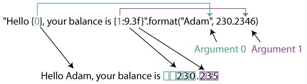

+++
date = '2025-07-01T13:59:52+05:00'
draft = false
title = 'Строки'
math = true
tags = ["Python", "informatika", "osnovi-programmirovaniya"]
categories = ['osnovi-programmirovaniya']
courses = ['osnovi-programmirovaniya']
weight = 8
+++

<!--more-->


>**Строка** - [неизменяемая]() [упорядоченная]() [структура данных](), представляющая собой последовательность символов

- Символы могут быть буквами, цифрами и специальными символами
- Чтобы присвоить переменной строковое значение, достаточно приравнять выражение в кавычках.

  ```Python
  string = 'some text'
  s = "текст в двойных кавычках"
  a = "a"
  b = "$"
  string = "1"
  string = "124"
  ```

- Разницы между одинарными и двойными кавычками нет:
  ```python
  >>>text1 = "word"
  >>>text1
  'word'
  >>>text2 = 'word'
  >>>text2
  'word'
  ```
  однако их можно использовать вместе для создания кавычек внутри строки:
  ```python
  >>>text3 = "word 'word' word"
  >>>text3
  "word 'word' word"
  >>>text4 = 'word "word" word'
  >>>text4
  'word "word" word'
  ```
    
### Операции со строками

Ввиду того, что строка является упорядоченной последовательностью, со строкой можно работать так же, как и со списком:

- Строки можно складывать:
  ```Python
  >>> s_1 = 'Python'
  >>> s_2 = ' '
  >>> s_3 = 'is awesome!'
  >>> print(s_1 + s_2 + s_3)
  'Python is awesome!'
  ```
- Строки можно дублировать:
  ```Python
  >>> print('spam' * 3)
  spamspamspam
  ```
- С помощью метода `len()` можно узнать количество символов в строке:
  ```Python
  >>> len('Python')
  6
  ```
- Можно обращаться к элементам по их индексу (индексация ведется от нуля):
  ```Python
  >>> s = 'Python'
  >>> print(s[0])
  P
  >>> print(s[5])
  n
  ```
По индексу можно извлекать несколько символов, тогда это будет называться срез:
  ```Python
  >>> s = 'Python'
  >>> print(s[1:2])
  y
  >>> print(s[0:])
  Python
  >>> print(s[:3])
  Pyt
  >>> print(s[:])
  Python
  ```

### Метод объектов строк 
Методов работы со строками довольно много, мы рассмотрим часть наиболее популярных:
- `find(str, [start],[end])` - Поиск подстроки в строке. Возвращает номер первого вхождения
или -1
  ```Python
  >>> s = 'PythonohtyP'
  >>> s.find('t')
  2
  ```
- `rfind(str, [start],[end])` - Поиск подстроки в строке. Возвращает номер последнего
вхождения или -1
  ```Python
  >>> s = 'PythonohtyP'
  >>> s.rfind('t')
  8
  ```
- `index(str, [start],[end])` - Поиск подстроки в строке. Возвращает номер первого вхождения
или вызывает ValueError
  ```Python
  >>> s = 'Python'
  >>> s.index('t')
  2
  ```
- `rindex(str, [start],[end])` - Поиск подстроки в строке. Возвращает номер или вызывает ValueError
  ```Python
  >>> s = 'PythonohtyP'
  >>> s.rindex('t')
  8
  ```
- `replace(шаблон, замена)` - Замена шаблона
  ```Python
  >>> s = 'Python'
  >>> s.replace('P', 'AAA')
  'AAAython'
  ```
- `split(символ)` - Разбиение строки по разделителю
  ```Python
  >>> s = 'Python'
  >>> s.split('t')
  ['Py', 'hon']
  ```
- `isdigit()` - Состоит ли строка из цифр
  ```Python
  >>> s = 'Python'
  >>> s.isdigit()
  False
  ```
- `isalpha()` - Состоит ли строка из букв
  ```Python
  >>> s = 'Python'
  >>> s.isalpha()
  True
  ```
- `isalnum()` - Состоит ли строка из цифр или букв
  ```Python
  >>> s = 'Python'
  >>> s.isalnum()
  True
  ```
- `islower()` - Состоит ли строка из символов в нижнем регистре
  ```Python
  >>> s = 'Python'
  >>> s.islower()
  False
  ```
- `isupper()` - Состоит ли строка из символов в верхнем регистре
  ```Python
  >>> s = 'Python'
  >>> s.isupper()
  False
  ```
- `istitle()` - Начинаются ли слова в строке с заглавной буквы
  ```Python
  >>> s = 'Python'
  >>> s.istitle()
  True
  ```
- `upper()` - Преобразование строки к верхнему регистру
  ```Python
  >>> s = 'Python'
  >>> s.upper()
  'PYTHON'
  ```
- `lower()` - Преобразование строки к нижнему регистру
  ```Python
  >>> s = 'Python'
  >>> s.lower()
  'python'
  ```
- `startswith(str)` - Начинается ли строка S с шаблона str
  ```Python
  >>> s = 'Python'
  >>> s.startswith('P')
  True
  ```
- `endswith(str)` - Заканчивается ли строка S шаблоном str
  ```Python
  >>> s = 'Python'
  >>> s.endswith('a')
  False
  ```
- `join(список)` - Сборка строки из списка с разделителем S
  ```Python
  >>> s = 'Python'
  >>> s.join(['a','b','c'])
  'aPythonbPythonc'
  ```

    
## Использование форматированных строк для представления данных
    
В Python можно форматировать числа разными способами. Суть обоих способов заключается в том, что внутри строки указываются места подставления данных

- f-строки (рекомендуется в Python 3.6+). Ссылка на данные (объекты) и форматы указываются в месте их появления
- метод `.format()`. Номера объектов и форматы указываются числами в месте их появления, ссылки на объекты указываются в качестве аргументов в методе 
        



    
    
### Форматы чисел в Python

Таблица с различными вариантами форматирования чисел в Python (f-строки и `format()`):

| **Тип**               | **Пример**          | **f-строка**           | **`format()`**               | **Вывод**            |
|-----------------------|--------------------|------------------------|-----------------------------|----------------------|
| **Целое число**       | `42`               | `f"{num}"`             | `"{0}".format(num)`         | `42`                 |
| **Дополнение нулями** | `42`               | `f"{num:05d}"`         | `"{0:05d}".format(num)`     | `00042`              |
| **Выравнивание**      | `42`               | `f"{num:<5d}"`         | `"{0:<5d}".format(num)`     | `42   `              |
| **Знак числа**        | `42` / `-42`       | `f"{num:+d}"`          | `"{0:+d}".format(num)`      | `+42` / `-42`        |
| **Дробное число**     | `3.1415926535`     | `f"{pi:.2f}"`          | `"{0:.2f}".format(pi)`      | `3.14`               |
| **Экспонента**        | `3141.5926535`     | `f"{pi:.2e}"`          | `"{0:.2e}".format(pi)`      | `3.14e+03`           |
| **Двоичное**          | `255`              | `f"{n:b}"`             | `"{0:b}".format(n)`         | `11111111`           |
| **Шестнадцатеричное** | `255`              | `f"{n:x}"`             | `"{0:x}".format(n)`         | `ff`                 |
| **С префиксом**       | `255`              | `f"{n:#x}"`            | `"{0:#x}".format(n)`        | `0xff`               |
| **Разделитель тысяч** | `1_000_000`        | `f"{big_num:,}"`       | `"{0:,}".format(big_num)`   | `1,000,000`          |
| **Проценты**          | `0.756`            | `f"{progress:.1%}"`    | `"{0:.1%}".format(progress)`| `75.6%`              |

    
## Экранирование
    
>***Экранированные последовательности*** - это последовательности символов, определяющие специальные символы которые тяжело ввести с клавиатуры или отобразить на экране. Экранированные символы начинаются с символа `\`:

| **Символы**      | **Назначение**                             |
|------------------|--------------------------------------------|
| `\n`             | Перенос курсора на следующую строку        |
| `\\`             | Символ обратной косой черты (слэша)        |
| `\r`             | Возврат курсора на начало строки           |
| `\t`             | Табуляция                                  |
| `\'`             | Кавычка                                    |
| `\"`             | Двойная кавычка                            |


1. **`\n`** — перенос строки  
   ```python
   print("Первая строка\nВторая строка")
   ```
   Вывод:  
   ```
   Первая строка
   Вторая строка
   ```

2. **`\\`** — обратный слеш  
   ```python
   print("Путь: C:\\Папка\\Файл.txt")
   ```
   Вывод:  
   ```
   Путь: C:\Папка\Файл.txt
   ```
   
3. **`\r`** — возврат каретки (перезапись строки)  
   ```python
   print("Загрузка...\rГотово!")
   ```
   Вывод:  
   ```
   Готово!
   ```
   
4. **`\t`** — табуляция  
   ```python
   print("Имя:\tАлексей")
   ```
   Вывод:  
   ```
   Имя:    Алексей
   ```

5. **`\'` и `\"`** — кавычки внутри строки  
   ```python
   print('Он сказал: \"Привет!\"')
   print("Это 'важно'")
   ```
   Вывод:  
   ```
   Он сказал: "Привет!"
   Это 'важно'
   ```

## Вставка Unicode-символов

В Python можно использовать Unicode-символы несколькими способами:

### 1. Прямая вставка символа
Если редактор поддерживает Unicode, можно просто вставить символ в строку:
```python
print("Символ: π")
```

### 2. Через Unicode-код (16-ричный формат)
Используйте `\u` для 4-значного кода или `\U` для 8-значного:
```python
print("\u03C0")  # π (код U+03C0)
print("\U0001F60A")  # 😊 (код U+1F60A)
```

[Таблица Unicode-символов](https://unicode-table.com/ru/)


### 3. Через имя символа (используя `\N{name}`)
```python
print("\N{GREEK SMALL LETTER PI}")  # π
print("\N{SMILING FACE WITH SMILING EYES}")  # 😊
```

### 4. Использование `chr()`
Функция `chr()` преобразует Unicode-код в символ:
```python
print(chr(960))  # π (десятичный код 960)
print(chr(128522))  # 😊 (десятичный код 128522)
```

### 5. Экранирование в байтовых строках
Для байтовых строк (`bytes`) используйте `\x`, `\u` или `\U`:
```python
print(b"\xCF\x80".decode('utf-8'))  # π (в UTF-8)
```
  

## Расширенное исполользование функции `print`

```Python    
print(value, ..., sep='', end='\n', file=sys.stdout)
```

- **value** - выводимая строка, или другие данные, которые будут переформатированы в строку
- **sep** - разделитель (separator) который будет помещаться между значениями, по умолчанию — пробел.
- **file** - поток, в который будет выведена информация. По умолчанию — это `sys.stdout`. Здесь можно указать файл
- **end** - строка, которая добавляется после последнего значения. По умолчанию — это перенос на новую строку `\n`.


```python
for symbol in 'some text':
    print(symbol, end=' ')
#Вывод: s o m e   t e x t
```

```python
string = 'abcdef'
print(string[5]) # вывод: f
```

```python
print('-'.join(['-' for _ in range(20)]))
#Вывод: ---------------------------------------
```

```python
print('abc'+'ty')
#Вывод: 'abcty'
```
    
    
## Задачи для самостоятельного решения
    
### Зачада №1
Дана строка: Abracadabra
Требуется:
1. Вывести третий символ этой строки.
2. Вывести предпоследний символ этой строки.
3. Вывести первые пять символов этой строки.
4. Вывести строку, кроме последних двух символов.
5. Вывести все символы с чётными индексами (считайте, что 0 - четный индекс).
6. Вывести все символы с нечётными индексами.
7. Вывести все символы в обратном порядке.
8. Вывести все символы строки через один в обратном порядке, начиная с последнего.
9. Вывести длину данной строки.

### Зачада №2
Напишите программу, которая обрабатывает список строк, и, если строка включает цифры, то к ней добавляется символ галочки ✓


### Зачада №3
Пароль считается надёжным, если его:
- длина составляет не менее 8 символов, 
- пароль должен содержать:
  - минимум одну заглавную букву,
  - минимум одну строчную букву,
  - минимум одну цифру,
  - минимум один спецсимвол. 
Напишите функцию, которая определяет, надёжен ли пароль. 

Программа в бесконечном цикле спрашивает у пользователя ввод пароля и, если пароль не надежен, запрашивает у пользователя повторный ввод, иначе завершается.


### Зачада №3
При обработке данных, составленных людьми, зачастую возникают проблемы с некорректным использованием символов. Например лишний пробел вместо первого символа записи или последнего символа, двойные пробелы и т.д. Это может создать проблемы при сопоставлении записей, ведь "  " не равно " ". Или при создании директорий и файлов на основе их. 

Создайте функцию, которая проверяет список исходных строк на наличие пробела в начале записи, пробела в конце записи, множественных пробелов между словами. 

Протестируйте функцию обработав диапазон значений из электронной таблицы


