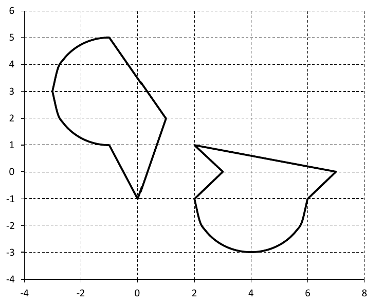

+++
date = '2025-07-01T13:59:16+05:00'
draft = false
title = 'Ветвящиеся алгоритмы'
math = true
tags = ["Python", "Информатика", "Основы программирования"]
categories = ['Основы программирования']
courses = ['Основы программирования']
weight = 10
+++

<!--more-->

Ветвящиеся алгоритмы - алгоритмы, в которых существует несколько сценариев (ветвей) выполнения заданных операций. 
Тот или иной сценарий выполняется в зависимости от условного оператора (или просто условия).

Если в алгоритме одно условие, то существует два сценария выполнения алгоритма. Соответственно каждое дополнительное условие будет увеличивать количество сценариев.

Рассмотрим задачи, решение которых можно реализовать только с помощью ветвящихся алгоритмов.

## Задача с условием (математика)
Необходимо создать программу, вычисляющую значение функции:

$$f(x)=\begin{cases}x^2-1, \quad x>=1 \\ 0, \quad x<1\end{cases}$$

Алгоритм решения такой задачи можно представить в виде блок-схемы:

```goat
            .-------.
           |  Начало |
            '---+---'
                |       
                v
            .---------. 
           /  Ввод x /  
          '-----+---'  
                |      
                v
                .
               / \
              /   \        
        Нет  /     \   Да  
      .-----+ x>=1  +-----.
      |      \     /      | 
      v       \   /       v 
.-----+-----.  \ /  .-----+-----.
|    f=0    |   '   |  f=x**2-1 |
'-----+-----'       '-----+-----' 
      |                   |   
      |     .---------.   |
      '--->/ вывод f /<---'             
          '-----+---'         
                |
                v
            .---+---.
           |  Конец  |
            '-------'
```
Ромбовидный блок - блок условия. В зависимости от того, является ли выражение в нём правдой или ложью, алгоритм пойдёт по одной из выходящих из ромба веток. Как правило, в языках программирования (в том числе в Python) такой блок реализуется с помощью команды `if` (с англ. - если). Альтернативный же сценарий прописывается с помощью команды `else` (с англ. - иначе, в противном случае).

Структура данной блок-схемы является самым стандартным примером ветвящегося алгоритма.

Соответствующее блок-схеме решение в Python выглядит следующим образом:
```python
# Ввод переменных
x = float(input("Введите x: "))
     
# Вычисление функции
if x >= 1:
    f = x**2 - 1
else:
    f = 0
    
# Вывод результатов
print(f"f равно {f}")
```
В данном случае будет выполнена только одна операция, либо:
```python
f = x**2 - 1
```
если значение переменной **x** действительно больше или равно единицы. Либо:
```python
f = 0
```
если значение **x** меньше единицы.


## Задача с условием (экономика)

Вы купили акции за **shares_buy_value** и продали их за **shares_sell_value** через **months** месяцев после покупки. Вычислите величину налога на прибыль **tax** при условии, что ставка налога 13%, но при держании акций более, чем 3 года, налог не взымается.

### Алгоритм решения задачи
Общий алгоритм решения текстовых задач (из экономики, физики и других сфер) заключается в следующем:
1. Определите константы
2. Определите заданные и вычисляемые переменные (в том числе требуемый результат)
3. Составьте алгоритм программы

### Решение
#### 1. Определяем константы
**Константы** - значения, которые не будут меняться во время выполения программы:
- **TAX_RATE**=13% - ставка налога
- **YEARS**=3 - количество лет, после достижения которых величина налога будет равна 0
- **MONTHS_PER_YEAR** - количество месяцев в году. Может показаться, что это в этой постоянной нет смысла, однако если внутри кода встретить выражение `YEARS*12`, то сразу не будет понятно, что речь идёт о переводе в месяцы, такое выражение может также трактоваться, как 12 периодов по `YEARS` лет. 

#### 2. Определяем переменные
**Переменные** - значения, которые могут изменяться во время работы программы, в том числе входные значения:
- **shares_buy_value** - стоимость покупки акций
- **shares_sell_value** - стоимость продажи акций
- **months** - количество месяцев удержания акций
- **tax** - величина налога в рублях.


- shares - акции
- value - стоимость
- buy - купить
- sell - продать
- months - месяцы
- tax - налог
- tax rate - ставка налога


#### 2. Составляем алгоритм программы

**Алгоритм программы:**
1. задать константы **MONTHS_PER_YEAR** = 12, **YEARS** = 3, **TAX_RATE** = 0.13
2. получить из консоли значения переменных: **shares_buy_value**, **shares_sell_value**, **months**
3. сравнить **months** > **MONTHS_PER_YEAR** * **YEARS**
4. если **Правда**, то **tax** = 0
5. если **Ложь**, то **tax** = **TAX_RATE** * (**shares_sell_value** - **shares_buy_value**)
6. если **tax** < 0, то **tax** = 0 т.к. отрицательного налога на прибыль не может быть, это соответствует случаю убытков, а не прибыли.
7. вывести в консоль **tax**

### Код программы
```python
MONTHS_PER_YEAR = 12
YEARS = 3
TAX_RATE = 0.13
     
shares_buy_value = float(input("Введите цену покупки акции: "))
shares_sell_value = float(input("Введите цену продажи акции: "))
months = int(input("Введите количество месяцев: "))

if months > MONTHS_PER_YEAR:
    tax = 0
else:
    tax = TAX_RATE * (shares_sell_value - shares_buy_value)
    if tax < 0:
        tax = 0
        
print(f"налог на прибыль: {tax}")
```

## Задача с множественным условием (математика)
Необходимо создать программу, вычисляющую значение функции:

$$z(x)=\begin{cases}\sin x, \quad x<0 \\ e^x, \quad 0 \le x<1 \\ e, \quad x \ge 1 \end{cases}$$

Алгоритм решения такой задачи можно представить в виде блок-схемы:

```goat
                      .-------.
                     |  Начало |
                      '---+---'
                          |       
                          v
                      .---------. 
                     /  Ввод x /  
                    '-----+---'  
                          |      
                          v
                          .
                         / \
                        /   \        
                  Нет  /     \   Да  
                .-----+  x<0  +-----.
                |      \     /      | 
                v       \   /       v 
                .        \ /  .-----+-----.
               / \        '   | z=sin(x)  |
              /   \           '-----+-----' 
        Нет  /     \   Да           |   
      .-----+  x<1  +-----.         |
      |      \     /      |         | 
      v       \   /       v         |
.-----+-----.  \ /  .-----+-----.   |
|    z=e    |   '   |   z=e^x   |   |
'-----+-----'       '-----+-----'   |
      |                   |         |
      |     .---------.   |         |
      '--->/ вывод z /<---'         |   
          '-----+---'               |
                '---------+---------'
                          |
                          v            
                      .---+---.
                     |  Конец  |
                      '-------'
```
Обратите внимание, что в исходном выражении три условия: 
$$ x<0 $$
$$ 0 \le x<1 $$
$$ x \ge 1 $$
однако в блок-схеме только два условия: `x<0`, `x<1`. Математически блок-схема полностью соответсвует заданным условиям. Однако алгоритм, в отличие от математической записи, подразумевает строгую последовательность действий. Поэтому после проверки первого условия `x<0`, если условие не выполнилось, то противоположное условие `x>=0` выполняется автоматически, в таком случае проверка `x<1` соответствует выражению \( 0 \le x<1 \). Если же и это условие оказывается ложным, то условие \( x \ge 1 \) выполняется автоматически, т.к. все три условия полностью покрывают область определения \( x \) (\( -\infty < x < \infty \)), в таком случае его проверять не нужно (чему соответсвует команда `else`)


Соответствующее блок-схеме решение в Python выглядит следующим образом:
```python
# Ввод переменных
x = float(input("Введите x: "))
     
# Вычисление функции
if x < 0:
    z = sin(x)
elif x < 1:
    z = math.exp(x)
else:
    z = math.e
    
# Вывод результатов
print(f"z равно {z}")
```

## Задачи для самостоятельного решения

### Зачада №1
Напишите программу, которая определяет, является ли заданное пользователем число чётным.

### Задача №2
Напишите программу, которая определяет значение функции:
$$f\left(x\right)=\begin{cases}x^{2}+5, & x\geq0 \\5\cdot \cos\left(x\right) & x<0 \end{cases}\,$$

### Задача №3
Написать функцию `is_point_in_figure(x, y)`, которая даёт ответ, попала ли в фигуру точка по введённым координатам.



Алгоритм попадания точки в область заключается в следующем:
1. разложите фигуры линии, на составляющие их контур (прямые или дуги окружности)
2. составьте уравнения для каждой линии
3. сравните координаты точки \( (x, y \) с проекциями этой точки на каждую линию из контура. Если точка лежит внутри области, значит она лежит выше всех нижних линий, ниже - верхних, правее левых, левее правых. Если фигура невыпуклая, то её надо разбить на выпуклые фигуры (добавить ещё уравнение линии, разделяющей фигуры)


