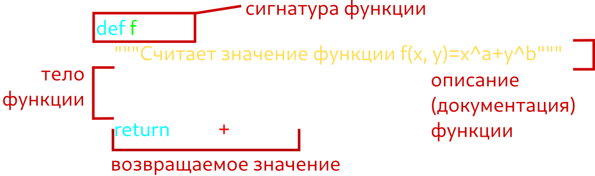
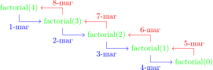

+++
date = '2025-07-01T14:00:02+05:00'
draft = false
title = 'Функции в Python'
math = true
tags = ["Python", "Информатика", "Основы программирования"]
categories = ['Основы программирования']
courses = ['Основы программирования']
weight = 7
+++

<!--more-->

## 1. Что такое функция?

Функция - это именованный блок кода, который выполняет определенную задачу и может быть вызван из других частей программы.

**Основные характеристики:**
- Выполняется только при вызове по имени функции
- Может принимать входные аргументы
- Может возвращать результат
- Улучшает читаемость и структуру кода программы

### Пример стандартной функции из пакета math
Использование функции косинуса:
```
>>>from math import cos
>>>cos(0)
1.0
>>>cos(3.14159265)
-1.0
>>>cos(0.5)
0.8775825618903728
```

### Пример простой функции, созданной пользователем:
Создание функции:
```python
def sum(x, y):
    return x + y
```

Использование функции:
```
>>>sum(1,4)
5
>>>sum(4,5)
9
>>>sum(9,12.4)
21.4

```


## 2. Создание функции

Код функции включает в себя:
1. Сигнатуру
2. Описание (документацию) функции
3. Тело функции
4. Возвращаемое значение



### Сигнатура
В сигнатуре по порядку записываются:
1. Ключевое слово **def**
2. Имя функции

Функции в Python называются в стиле [snake_case](https://en.wikipedia.org/wiki/Snake_case). То есть все слова пишутся маленькими буквами и разделяются между собой нижним подчёркиванием (_)


3. В круглых скобках входные аргументы функции
4. Двоеточие


#### Аргументы
Аргументы, или входные значения, являются значениями, которые влияют на работу функции и на её результат. Разные входные значения
```
>>>import math
>>>math.asin(0)
0
>>>math.asin(1)
1.5707963267948966
```

Если аругментов больше, чем один, то они разделяются запятыми. Важно, что при вызове функции должны быть указаны все её аргументы. Например для если функция вычисляет выражение \( g(x,a)=x^a \) и имеет код:
```Python
def g(x, a):
    return x**a
```
то при вызове обязательно нужно указать все аргументы:
```
>>>print(g(5, 2))
25
```

 Если аргументов нет, то указываются пустые скобки ()

##### Значения аргументов по-умолчанию
Однако, если параметр имеет значение по-умолчанию (например, \(a=2\)), то в таком случае его можно не указывать, для этого аргумент объявляется следующим образом:
```Python
def g(x, a=2):
    return x**a
```
В таком случае функция будет работать следующим образом:
```
>>>g(5)
25
>>>g(5, 2)
25
>>>g(5, 3)
125
```
Аргументы, имеющие значения по-умолчанию, указываются после всех обязательных аргументов.

##### Произвольное число аргументов
В случае, если заранее неизвестно, сколько будет аргументов, то используется выражение ***args**, которое является кортежем входных параметров
```python
def sum(*args):
    """Вычисляет сумму входных аргументов"""
    result = 0
    for arg in args:
        result = result + arg
    return result
```
Результат вызова функции:
```
>>>sum(5, 3, 4)
12
>>>sum(2, 2)
4
>>>sum()
0
```

В случае, если в рамках функции удобно использовать не кортеж аргументов, а словарь:
```python 
def print_kwargs(**kwargs):  # kwargs - словарь
    print(kwargs)
```

#### Указание типов в сигнатуре
Python является языком с динамической типизацией.

Однако в сигнатуре для удобства пользования функцией можно указать тип в явном виде:
##### Функция без указания типов данных
```python 
def p(s, n):
    """Функция определяет, является ли число n длиной строки s. 
    Функция возвращает True или False"""
    return len(s)==n 
```

##### Функция с явным указанием типов данных
```python 
def p(s: str, n: int) -> bool:
    """Функция определяет, является ли число n длиной строки s. 
    Функция возвращает True или False"""
    return len(s)==n 
```

Результат работы функции:
```
>>> p('text',4)
True
>>> p('text',3)
False
```


### Документирование функции
Описание или документация функции указывается следующей сторокой после сигнатуры и включает в себя описание функции. 
Описание функции очень важно, т.к. позволяет создателю функции, другим разработчикам и пользователям быстро разобраться, что делает функция и как она работает.

#### Пример краткого (однострочного) описания функции:
```python
def multiply(a: float, b: float) -> float:
    """Возвращает произведение двух чисел."""
    return a * b
```

#### Примеры подробного (многострочного) описания функции:
```python
def multiply(a: float, b: float) -> float:
    """Вычисляет произведение двух чисел.

    Args:
        a (float): Первый множитель. Может быть целым или дробным числом.
        b (float): Второй множитель. Может быть целым или дробным числом.

    Returns:
        float: Результат умножения a на b. Всегда возвращает float,
               даже для целочисленных аргументов.

    Examples:
        >>> multiply(2, 3)
        6.0
        >>> multiply(1.5, 4)
        6.0
    """
    return a * b
```

```python
def vector_to_str(vector):
    '''
    Преобразует вектор в строку для вывода
    
    :param vector: исходный вектор (list)
    :return: строка представления вектора (str)
    '''
    return '[' + ', '.join(f'{item:.2f}' for item in vector) + ']'
```


Известные стандарты документирования функций:
1. [PEP 257 – Docstring Conventions](https://peps.python.org/pep-0257/)
2. [Numpy Docstring Standard](https://numpydoc.readthedocs.io/en/latest/format.html#docstring-standard)
3. [Google Python Style Guide: Docstrings](https://google.github.io/styleguide/pyguide.html#38-comments-and-docstrings)

### Тело функции
Тело функции включает в себя основной код, необходимый для реализации задачи, для которой написана функция.

Тело функции начинается со следующей строки после сигнатуры или документации функции (если она есть) и заканчивается ключевым словом **return**.

Если функция состоит только из выражения после **return**, то тело функции считается пустым.


### Возвращаемое значение
Если функция должна вернуть значение после выполнения, то для этого используется ключевое слово **return**, после которого указывается постоянное значение, переменная или выражение. 

#### Пример функции с возвращаемым значением
```python
import os

def get_file_status(filename):
    """Функция возвращает статус файла в текущей директории"""
    return os.path.isfile(filename)
        
print(get_file_status('test_file1.txt'))
print(get_file_status('test_file2.txt'))    

```
Результат работы функции:
```
True
False
```

#### Пример функции без возвращаемого значения
```python
import os

def print_file_status(filename):
    """Функция выводит в консоль статус файла в текущей директории"""
    if os.path.isfile(filename):
        print(f"\033[92m[✓]\033[0m Файл '{filename}' найден")
    else:
        print(f"\033[91m[×]\033[0m Файл '{filename}' отсутствует")
        
print_file_status('test_file1.txt')
print_file_status('test_file2.txt')    

```
Результат работы функции:
```
[✓] Файл 'test_file1.txt' найден
[×] Файл 'test_file2.txt' отсутствует

```

#### Пример функции, возращающей несколько значений

В случае, если необходимо вернуть несколько значений, то они указываются через запятую, и в таком случае функция вернёт кортеж значений.

```Python
def calculate_stats(numbers):
    """Возвращает минимум, максимум и среднее из списка чисел"""
    minimum = min(numbers)
    maximum = max(numbers)
    average = sum(numbers) / len(numbers)
    return minimum, maximum, average  # Фактически возвращается кортеж (min, max, avg)

# Использование
nums = [4, 2, 9, 5]
min_val, max_val, avg_val = calculate_stats(nums)
print(f"Min: {min_val}, Max: {max_val}, Avg: {avg_val}")
```

Также можно вернуть другие структуры данных, которые будут в себе хранить множество значений.


## 2. Зачем нужны функции?

Рассмотрим задачу

### Задача
Вычислить выражение:
$$y(x)=\frac{x^2}{2!}+\frac{x^4}{4!}+\frac{x^6}{6!}$$

#### Решение без функции:
```python
fact1 = 1
for i in range(1, 3):
    fact1 *= i

fact2 = 1
for i in range(1, 5):
    fact2 *= i

fact3 = 1
for i in range(1, 7):
    fact3 *= i

y = x**2/fact1 + x**4/fact2 + x**6/fact3
```
Как можно видеть, часть схожего кода повторяется несколько раз. В таком случае этот код можно поместить в отдельную функцию.

#### Решение с функцией:
```python
def factorial(n):
    result = 1
    for i in range(1, n + 1):
        result *= i
    return result

y = x**2/factorial(2) + x**4/factorial(4) + x**6/factorial(6)
```


## 3. Типы функций

### 3.1. По области видимости

**Глобальные функции:**
- Доступны из любой части кода
- Определяются на уровне модуля (файла с расширением *.py*)

**Локальные функции:**
- Определяются внутри других функций
- Видимы только внутри родительской функции

Пример:
```python
def task1():  # Глобальная
    x = float(input("Введите x: "))
    
    def f(x):  # Локальная
        return x**5/factorial(5)
    
    print(f"f(x) = {f(x):.2f}")

task1()
print(f"3! = {factorial(3)}")  # Глобальная функция доступна
```

### 3.2. Лямбда-функции
Анонимные функции или лямбда-функции, определяемые через ключевое слово **lambda**, позволяют создавать функции в любой части кода.

#### Пример обычной функции
```python
def get_length(x):
    """Функция возвращает длины передаваемого объекта"""
    return len(x)

print(get_length([2, 2, 2]))
```
Результат работы функции:
```
3
```
#### Пример аналогичной анонимной функции
```python
function = lambda x: len(x)

print(function([2, 2, 2]))

```
Результат работы функции аналогичен использованию обычной функции:
```
3
```
В данном примере функции была присвоена ссылка (имя) **function**. Однако при создании анонимной функции необязательно ей присваивать имя.

#### Пример создания и использования анонимной функции без указания имени
```python
result = (lambda x, y: x**y)(2, 3)

print(result)

```
Результат работы функции:
```
8
```
Обратите внимание, что **result** - это не ссылка на функцию, а результат её работы - полученное значение. 


Так как в Python всё является объектами, лямбда-функции - тоже объекты. Следовательно функции можно создавать в [цикле]()), и ссылки  на них помещать в структуры данных.
#### Пример создания и использования множественных анонимных функций
```python
x = 2

# создание списка функций: x, x^2, x^3, ...
functions = []
for power in range(1, 5):
    functions.append(lambda x, p=power: x**p)

# использования созданных функций
for function in functions:
    print(function(x))
```
Результат работы кода:
```
2
4
8
16
```

### 3.3. Методы
Методы - функции, привязанные к объектам:
```python
import math

math.cos()  # Метод модуля math

my_list = []
my_list.append(2)  # Метод списка, добавляет элементы списка
```

## 4. Продвинутые возможности

### 4.1. Функции как аргументы

Функции можно передавать как аргументы другим функциям. 

В примере функция **func_plot** строит график любой переданной математической функции одного аргумента на указаном интервале:

```python
import math
import matplotlib.pyplot as plt

def func_plot(f, start, end):
    """Визуализирует график функции f на интервале [start, end]"""
    POINTS_NUMBER = 10
    step = (end - start)/(POINTS_NUMBER - 1)
    x = [start + step*i for i in range(POINTS_NUMBER)]
    y = [f(xi) for xi in x]
    
    plt.plot(x, y)
    plt.grid()
    plt.show()

# Использование
func_plot(math.cos, -3, 3)
func_plot(lambda x: x**3 + 5, -2, 5)
```

### 4.2. Рекурсия

Рекурсивная функция - это функция, вызывающая саму себя. 

Сценарий без вызова самой функции называется базовым случаем (```if n == 0: return 1``` в примере ниже)

#### Пример рекурсии
Так как факториал по определению является числом, умноженным на факториал меньшего на единицу числа, удобно для его расчёта использовать рекурсию:

```python
def factorial(n):
    if n == 0:  # Базовый случай
        return 1
    else:
        return n * factorial(n - 1)
```

Процесс работы рекурсии:



#### Плюсы рекурсии:
- Упрощает решение сложных задач, касающихся структур данных и сложных алгоритмов (сортировки, обходы дверовидных структур)
- Делает код короче, чище и понятнее

#### Минусы рекурсии:
- Задействует больше вычислительных ресурсов (оперативной памяти и процессора)


## 5. Задачи для самостоятельного решения

### Зачада №1
Напишите функции, реализующие стандартные арифметические операции с числами: сложение, вычитание, умножение, деление, возведение в степень.

### Задача №2
Напишите функцию, которая возвращает объект функции полинома произвольной степени. В качестве входных аргументов функция принимает значения коэффициентов полинома от нулевой степени до наибольшей

Посчитайте с помощью функции значения следующих полиномов:

$$y(x) = 3+5x-7.5x^2+2x^3$$
$$y(x) = 5x-7.5x^2+2x^3-4x^4$$
$$y(x) = -12+x^5$$


