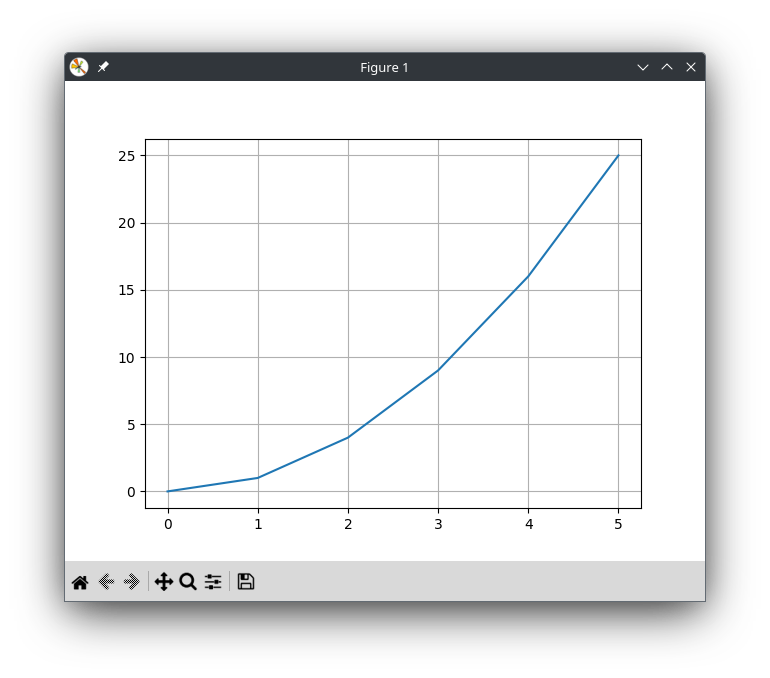

+++
date = '2025-07-01T13:59:52+05:00'
draft = false
title = 'Структуры данных'
math = true
tags = ["Python", "Информатика", "Основы программирования"]
categories = ['Основы программирования']
courses = ['Основы программирования']
weight = 7
+++

<!--more-->

Перед рассмотрением структур данных рассмотрим следующие понятия.

## Изменяемость объектов
**Изменяемость** объекта (любого объекта, не только структуры данных) определяет, можно ли изменить значение объекта в той же ячейке памяти, где оно хранится:
- *изменяемые (mutable)* объекты допускают изменение значения объекта.
  
  *изменяемые структуры* допускают модификацию их элементов (добавление, удаление, изменение элементов).

  Примеры: [списки (list)](), [словари (dict)](), [множества (set)]()

- *неизменяемые (immutable)* структуры нельзя изменить после создания.
  
  При "изменении" такой структуры создаётся новый объект и на него даётся та же ссылка, что на предыдущий. Предыдущий объект при этом удаляется.
  
  Примеры: [кортежи (tuple)](), [строки (str)](), числа (int, float)

  
| Класс объекта  | Описание               | Изменяемый? |
|----------------|------------------------|-------------|
| `bool`         | True/False             | -           |
| `int`          | целые числа            | -           |
| `float`        | вещественные числа     | -           |
| `list`         | списки                 | +           |
| `tuple`        | кортежи                | -           |
| `str`          | строки                 | -           |
| `set`          | множества              | +           |
| `frozenset`    | неизменяемые множества | -           |
| `dict`         | словари                | +           |
       

### Ссылки на объекты

Особенностью языка **Python** является то, что все данные в нём является объектами (их тип - *object*). В том числе объекты, которые обычно называют переменными (например, `x=2.4`, `is_valid=True`, `some_string='test`). Однако такой объект, в отличие от классической переменной, является неизменяемым.

Рассмотрим вариант "изменения" значения "переменной":
```Python
>>>x=5
>>>id(x)
139968856327592
>>>x=x+1
>>>x
6
>>>id(x)
139968856327624
```
Функция `id()` показывает адрес памяти, где хранится объект.

Как видно, после выполнения операции `x=x+1` ссылка `x` ведёт на другой адрес. Таким образом, то, что принято называть переменной, в **Python** является *ссылкой на объект* или *именем переменной*.


## Упорядоченность

**Упорядоченность** структуры данных определяет, существует ли чёткий порядок элементов в структуре данных
- *упорядоченные* структуры имеют фиксированный порядок, 
  например, [список]() `[2, 4, 6]` всегда сохраняет эту последовательность, т.е. на нулевой позиции всегда будет 2, на первой - 4, на второй - 6. И к этим элементам можно обратиться по номеру позиции.
  
  Примеры: [списки (list)](), [кортежи (tuple)](), [строки (str)]()

- *неупорядоченные* структуры содержат элементы, порядок которых явным образом не определён.
  
  например [множество]() `{1, 2, 3}` в множестве может выводиться как `{2, 1, 3}`.
  
  Примеры: [множества (set)](), [словари (dict)]()
     


## Списки {#list}

**Список (list)** - упорядоченная изменяемая коллекция объектов произвольных типов.

Объектами списка могут быть целые числа, вещественные числа, строки, списки (и другие структуры данных) и другие объекты.


### Задача со списком (математика)

Рассмотрим задачу

> **Задача**: Построить график функции \( f(x) = x^2 \) для интервала \( x \in [0, 5] \).

Используемые инструменты:
- Пакет Matplotlib
- Объекты - списки (list)

```python
import matplotlib.pyplot as plt

x = [0, 1, 2, 3, 4, 5]
y = [0, 1, 4, 9, 16, 25]

plt.plot(x, y) # нарисовать график
plt.grid() # включить сетку
plt.show() # показать рисунок
```

Результат работы программы:


### Способы создания списка

#### Создание пустого списка
```Python
>>>lst = []
>>>lst
[]

```
Другой вариант:
```Python
>>>lst = list()
>>>lst
[]
```

#### Создание списка с элементами
```Python
>>>lst = [1, 2, 3, 'a', 'b', True]  # Может содержать разные типы
>>>lst
[1, 2, 3, 'a', 'b', True]
```

#### Создание списка с помощью конструктора `list()`
```python
>>>list('hello')  
['h', 'e', 'l', 'l', 'o']
>>>list(range(5))
[0, 1, 2, 3, 4]
>>>list((1, 2, 3))  # Конвертация кортежа
[1, 2, 3]
```

`list()` может конвертировать любую итерируемую коллекцию

#### Создание списка с помощью генератора списков (list comprehension)
```Python
>>>[x for x in range(10)]  
[0, 1, 2, 3, 4, 5, 6, 7, 8, 9]
```
```Python
>>>[x**2 for x in range(5)]
[0, 1, 4, 9, 16]
```
```Python
>>>[c.upper() for c in 'hello']
['H', 'E', 'L', 'L', 'O']
```
```python
>>>x = [0, 1, 2, 3, 4, 5]
>>>y = [a**2 for a in x] # одновременное создание и заполнение
>>>y
[0, 1, 4, 9, 16, 25]
>>>z = [a**2 for a in x if a > 2] 
>>>z
[9, 16, 25]
```
Генераторы списков - самый мощный и Python-способ

#### Создание списка с помощью `split()` (из строки)
```python
lst = "apple banana cherry".split()  # ['apple', 'banana', 'cherry']
lst = "1,2,3,4".split(',')  # ['1', '2', '3', '4']
```

#### Сложение списков
```python
lst = [1, 2] + [3, 4]  # [1, 2, 3, 4]
```

#### Копирование списка
```python
original = [1, 2, 3]
lst = original.copy()  # [1, 2, 3]
lst = list(original)  # Альтернативный вариант
lst = original[:]  # Срез от начала до конца
```

#### Создание списка с помощью оператора `*`
```python
lst = [0] * 5  # [0, 0, 0, 0, 0]
lst = ['hello'] * 3  # ['hello', 'hello', 'hello']
```

`*` оператор удобен для создания однородных списков

#### Вложенные списки
```python
matrix = [[1, 2], [3, 4], [5, 6]]
```

#### Создание списка с помощью функции `map()`
```python
lst = list(map(str, range(3)))  # ['0', '1', '2']
```

#### Создание списка с помощью функции фильтрации `filter()`
```python
lst = list(filter(lambda x: x > 0, [-2, -1, 0, 1, 2]))  # [1, 2]
```

#### Создание списка с помощью других коллекций
```python
lst = list({'a': 1, 'b': 2})  # ['a', 'b'] (ключи словаря)
lst = list({1, 2, 3})  # [1, 2, 3] (из множества)
```

Для копирования лучше использовать методы `.copy()` или `list()`

## Методы списка
| Метод | Описание |
|-------|----------|
| `list.append(x)` | Добавляет элемент в конец списка |
| `list.extend(L)` | Расширяет список list, добавляя в конец все элементы списка L |
| `list.insert(i, x)` | Вставляет на i-ый элемент значение x |
| `list.remove(x)` | Удаляет первый элемент в списке, имеющий значение x. ValueError, если такого элемента не существует |
| `list.pop([i])` | Удаляет i-ый элемент и возвращает его. Если индекс не указан, удаляется последний элемент |
| `list.index(x, [start [, end]])` | Возвращает положение первого элемента со значением x (при этом поиск ведется от start до end) |
| `list.count(x)` | Возвращает количество элементов со значением x |
| `list.sort([key=функция])` | Сортирует список на основе функции |
| `list.reverse()` | Разворачивает список |
| `list.copy()` | Поверхностная копия списка |
| `list.clear()` | Очищает список |

## Кортежи {#tuple}

**Кортеж (tuple)** - упорядоченная неизменяемая коллекция объектов произвольных типов.

- Используются для защиты данных, которые не должны быть изменены.
- Удобен для передачи данных фиксированной длины и содержания между функциями/методами.
- Работает быстрее, чем список.

```Python
a = (1, 2, 3, 4, 5, 6)
a = ("John", 45, True)
a = (1,)
```

## Множества {#set}
**Множество (set)** - неупорядоченная изменяемая коллекция неповторяющихся объектов произвольных типов.
Удобны для удаления неповторяющихся значений.

```Python
a = set()
a = set('hello') # {'h', 'o', 'l', 'e'}
a = {'a', 'b', 'c', 'd'}
a = {i ** 2 for i in range(7)} # {0, 1, 4, 9, 16, 25}
a = {'a', 'b', 'c', 'a'} # {'a', 'b', 'c'}
```

```Python
words = ['break', 'file', 'break', 'one']
>>>set(words)
{'file', 'break', 'one'}
```

### Методы множеств:
- in
  ```Python
  >>>a = {'a', 'b', 'c', 'd'}
  >>>'a' in a
  True  
  ```
- issubset(other) - истина, если все элементы set принадлежат other:
  ```Python
  >>>a = {'a', 'b', 'c', 'd'}
  >>>a.issubset({'a', 'b', 'c', 'd', 'f', 'e'})
  True
  ```
- union(other, ...) - возвращает объединение нескольких множеств: 
  ```Python
  >>>a = {'a', 'b', 'c', 'd'}
  >>>a.union({'f', 'd'})  
  {'b', 'a', 'c', 'f', 'd'}
  ```

## Словари {#dictionary}

**Словари** - неупорядоченные изменяемые коллекции произвольных объектов с доступом по ключу.

- Данные в словарях хранятся в парах: `ключ` : `значение`.
- Словарь является реализацией ассоциативного массива в Python.
- В словаре не может быть двух элементов с одинаковыми ключами. Однако могут быть одинаковые значения у разных ключей.

Рассмотрим задачу, при решении которой удобно использовать словарь.

**Задача**: Написать программу, которая по введённому пользователем дню недели выводит заранее известное количество шагов, которое ему нужно пройти.

Код программы решения задачи:
```Python
steps = {'понедельник': 3500, 'вторник': 5000, 'среда': 6000, 'четверг': 8000, 'пятница': 10000, 'суббота': 4000, 'воскресенье': 0}

while True:
    print(steps[input('Введите день недели: ')])
```

Запустите программу с различными входными условиями.

### Варианты создания и заполнения словаря

#### Создание словаря с помощью функции `dict`:
```Python
>>>d = dict(short='dict', long='dictionary')
>>>d
{'short': 'dict', 'long': 'dictionary'}
```

#### Создание словаря с помощью функции `dict` на основе списка кортежей
```Python
>>>d = dict([(1, 1), (2, 4)])
>>>d
{1: 1, 2: 4}
```

#### Получение значений словаря по ключу
```PYthon
>>>d = {'a': 2, 'b': 4, 'g': 9}
>>>d 
{'a': 2, 'b': 4, 'g': 9}
>>>d['b']
4
>>>d['g']
9
```

#### Создание пустого словаря и добавление к нему значений
```Python
>>>d = {}
>>>d['key1'] = 'value1'
>>>d
{'key1': 'value1'}
```

#### Добавление нескольких элементов с помощью метода `update()`
```Python
>>>d = {'a': 1}
>>>d.update({'b': 2, 'c': 3})
>>>d
{'a': 1, 'b': 2, 'c': 3}
```

#### Добавление элементов с проверкой с помощью метода `setdefault()`
```Python
>>>d = {'name': 'Alice'}
>>>d.setdefault('age', 25)  # Добавит, если ключа нет
25
>>>d.setdefault('name', 'Bob')  # Не добавит, т.к. ключ существует
'Alice'
>>>d
{'name': 'Alice', 'age': 25}
>>>d.update({'name': 'Bob'})  # Обновит существующее значение
>>>d
{'name': 'Bob', 'age': 25}
```

#### Объединение словарей с помощью оператора `|=`
```Python
>>>d = {'x': 10}
>>>d |= {'y': 20, 'z': 30}  # Объединение словарей
>>>d
{'x': 10, 'y': 20, 'z': 30}
```

#### Метод fromkeys() (инициализация с одним значением)
```Python
>>>keys = ['a', 'b', 'c']
>>>d = dict.fromkeys(keys, 0)  # Все значения 0
>>>d
{'a': 0, 'b': 0, 'c': 0}
```

#### Добавление через распаковку
```Python
>>>d = {'a': 1}
>>>new_items = {'b': 2, 'c': 3}
>>>d = {**d, **new_items}  # Распаковка словарей
>>>d
{'a': 1, 'b': 2, 'c': 3}
```

#### Добавление с проверкой через `if`
```Python
d = {}
key, value = 'color', 'blue'
if key not in d:
    d[key] = value
print(d)
```
Результат работы кода:
```
{'color': 'blue'}
```

### Методы словарей
| Метод | Описание |
|-------|----------|
| `dict.clear()` | Очищает словарь |
| `dict.copy()` | Возвращает копию словаря |
| `dict.fromkeys(seq[, value])` | Создает словарь с ключами из seq и значением value (по умолчанию None) |
| `dict.get(key[, default])` | Возвращает значение ключа, но если его нет, возвращает default (по умолчанию None) |
| `dict.items()` | Возвращает пары (ключ, значение) |
| `dict.keys()` | Возвращает ключи в словаре |
| `dict.pop(key[, default])` | Удаляет ключ и возвращает значение. Если ключа нет, возвращает default (по умолчанию бросает исключение) |
| `dict.setdefault(key[, default])` | Возвращает значение ключа, но если его нет, создает ключ с значением default (по умолчанию None) |
| `dict.update([other])` | Обновляет словарь, добавляя пары (ключ, значение) из other. Существующие ключи перезаписываются |
| `dict.values()` | Возвращает значения в словаре |


## Задачи для самостоятельного решения

### Зачада №1
Создайте список, состоящий из \( n \) первых простых чисел.

### Задача №2
Постройте график любой функции на диапазоне, границы которого заданы пользователем.

### Задача №3
Напишите функцию, которая возвращает список общих элементов двух списков.

### Задача №4
Реализуйте алгоритм пузырьковой сортировки для списка.

### Задача №5
Дан словарь sales, где ключ — название товара, а значение — список продаж за последние 5 дней, например:
```Python
sales = {
    "Ноутбук": [12000, 15000, 9000, 11000, 13000],
    "Смартфон": [8000, 9500, 7000, 8500, 10000],
    "Планшет": [5000, 6000, 4000, 5500, 4500],
    "Наушники": [2000, 1500, 3000, 2500, 1800]
}
```
Напишите программу, которая строит подобный словарь по введённым пользователем значениям.

Выведите список товаров по убыванию суммарной выручки.


