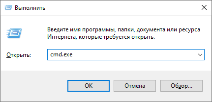
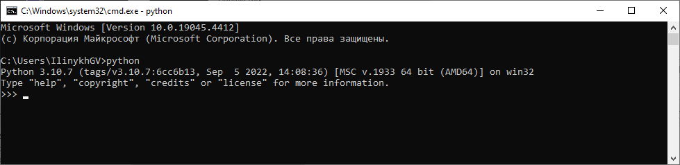
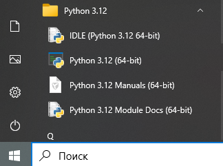
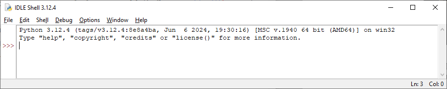
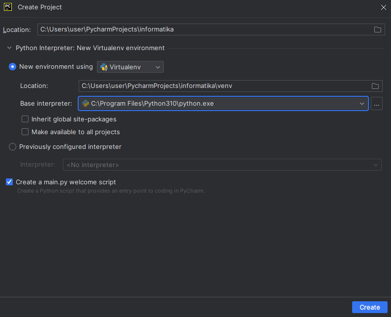
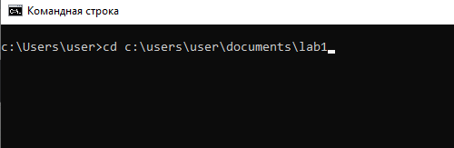
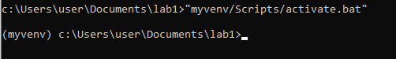
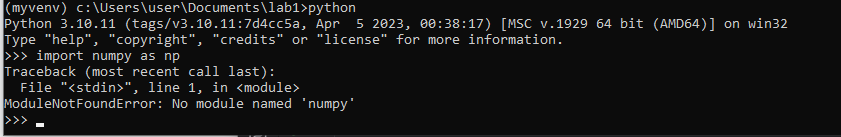
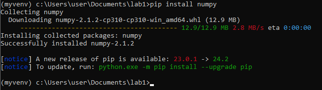

+++
date = '2025-07-01T13:56:15+05:00'
draft = false
title = 'Запуск Python на компьютере. Настройка виртуального окружения Python. Импорт пакетов/модулей/библиотек'
math = true
tags = ["Python", "Информатика", "Основы программирования", "Виртуальное окружение"]
categories = ['Основы программирования']
courses = ['Основы программирования']
weight = 3
+++

<!--more-->

## Запуск Python
   
### Запуск Python в командной строке {#python_cmd}

Запустите командную строку:
1. В Windows: нажмите комбинацию клавиш `Win+R`
2. В появившемся окне введите название программы командной строки: `cmd.exe`
   
3. В появившемся окне введите название программы интерпретатора Python: `python` и нажмите `Enter`
   
4. В командной строке открылся Python в интерактивном режиме. В таком режиме можно пользоваться Python как калькулятором. Введите выражение `75*35` и нажмите `Enter`.
5. Задайте переменную `x=5`. Введите выражение `x/7+5**3` и нажмите `Enter`.
6. Для более сложных расчётов необходимо импортировать дополнительную библиотеку Math. Введите `import math` и нажимите Enter.
7. Аналогичным образом задайте произвольное значение для переменной `y`.
8. Посчитайте выражение \( \cos{y}+3\sin{x} \). Для ввода функции \( \cos{y} \) используется код `math.cos(y)`
9. Для выхода из Python используйте комбинацию клавиш Ctrl+z.

### Запуск Python IDLE {#python_idle}

Запустите программу IDLE Python - простую среду для работы с Python:
1. В Windows: нажмите клавишу Win и введите в поиске IDLE, запустите найденную программу **IDLE (Python)**. Также программу можно найти в панели программ в папке Python:
   
2. Открывшееся окно представляет собой оболочку для запуска Python, аналогичную той, что была запущена в командной строке в [предыдущем разделе]()
   
3. Нажмите **File → New File** чтобы создать текстовый файл.
4. В проводнике Windows создайте свою папку `lab_python` в документах пользователя и сохраните редактируемый текстовый файл под именем `task2.py` в этой папке.
5. Для запуска программы из текстового файла нажмите **Run → Run Module** или клавишу **F5** в выбранном окне файла.
6. Напишите программу для вычисления следующих математических функций:
   $$a=\sqrt{\frac{x^3}{2}}-\sin{y}$$  
   $$b=\frac{e^2}{3}-\cos{y}+z+\ln{y}$$
 
Первая строка программы включает импорт функций. Выражение для импорта косинуса и натурального логарифма имеет вид: `from math import cos, log`. Добавьте в это выражение импорт функции синуса, квадратного корня (`sqrt`) и экспоненты (`e`) и напишите его в программе. 

В таком случае к функции `cos` можно обратиться по её имени без указания имени библиотеки `math.cos`. Аналогично для других функций.

7. Для ввода переменной `x` пользователем добавьте код:
```python
x = float(input("Введите значение переменной x: "))
```
Здесь `input` - функция, вызывающая ввод символов из консоли, `float` - функция, переводящая символы в вещественное число.

Напишите аналогичные строки кода для ввода переменных `y` и `z`.
8. После подсчёта функции `a` выведите её значение в консоль командой:
```python
print(f"Получено значение функции a={a}")
```

### Запуск Python в интегрированной среде разработки Pycharm {#pycharm}

Запустите программу **Pycharm**:
1. В Windows: нажмите клавишу Win и введите в поиске Pycharm, запустите найденную программу **Pycharm Community Edition**. Также программу можно найти в панели программ в папке **JetBrains**
   
2. Создайте новый проект **File → New Project**. При этом автоматически будет создано новое [виртуальное окружение]() в папке `venv`.
3. Создайте новый файл в дереве проекта (левая панель) с помощью **ПКМ → New File...** с именем `task3.py` (ПКМ - правая клавиша мыши).
4. Запишите в новом файле код вычисления значения функции:
   $$z=2\sqrt[4]{x^6}(x+a)+y^{b}$$
   используя пользовательский ввод и вывод, как в [предыдущем разделе]().
5. Запускайте программы комбинацией клавиш `Ctrl+Shift+F10` при первом запуске и `Shift+F10` при последующих.


## Виртуальное окружение Python {#venv}

В процессе разработки на языке Python требуется подключение тех или иных модулей и библиотек. При этом для разных проектов требуются не только разные библиотеки, но зачастую одна и та же библиотека, но разных версий. 

Для того, чтобы не устанавливать все библиотеки в директорию интерпретатора пользователя или операционной системы, библиотеки устанавливаются в виртуальное окружение (venv - virtual environment). Виртуальное окружение представляет собой отдельную директорию, которая, как правило, находится в корневой папке проекта. В нём же находится копия интепретатора определённой версии, который будет запускать код проекта.

```goat
   .-------------.
   |интерпретатор|
   |Python в ОС  |
   .---+---------.
       |
       v
       |
   .---+---------------.-------------.    
   |                   |             |
   v                   v             v   
 .-+---------------. .-+---------. .-+---------.
 |Проект 1         | |Проект 2   | |Проект 3   |
 .-----------------. .-----------. .-----------.
 |Виртуальное      | |Виртуальное| |Виртуальное|
 |окружение 1      | |окружение 2| |окружение 3|
 .-----------------. .-----------. .-----------.
 .-pytest=7.1.3    | .-numpy=1.24| .-flask     |  
 .-matplotlib=3.7.1| .-scipy     | .-----------.
 .-numpy=1.23.3    | .-----------. 
 .-----------------.
 ```

### Создание виртуального окружения в командной строке 

Как было показано [ранее]() интегрированная среда разработки сама может создать виртуальное окружение. Однако полезно уметь работать с виртуальным окружением с помощью командной строки.

1. Откройте командную строку `cmd.exe`
2. Перейдите в папку, созданную [ранее]() с помощью команды `cd`:
   
3. Введите команду:
  ```cmd
  python -m venv myvenv
  ```
   Ключ `-m` значит, что Python будет запускать модуль. В данном случае будет запущен модуль `venv`, который создаёт виртуальное окружение. Будет создано виртуальное окружение под названием `myvenv`. Папка с соответствующим названием будет создана в текущей директории. Можно это проверить зайдя в папку в Проводнике Windows или введя команду `dir` в консоли.
4. Активируйте созданное виртуальное окружение с помощью запуска программы `activate.bat`:
   
   Если окружение активировано, то слева появится его имя в круглых скобках. Значит теперь вы работаете именно в этом окружении в рамках текущей консоли (командной строки). Если вы хотите выключить виртуальное окружение, то аналогичным образом запустите программу `deactivate.bat`.
5. Откройте консоль Python с помощью соответствующей команды `python`.
6. Попробуйте импортировать пакет `numpy`:
   ```python
   import numpy as np
   ```
   Так как в данном окружении пакет не установлен, то появится ошибка:
   
7. Закройте консоль Python с помощью `Ctrl+z`.
8. Установите пакет `numpy` в данном виртуальном окружении с помощью команды:
   ```cmd
   pip install numpy
   ```
   Запустится процесс установки пакета:
   
9. Повторите шаги 5-6.

Если вы хотите установить библиотеку определённой версии, то команда выглядит следующим образом:
```cmd
pip install numpy==1.24
```

## Информация по импорту модулей/пакетов/библиотек
- Импорт всегда указывается в самом начале программы
- Пакеты/модули/библиотеки могут быть предустановлены или их необходимо скачать перед импортом
- Пакеты, как и любое другое программное обеспечение имеют версию. Если указывать версию при загрузке библиотеки, то будет скачана указанная версия. Если версию не указать, то последняя версия для текущей версии интерпретатора.
- Скачать пакеты можно через IDE (интегрированную среду разработки)
- Пакеты можно создавать самостоятельно
- В Python пакеты необходимо устанавливать в виртуальное окружение!
- В Python установкой пакетов занимается программа `pip`, которой можно воспользоваться через командную строку

## Задание на самостоятельную работу

Создайте три виртуальных окружения `venv1`, `venv2`, `venv3`, в которые установите разные библиотеки, как показано на схеме [выше]() 
