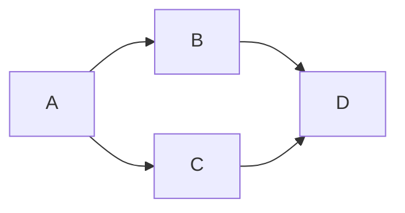

+++
date = '2026-01-14T11:54:31+05:00'
draft = true
title = 'Тестовый пост для проверки функциональностей'
+++

Проверяются: Tikz, Latex, Video, Скрывающийся текст, Диаграммы, ссылки, svg, код, таблица

<!--more-->


## Latex

Формула в отдельной строке через goldmark: $$ Fmax ≤ Fкр $$ 

Формула внутри строки через goldmark: \( E = \sigma \cdot \varepsilon \)

Inline формула:
x^2 + 1

Блочная формула:

\int_0^1 x^2 \, dx = \frac{1}{3}


## Video



## Скрывающийся текст


Функции в Python называются в стиле [snake_case](https://en.wikipedia.org/wiki/Snake_case). То есть все слова пишутся маленькими буквами и разделяются между собой нижним подчёркиванием (_)


<!--  <p class="speshal-fancy-custom">
    This is <strong>raw HTML</strong>, inside Markdown.
  </p>-->


## Встраиваемый html-код

<!-- 
<div>
  <iframe src="https://trinket.io/embed/python/5a2046f9ee" width="100%" height="356" frameborder="0" marginwidth="0" marginheight="0" allowfullscreen></iframe>
</div>
 -->

## Ссылки

[Hugo documentation](https://gohugo.io/commands/hugo_server/)
1. [PEP 257 – Docstring Conventions](https://peps.python.org/pep-0257/)
2. [Numpy Docstring Standard](https://numpydoc.readthedocs.io/en/latest/format.html#docstring-standard)
3. [Google Python Style Guide: Docstrings](https://google.github.io/styleguide/pyguide.html#38-comments-and-docstrings)

## Картинки

### Диаграммы GOAT

```goat
          |
          +<----------------+
          |                 |
          v                 | 
          .                 |
         / \                |
        /   \               |
       /     \              | 
 Нет  /       \  Да         |
.----+ условие +----.       |
|     \       /     |       |                              
|      \     /      |       |
|       \   /       v       |
|        \ /  .-----+-----. |
|         '   |  действие | |
|             '-----+-----' | 
'---------+         |       |
          |         '-------+		   
          v
```

```goat
           |           
           v           
       .-------.       
      /         \ Нет  
.--->+ i=1 до n  +---. 
|     \         /    | 
|      '---+---'     | 
|          |  Да     |
|          v         |
|    .-----+-----.   |
|    |  действие |   |
|    '-----+-----'   | 
|          |         |
+----------+         |
                     |
           +---------+
           |
           v
```

### Диаграммы Mermaid




### svg


### png

### Tikz


<script type="text/tikz">
\draw (0,0) circle (1in);
</script>


## Код

bash:
```bash
hugo --gc --minify --cleanDestinationDir 
```

python:
```python
for i in range(0,15):
  print(i)
```

```math
\begin{equation}
B_{n,p}(k) = {n \choose k} p^k (1-p)^{n-k}
\end{equation}
‍```

## Таблицы

| Номер слоя | Вид грунта | Нормативный модуль деформаций, МПа | Коэффициент Пуассона | Плотность, кг/м^3  | 
|:-----------|:----------:|:-----------:|:-----------:|:-----------:|
| 1 | Суглинок | 34 | 0.35 | 1600 |
| 2 | Супесь   | 32 | 0.30 | 1400 |
| 3 | Гравий   | 30 | 0.27 | 1200 |