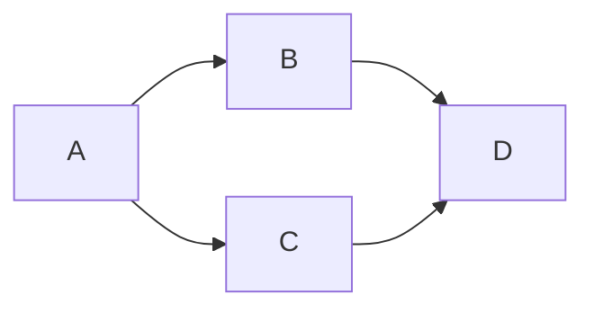

+++
date = '2026-01-14T11:54:31+05:00'
draft = true
title = 'Тестовый пост для проверки функциональностей'
+++

Проверяются: Tikz, Latex, Video, Скрывающийся текст, Диаграммы, ссылки, svg, код, таблица

<!--more-->


## Latex

Формулы внутри строки через goldmark: \( x \) \( E = x \) \( E = \sigma_{\text{продолн.}} \cdot \varepsilon \), \( y=2 \cdot x \) и \( F_{max} \le F_{\text{кр}} \) 

Ещё формулы внутри строки \( z(x)=\begin{cases}1 \\ 2 \\ 3 \end{cases} \) \( \psi \ge 1 \) \( x \le 1 \)

Формула в отдельной строке через goldmark: $$ F_{max} \le F_{кр} $$ 
область определения \( x \) (\( -\infty < x < \infty \))

$$ x<0 $$
$$ 0 \le \Omega < 1 $$
$$ x \ge 1 $$

Длинные формулы:
$$\sh x=\sum_{i=1}^{\infty}\frac{x^{2i-1}}{\left(2i-1\right)!}=x+\frac{x^3}{3!}+\frac{x^5}{5!}+\frac{x^7}{7!}+..., \quad \sh x=\frac{e^x-e^{-x}}{2}$$ 
$$y_n=\frac{1}{p}\left(\left(p-1\right)y_{n-1}+\frac{x}{y^{p-1}_{n-1}}\right), \quad n=1,2,...$$ 

Многострочные формулы:
$$ z(x)=\begin{cases}1 \\ 2 \\ 3 \\ 4 \end{cases} $$

$$ z(x)=\begin{cases}\sin x, \quad x<0 \\ e^x, \quad 0 \le x<1 \\ e, \quad x \ge 1 \end{cases} $$

$$f(x)=\begin{cases}x^2-1, \quad x>=1 \\ 0, \quad x<1\end{cases}$$
## Video



## Скрывающийся текст


Функции в Python называются в стиле [snake_case](https://en.wikipedia.org/wiki/Snake_case). То есть все слова пишутся маленькими буквами и разделяются между собой нижним подчёркиванием (_)


<!--  <p class="speshal-fancy-custom">
    This is <strong>raw HTML</strong>, inside Markdown.
  </p>-->


## Встраиваемый html-код

<!-- 
<div>
  <iframe src="https://trinket.io/embed/python/5a2046f9ee" width="100%" height="356" frameborder="0" marginwidth="0" marginheight="0" allowfullscreen></iframe>
</div>
 -->

## Ссылки

[Hugo documentation](https://gohugo.io/commands/hugo_server/)
1. [PEP 257 – Docstring Conventions](https://peps.python.org/pep-0257/)
2. [Numpy Docstring Standard](https://numpydoc.readthedocs.io/en/latest/format.html#docstring-standard)
3. [Google Python Style Guide: Docstrings](https://google.github.io/styleguide/pyguide.html#38-comments-and-docstrings)

## Картинки

### Диаграммы GOAT

```goat
          |
          +<----------------+
          |                 |
          v                 | 
          .                 |
         / \                |
        /   \               |
       /     \              | 
 Нет  /       \  Да         |
.----+ условие +----.       |
|     \       /     |       |                              
|      \     /      |       |
|       \   /       v       |
|        \ /  .-----+-----. |
|         '   |  действие | |
|             '-----+-----' | 
'---------+         |       |
          |         '-------+		   
          v
```

```goat
           |           
           v           
       .-------.       
      /         \ Нет  
.--->+ i=1 до n  +---. 
|     \         /    | 
|      '---+---'     | 
|          |  Да     |
|          v         |
|    .-----+-----.   |
|    |  действие |   |
|    '-----+-----'   | 
|          |         |
+----------+         |
                     |
           +---------+
           |
           v
```

### Диаграммы Mermaid


```mermaid {class="mw5"}
graph LR;
    A-->B;
    A-->C;
    B-->D;
    C-->D;
```
### svg


### png


### Tikz


\begin{tikzpicture}[scale=0.2,node distance=3.5cm, auto]
    % Узлы
    \node (shape) [draw, rectangle, minimum width=4cm, text width=4cm] {Shape \color{gray} \\ coordintates()};
    \node (circle) [draw, rectangle, minimum width=4cm, text width=4cm, below left of=shape] {Circle \color{gray} \\ coordintates()};
    \node (rectangle) [draw, rectangle, minimum width=4cm, text width=4cm, below right of=shape] {Rectangle \color{gray} \\ coordintates()};
    % Стрелки
    \draw[->] (shape) -- (circle);
    \draw[->] (shape) -- (rectangle);
\end{tikzpicture}


Круг, нарисованный в TikZ:

\begin{tikzpicture}
\draw (0,0) circle (1cm);
\end{tikzpicture}


Круг с настройкой width="20%":

\begin{tikzpicture}
\draw (0,0) circle (1cm);
\end{tikzpicture}


Круг с настройкой width="2cm":

\begin{tikzpicture}
\draw (0,0) circle (1cm);
\end{tikzpicture}


Круг с настройкой height="2cm":

\begin{tikzpicture}
\draw (0,0) circle (1cm);
\end{tikzpicture}


Смайлик:

\begin{tikzpicture}
% Лицо (только контур, без заливки)
\draw (0,0) circle (1cm);

% Глаза (заполненные точки)
\fill (-0.35,0.2) circle (0.1cm);
\fill (0.35,0.2) circle (0.1cm);

% Улыбка
\draw (-0.5,-0.2) arc (180:360:0.5 and 0.3);

% Румянец (опционально)
\fill[red!30] (-0.6,-0.1) circle (0.1cm) (0.6,-0.1) circle (0.1cm);
\end{tikzpicture}



Смайлик внутри 
\begin{tikzpicture}
% Лицо (только контур, без заливки)
\draw (0,0) circle (1cm);

% Глаза (заполненные точки)
\fill (-0.35,0.2) circle (0.1cm);
\fill (0.35,0.2) circle (0.1cm);

% Улыбка
\draw (-0.5,-0.2) arc (180:360:0.5 and 0.3);

% Румянец (опционально)
\fill[red!30] (-0.6,-0.1) circle (0.1cm) (0.6,-0.1) circle (0.1cm);
\end{tikzpicture}  текста.


Смайлик с настройкой width="0.4cm" внутри 
\begin{tikzpicture}
% Лицо (только контур, без заливки)
\draw (0,0) circle (1cm);

% Глаза (заполненные точки)
\fill (-0.35,0.2) circle (0.1cm);
\fill (0.35,0.2) circle (0.1cm);

% Улыбка
\draw (-0.5,-0.2) arc (180:360:0.5 and 0.3);

% Румянец (опционально)
\fill[red!30] (-0.6,-0.1) circle (0.1cm) (0.6,-0.1) circle (0.1cm);
\end{tikzpicture}  текста.

## Код

bash:
```bash
hugo --gc --minify --cleanDestinationDir 
```

python:
```python
for i in range(0,15):
  print(i)
```


## Таблицы

| Номер слоя | Вид грунта | Нормативный модуль деформаций, МПа | Коэффициент Пуассона | Плотность, кг/м^3  | 
|:-----------|:----------:|:-----------:|:-----------:|:-----------:|
| 1 | Суглинок | 34 | 0.35 | 1600 |
| 2 | Супесь   | 32 | 0.30 | 1400 |
| 3 | Гравий   | 30 | 0.27 | 1200 |