+++
date = '2026-04-20T08:00:00+05:00'
title = 'Текстовый процессор. Основные понятия'
tags = ["Информатика", "Word"]
categories = ["informatika"]
courses = ["informatika"]
+++

<!--more-->

## Государственный стандарт оформления документов ГОСТ 7.32-2017

ГОСТ 7.32-2017
: — Основной документ, на который стоит опираться при оформлении отчётные документов (лабораторные работы, курсовые работы, выпускная квалификационная работа, отчёты о научно-исследователькой работе и т.п.).

---

Полное название документа
: ГОСТ 7.32-2017. Межгосударственный стандарт. Система стандартов по информации, библиотечному и издательскому делу. Отчёт о научно-исследовательской работе. Структура и правила оформления.

---

Краткое содержание ГОСТа:
1. Структурные элементы отчёта
2. Требования к структурным элементам отчёта
   - Титульный лист
   - Список исполнителей
   - Реферат
   - Содержание
   - Термины и определения
   - Перечень сокращений и обозначений
   - Введение
   - Основная часть отчёта о НИР
   - Заключение
   - Список использованных источников
   - Приложения
3. Правила оформления отчёта

---

## Форматы

Основными форматами файлов текстовых документов являются:
- **.docx** - Office Open XML открытый формат. Является zip-архивом. Можно открыть как архив для получения медиа-данных

Открытие документа как архива:
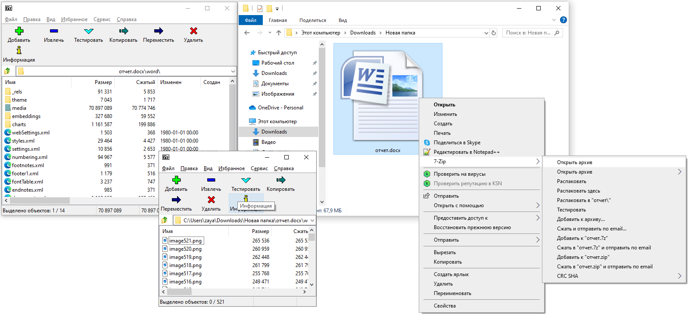

- **.doc** - проприетарные документы MS Word
- **.dotm** - шаблон документов Word
  
---

## Настройка рабочего пространства

Перед работой с текстовым документов в программе текстового процессора включают:
- невидимые символы, которые указывают в тексте на пробелы между словами, окочание абзаца, переход на новую страницу и т.п.
- линейку, которая указывает размеры и положение полей, отступов, табуляций
- стили текста для документов с разными стилями
- схему документа, которая представляет собой оглавление документа. Используется для документов среднего или большого размера

Общий вид рабочего пространства при работе с документов:
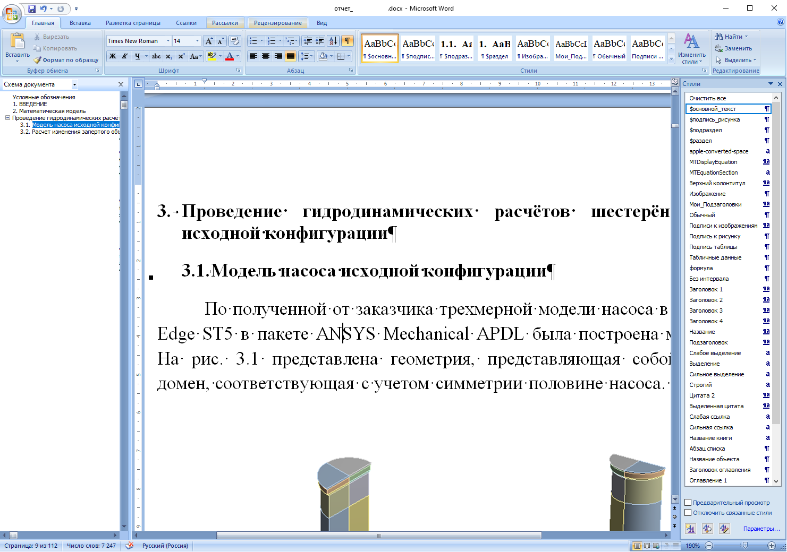

Для того, чтобы создать такой же вид документа включите настройки:

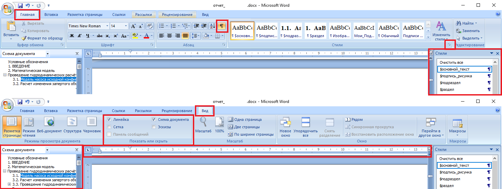

---

## Основные элементы текстового документа

Основные элементы текстового документа указаны на схеме:


\begin{tikzpicture}[
    scale=2.0,
    every node/.style={font=\large},
    arrow/.style={->,>=Stealth,thin, green!70!black},
    label1/.style={
        %font=\fontsize{12}{28}\selectfont,
        text=green!60!black,
        text width=4.3cm
    },
    decorator1/.style={
        decorate, 
        thick, 
        green!60!black
    },
]

% === Страница === 
\draw[thick] (0,0) rectangle (5,7);

% === Поля ===
\draw[dashed, gray] (0.5,0.5) rectangle (4.5,6.5);
\fill[red!10] (0.1,6.9) rectangle (0.5,0.1);
\fill[red!10] (4.5,6.9) rectangle (4.9,0.1);
%\fill[blue!10] (0.5,0.1) rectangle (4.5,0.5);

% === Колонтитулы ===
\fill[blue!10] (0.5,6.5) rectangle (4.5,6.9);
\fill[blue!10] (0.5,0.1) rectangle (4.5,0.5);

\node at (2.5,6.7) { };
\node at (2.5,0.3) { };

% === Текст ===
\draw (1.2,5.8) -- (4.2,5.8);
\draw (1.2,4.3) -- (4.2,4.3);
\foreach \y in {5.3,4.8,3.8}
    \draw (0.8,\y) -- (4.2,\y);

% Отступ первой строки
\node[anchor=north west, align=justify, text width=6.6cm, font=\fontsize{12}{28}\selectfont] at (0.75,6.04)
{
\hspace{1.0cm}Это пример текста документа. Он показывает, как выглядит набор строк на странице. \textparagraph

\hspace{1.0cm}Стрелки указывают на свойства страницы и абзаца текста.\textparagraph
};

% === ЛИНЕЙКИ ===

% Верхняя линейка
\draw[fill=gray!10] (0,7.2) rectangle (5,7.6);
\foreach \x in {0,1,...,5} {
    \draw (\x,7.2) -- (\x,7.4);
    %\node[above] at (\x,7.4) {\tiny \x};
}

% Левая линейка
\draw[fill=gray!10] (-0.6,0) rectangle (-0.2,7);
\foreach \y in {0,1,...,7} {
    \draw (-0.6,\y) -- (-0.4,\y);
    %\node[left] at (-0.6,\y) {\tiny \y};
}

% === Подписи ===

% Поля
\node[left, label1] at (-0.8,3.1) (leftfield) {Левое поле};
\draw[arrow] (leftfield) -- (0.3,3.5);

\node[right, label1] at (5.2,1.1) (rightfield) {Правое поле};
\draw[arrow] (rightfield) -- (4.7,1.5);

% Колонтитулы
\draw[arrow] (-0.8,6.7) -- (0.7,6.7);
\node[left, label1] at (-0.8,6.7) {Верхнее поле.\\ Верхний колонитул};

\draw[arrow] (-0.8,1.2) -- (0.7,0.3);
\node[left, label1] at (-0.8,1.2) {Нижнее поле.\\ Нижний колонтитул};

% Отступы
\draw[decorator1, decoration={brace,amplitude=2pt}] (0.8,3.8) -- (0.5,3.8);
\node[below, label1] at (1.7,1.7) (indentleft) {Отступ слева};
\draw[arrow] (indentleft) -- (0.65,3.7);

\draw[decorator1, decoration={brace,amplitude=2pt}] (4.5,3.8) -- (4.2,3.8);
\node[below, label1] at (3.6,1.7) (indentright) {Отступ справа};
\draw[arrow] (indentright) -- (4.35,3.7);

% первой строки
\draw[decorator1, decoration={brace,amplitude=2pt}] (1.2,5.8) -- (0.5,5.8);
\node[left, label1] at (-0.8,5.) (indentfirst) {Отступ первой строки};
\draw[arrow] (indentfirst) -- (0.85,5.75);

% Интервалы
\draw[decorator1, decoration={brace,amplitude=2pt}] (4.2,5.8) -- (4.2,5.5);
\node[right, label1, text width=5.2cm] at (5.2,4.5) (linespacing) {Междустрочный интервал};
\draw[arrow] (linespacing) -- (4.35,5.65);

\draw[decorator1, decoration={brace,amplitude=2pt}] (4.2,6.3) -- (4.2,6.0);
\node[right, label1] at (5.2,5.5) (beforespacing) {Интервал до абзаца};
\draw[arrow] (beforespacing) -- (4.35,6.15);

\draw[decorator1, decoration={brace,amplitude=2pt}] (4.2,4.8) -- (4.2,4.5);
\node[right, label1, text width=6.6cm] at (5.2,3.5) (afterspacing) {Интервал после первого абзаца =\\= интервал до второго абзаца};
\draw[arrow] (afterspacing) -- (4.35,4.65);

\end{tikzpicture}


¶ - символ окончания абзаца. С помощью этого символа определяются границы абзаца. 
Другими словами, абзац - текст между двумя значками ¶

---

## Поля

Поля можно выбрать из стандартного набора полей, либо можно настроить вручную в настройке Параметров страницы:


	\begin{tikzpicture}[
		img/.style={
		inner sep=0pt,
		anchor=north west
		},
		pnl/.style={
		inner sep=0pt,
		outer sep=0.4pt,
		anchor=north west,
		draw=red!70!black,
		line width=3pt
		},
		lbl/.style={
		inner sep=4pt,
		outer sep=0.4pt,
		anchor=north west,
		draw=red!70!black,
		line width=2pt,
		fill=white,
		font=\fontsize{10pt}{10pt}\selectfont,
		align=left,
		text=red!70!black,
		text width=3.4cm,
		execute at begin node={\hyphenpenalty=10000\relax}  % для исключения переносов слов через тире
		},
		frm/.style={
		inner sep=0pt,
		anchor=north west,
		draw=red!70!black,
		line width=1pt
		},
		arrow/.style={
		-{Triangle[length=12pt, width=8pt]},
		draw=red!70!black,
		line width=2pt,
		}
	]

	\node[img] (img1) at (0,0) {\includegraphics[height=6cm, trim=0 0 0 0, clip]{word_fields_3.png}};
	\node[img] (img1) at (6,0) {\includegraphics[height=6cm, trim=0 0 0 0, clip]{word_fields_1.png}};

	\end{tikzpicture}


Поля выбираются:
- исходя из полученных требований к конкретному документу
- по государственному стандарту ГОСТ 7.32-2017: левое 3см, правое 1.5см, верхнее и нижнее 2см
- для непечатных документов можно выбрать узкие поля

---

## Отступы

Отступы используются для смещения текста **по горизонтали**:
- Отступ слева - расстояние от правой границы левого поля до текста
- Отступ справа - расстояние от левой границы правого поля до текста
- Отступ первой строки - рассятоние от правой границы левого поля до первой строки абзаца

Ниже представлены различные варианты настроек отступов:
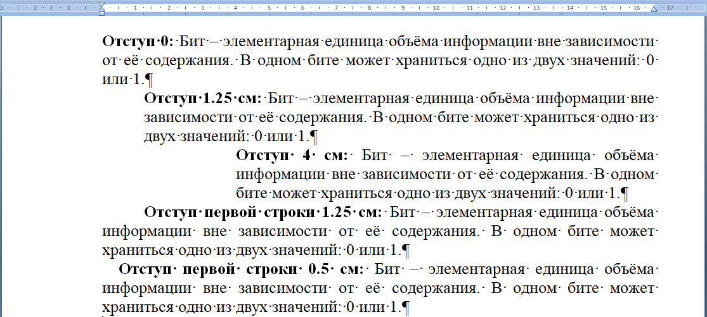

Отступы можно настроить с помощью настроек абзаца или с помощью линейки.

---

## Интервалы

Интервалы используются для смещения текста **по вертикали**.

Интевалы применяются к вертикальному расстоянию до или после абзаца (конец абзаца определяется значком ¶).

Интервалы используются:
- в заголовках/подзаголовках для визуального разделения от основного текста
- для пропуска строк вместо пустых строк

Ниже представлены различные варианты настроек интервалов:

---

## Междустрочный интервал

Междустрочный интервал определяет вертикальное расстояние между строк внутри абзаца.

Ниже представлены различные варианты настроек междустрочного интевала:

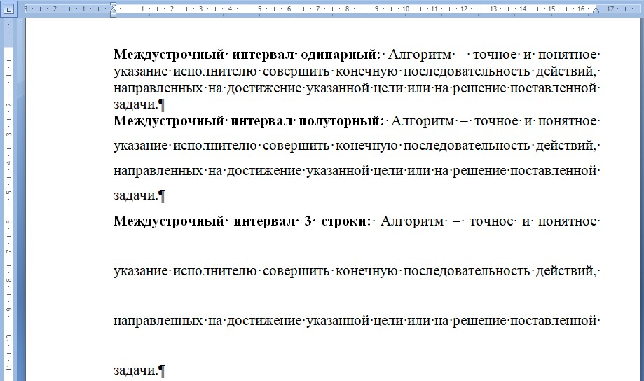

---

## Табуляция

Табуляция используется для горизонтального распределения текста в строке. 
Например для создания полей для заполнения (Фамилия, Имя, Учебная группа и т.п.).

Ниже представлен пример заполнения поля **"Проверили"**. 
Подчёркнутое поле не сдигается при заполнении поля.

Поле **"Проверили"** до заполнения:
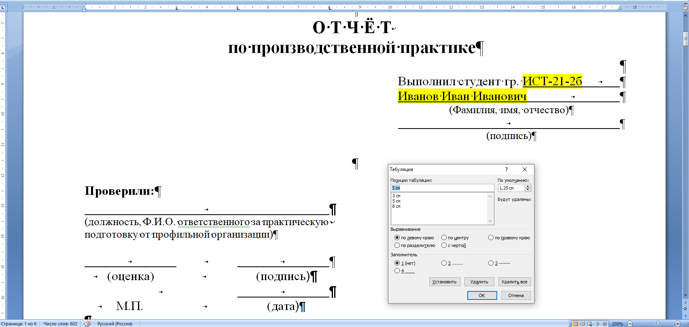

Поле **"Проверили"** после заполнения:
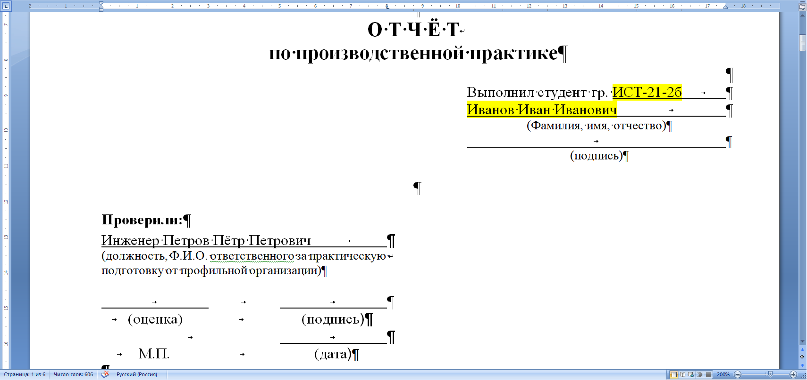

---

## Новая строка без нового абзаца

Новая строка без нового абзаца обозначается символом ↵ и используется для перехода на следующую строку без окончания абзаца. 
То есть новая строка будет создана в текущем абзаце.

Символ ↵ используется при необходимости визуально перенести текст на новую строку, но не заканчивать предложение и абзац. 

Обычное окончание абзаца (символ ¶) должно использоваться при его логическом завершении.
Например при окончании предложения. Если предложение не закончено, то использовать ¶ - некорректно.

Для быстрой вставки символа ↵ используется комбинация клавиш: ***shift+enter***

Пример использования новой строки без нового абзаца представлен ниже:

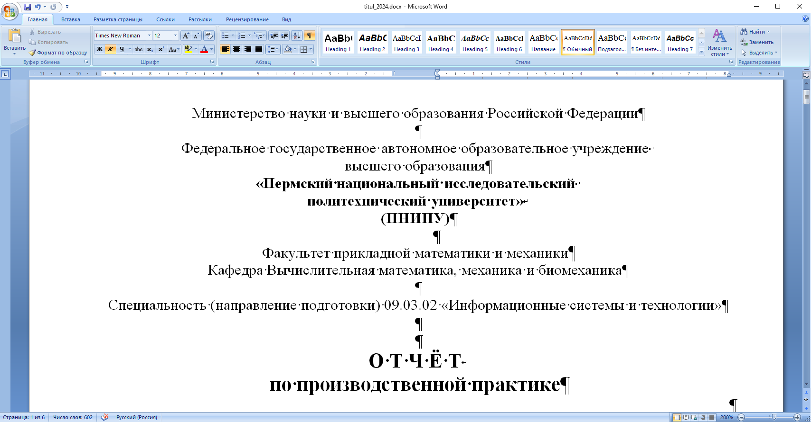

---

## Разделы, разрывы страниц, разрывы разделов

- Разрывы страницы используются для перехода к следующей странице, если необходимо на текущей странице оставить пустое пространство. 
- Разрыв страницы добавляется с помощью комбинации клавиш: ***ctrl+enter***
- В тексте разрыв страницы обозначается одноимёнными символом

Документ делится с одной стороны на страницы, с другой стороны - на разделы, которые обозначают разные части документа. 
Разделы могут могут носить смысл глав книги, параграфов, секций и других структурных элементов документа.

- Различные разделы могут иметь различные настройки страницы (поля, колонки, колонтитулы, ориентацию страницы и т.п.). 
Разделы отделяются разрывами раздела.

Настройки разрывов страниц и разрывов разделов представлены ниже:

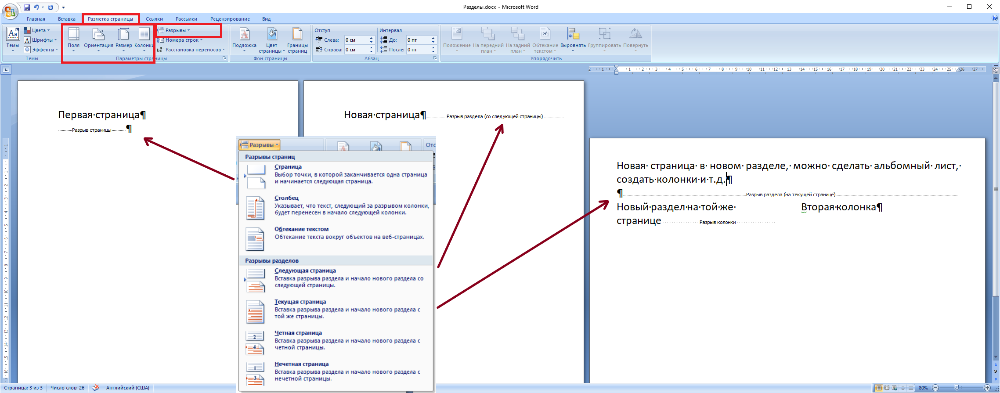

---

## Стили

- Стили используются для однотипного форматирования подобных друг другу и логически связанных фрагментов текста.

Текст без редактирования:
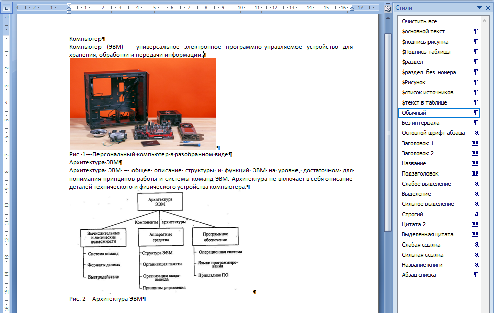

Создание стилей для разных типов абзацев:
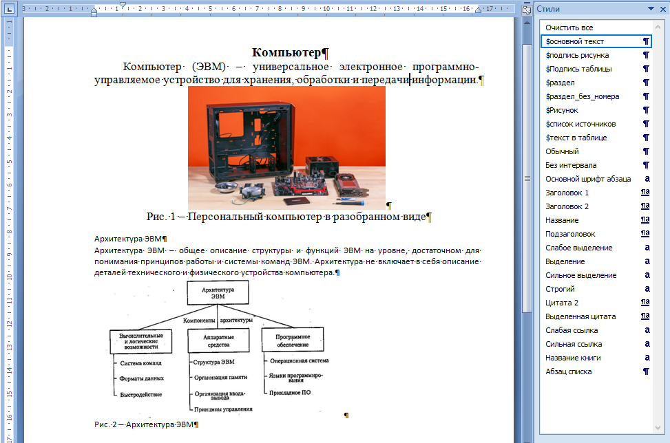

Применение стилей для всех абзацев документа:
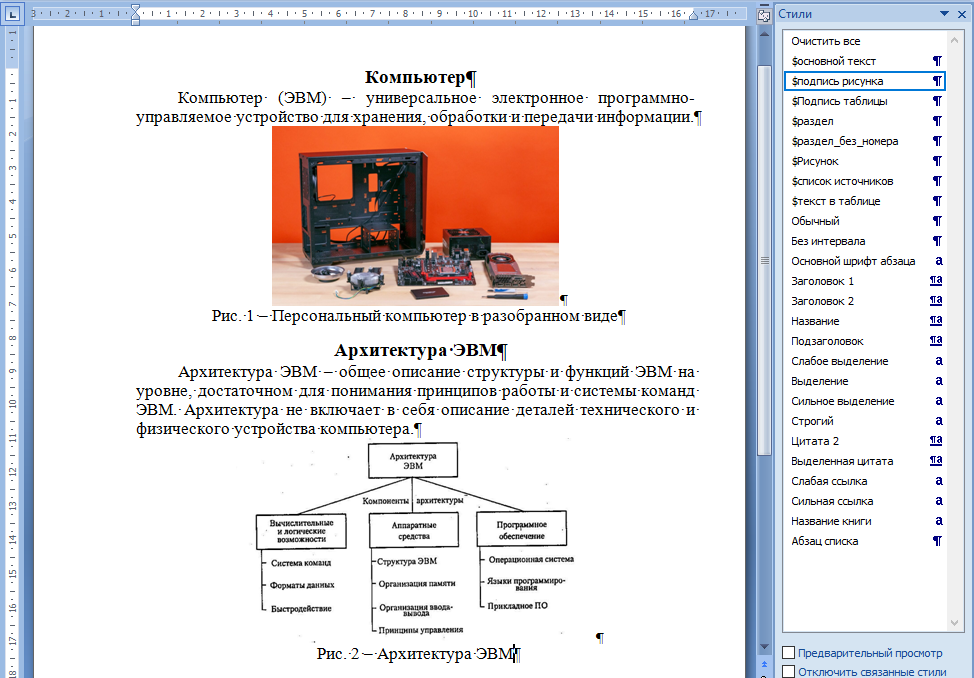

### Правила применения и рекомендации:
- использовать для документов из 10 страниц и более
- не использовать стиль **Обычный**, т.к. он используется для любого текста, в том числе надписей на рисунках и нестилизованных частях документа.
- создать для основного текста свой стиль
- создать свой шаблон для стилей в отдельном документе **.docx** или **.dotm** и использовать его для всех документов
- использовать стили для всех элементов документа (заголовки, текст, подписи рисунков, подписи таблиц, надписей на рисунках и т.д.).

---

## Автоматическая нумерация

При работе с большими документами (большое количество рисунков, таблиц, формул) возникает необходимость автоматической нумерации рисунков, таблиц, формул и других элементов текста. 

Для этого используются инструменты **Название** и **Перекрёстная ссылка**:
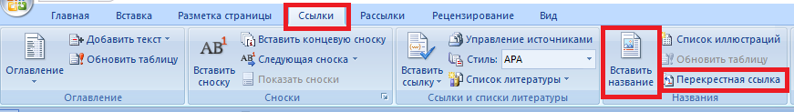


	\begin{tikzpicture}[
		img/.style={
		inner sep=0pt,
		anchor=north west
		},
	]

	\node[img] (img1) at (0,0) {\includegraphics[height=4cm, trim=0 0 0 0, clip]{word_auto_1_1.png}};
	\node[img] (img1) at (6,0) {\includegraphics[height=4cm, trim=0 0 0 0, clip]{word_auto_1_2.png}};

	\end{tikzpicture}


- названия добавляются в подписи рисунков, таблиц, формул и т.п.
- перекрестные ссылки используются для ссылок на названия из текста

Документ с использованием ссылок на рисунки по-умолчанию:

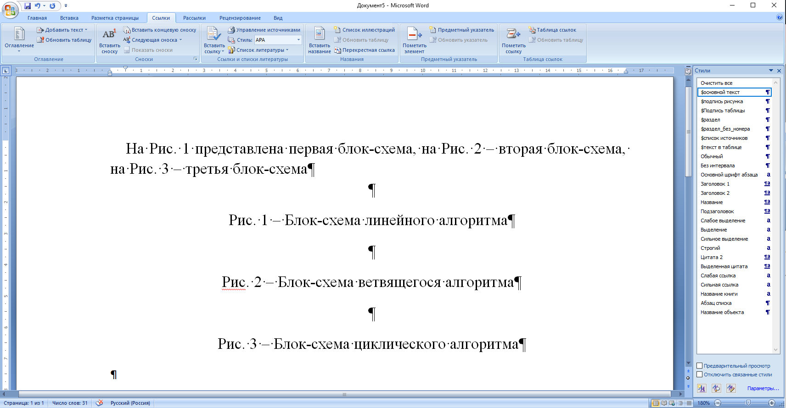

При добавлении в такой документ нового рисунка, нумерация в подписи рисунка и ссылка изменятся автоматически.

Если выделить текст, то названия и ссылки выделены серым цветом:

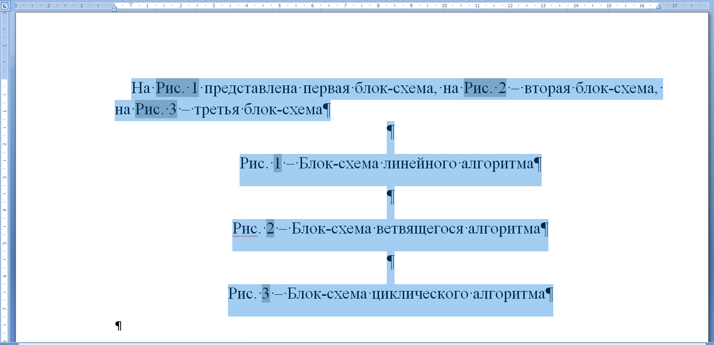

Однако ссылки в виде **"На Рис. 1"** (Рис с большой буквы) не используются в русском языке. В тексте на русском языке будет написано либо **"На рис. 1"**, либо **"На рисунке 1"**. 

Для реализации таких записей используется усложнённый вариант с двойными абзацами (комбинация клавиш ***ctrl+alt+enter***, работает не во всех текстовых редакторах):

Двойной абзац позволяет в ссылке использовать только номер, без подписи **"Рис."**:
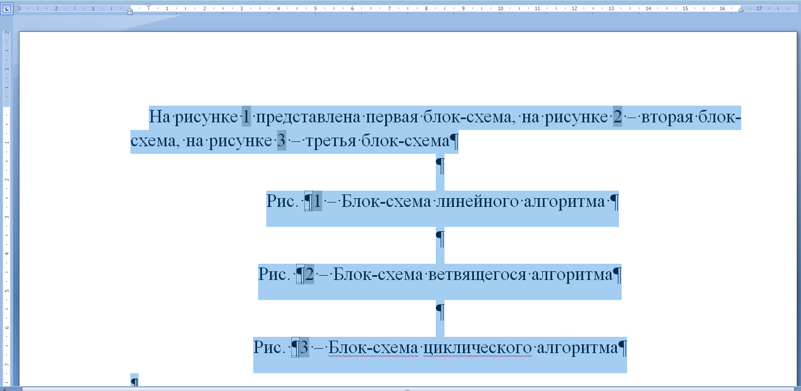

### Пример использования:
Если поменять местами рисунки:
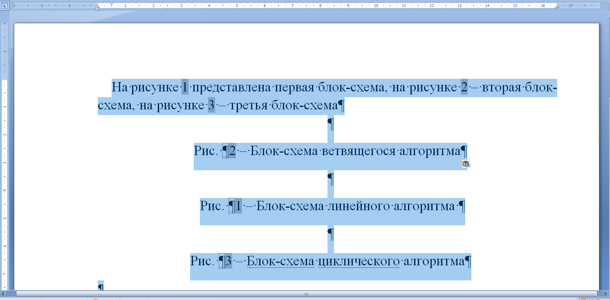

и обновить ссылки и названия:
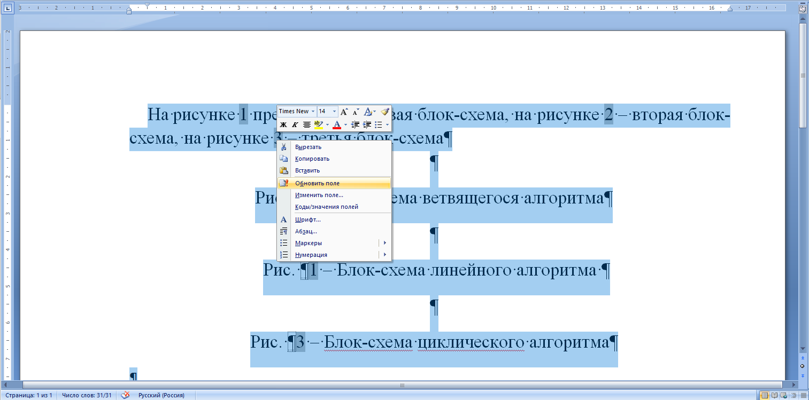

то номера изменятся как в подписях, так и в тексте:
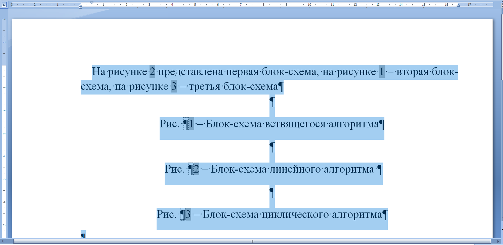

### Пример использования пользовательского названия

Помимо стандартных названия **Рисунок**, **Таблица**, **Формула** пользователь может создавать свои названия, для которых также будет работать автоматическая нумерация.

Использование дополнительного названия **Источник** для источников литературы:
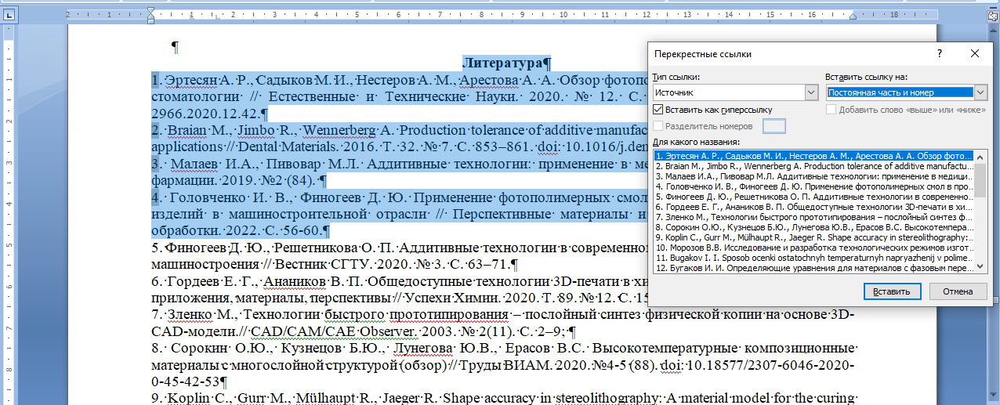

---

## Стандартные настройки текста

При отсутствии специальных требований к тексту принято использовать следующие настройки абзацев и шрифта:

- Шрифт Times New Roman
- Размер шрифта 14пт или 12пт (пт - пункты, специальная типографская единица измерения шрифтов, 1пт=0,376 мм, 12пт=4,23мм)
- одинарный междустрочный интервал
- без интервалов до и после
- отступ первой (красной) строки 1,25cм
- выравнивание по ширине

---

## Ключевые слова

Добавьте слова в свой глоссарий

|                                |                                 |
| ------------------------------ | ------------------------------- |
| Абзац                          | Настройка рабочего пространства |
| Поля                           | Отступ                          |
| Интервал до абзца              | Интервал после абзаца           |
| Междустрочный интервал         | Табуляция                       |
| Новая строка без нового абзаца | Формат                          |
| Раздел                         | разрыв страницы                 |
| разыв раздела                  | Стандартные настройки текста    |
| Автоматическая нумерация       | Стиль                           |
| Редактирование                 | Текст                           |

---

## Вопросы для самоконтроля

1. Зачем нужен ГОСТ 7.32-2017?
2. Чем интервал отличается от отступа?
3. Что такое междустрочный интервал?
4. Что такое табуляция?
5. Какие горячие клавиши создают раздел страницы?

